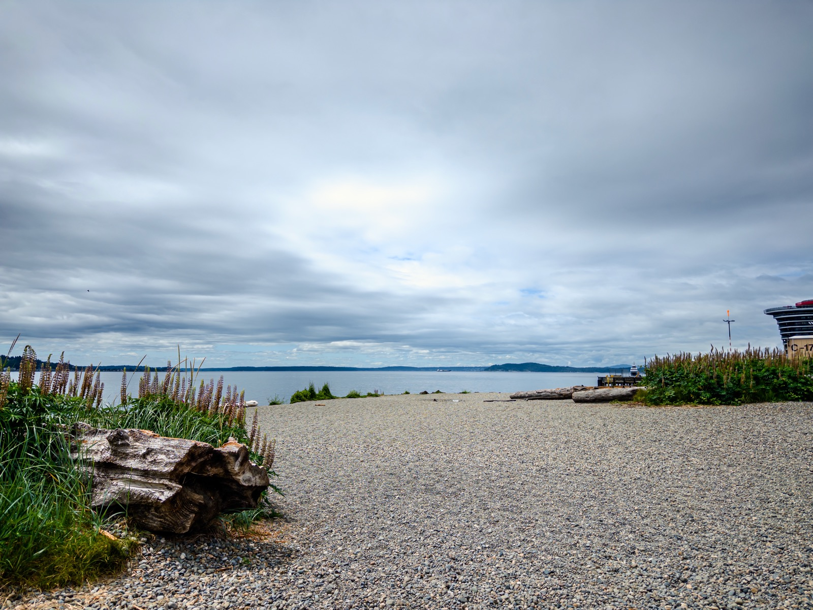
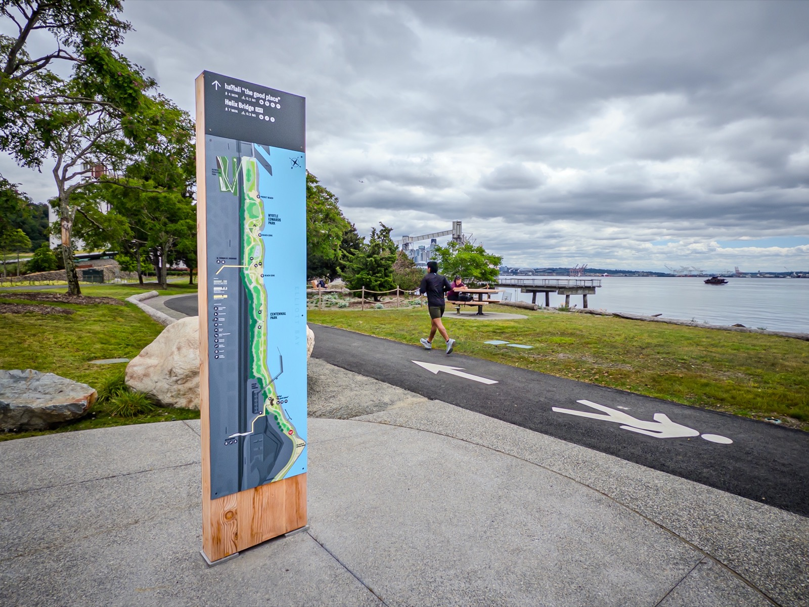
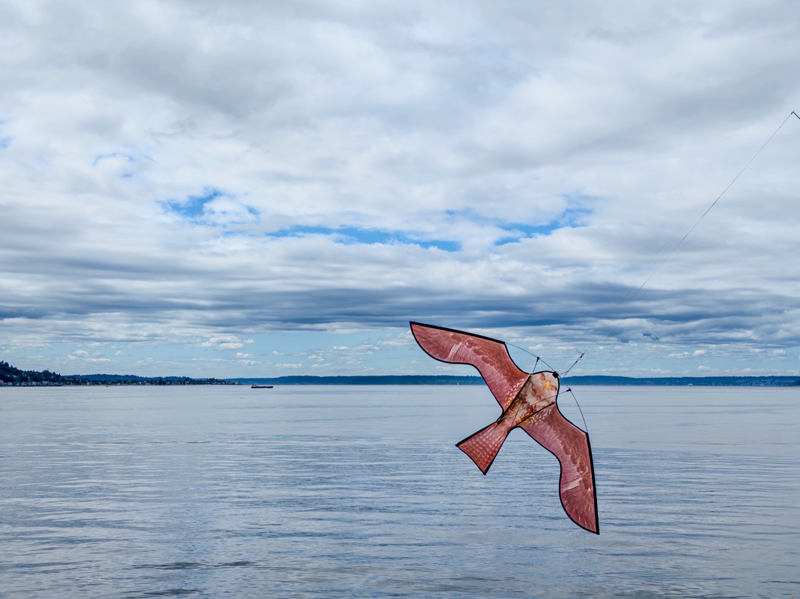
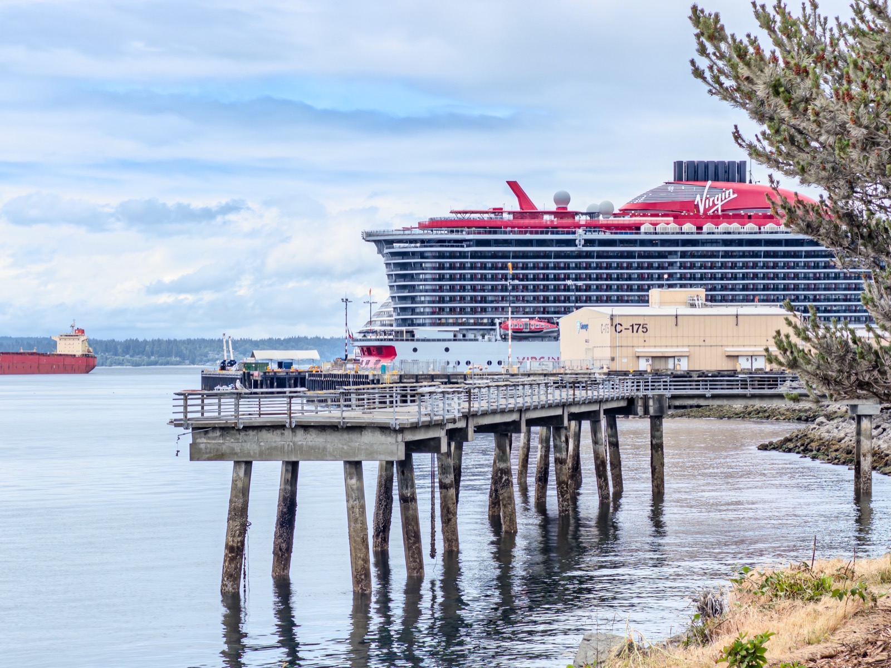
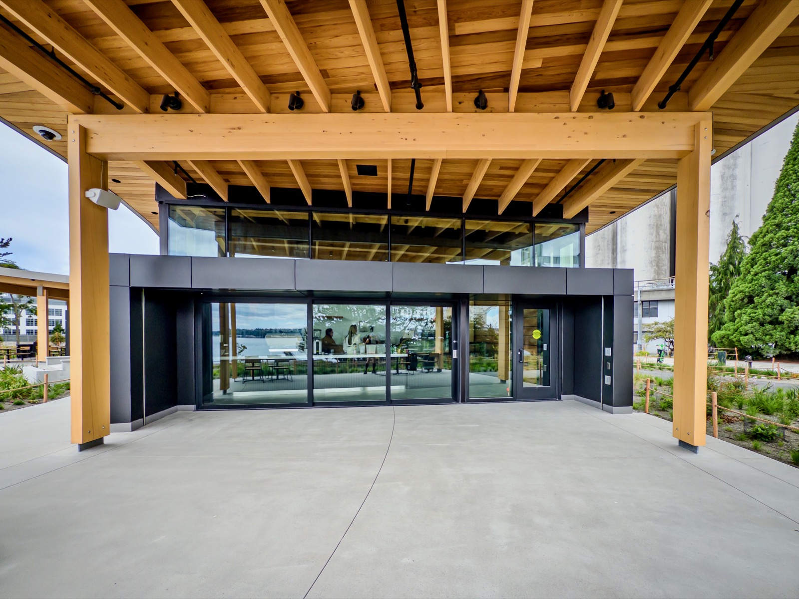
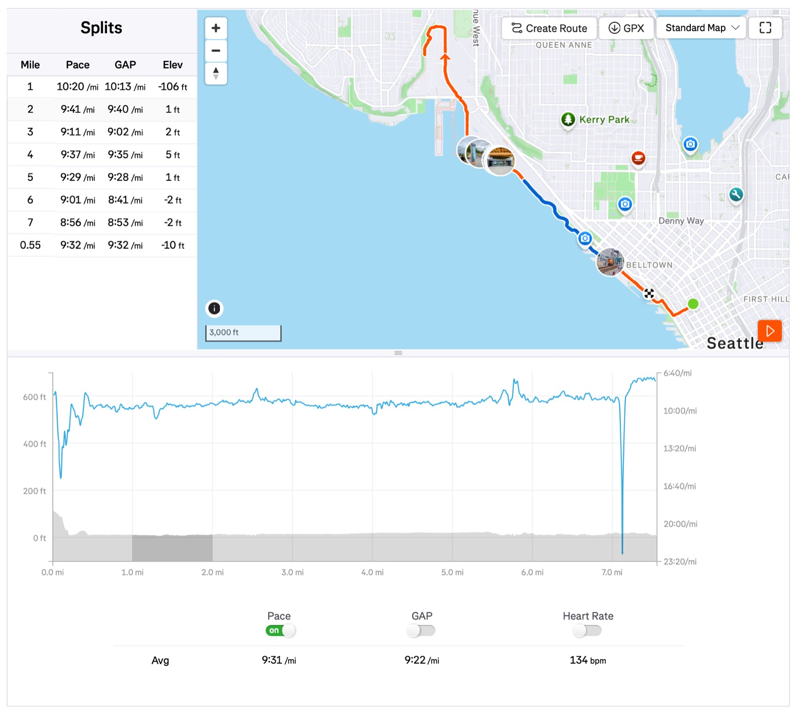

After 15-month of [construction](https://www.portseattle.org/blog/myrtle-edwards-and-centennial-parks-re-open-june-4), [Elliott Bay Trail](https://www.traillink.com/trail/elliott-bay-trail/) was finally opened yesterday on June 4! Of course I made a run through it -- the new trail is gorgeous: new beach coves, new landscaping, many picnic tables and seats along the shore, and even a new coffee shop!

The pictures didn't do a justice because of the gloomy weather when I ran (but no rain!). It was 56F, cloudy w/ 2.7mph breeze. Definitely will come back frequently (the standard lunch run route for me)!

{data-lightbox-src="cover-full.jpeg"}

{data-lightbox-src="image-2-full.jpeg"}

{data-lightbox-src="image-3-full.jpeg"}

{data-lightbox-src="image-4-full.jpeg"}

{data-lightbox-src="image-5-full.jpeg"}

{data-lightbox-src="image-6-full.jpeg"}

{data-lightbox-src="image-7-full.jpeg"}

{data-lightbox-src="image-8-full.jpeg"}

---

*Originally posted on [Mastodon](https://sigmoid.social/@BenjaminHan/116699208788591526).*
