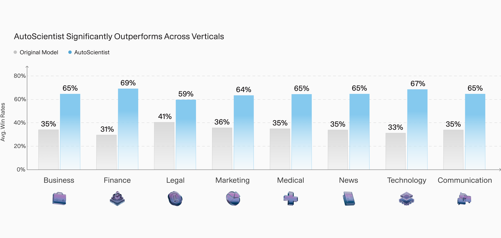

.](cover.jpg){fig-align="center"}

Adaption's [launch post](https://adaptionlabs.ai/blog/autoscientist) introduces AutoScientist, a system that automates the training of fine-tuned models.

- **The company**: Adaption (also styled Adaption Labs) is privately held, based in San Francisco, and co-founded by [Sara Hooker](https://www.sarahooker.me/), with 11–50 staff. Its mission is "the future of Adaptable Intelligence": models that keep adapting to new conditions instead of being retrained from scratch.
- **What it does**: AutoScientist automates the training-and-alignment loop, co-optimizing the data and the recipe together and self-improving over a limited number of past runs until quality converges. It targets the usual failure modes of training outside a frontier lab: catastrophic forgetting, overfitting on thin data, and conflicting training signals.
- **The claim**: all win rates are scored on Adaption's own in-house, domain-specialized evaluations. The headline is that AutoScientist beats fine-tuning configured by the lab's own AI research staff by an average of 35% across runs, with the aggregate win rate going from 48% (staff-configured) to 64% (AutoScientist). Datasets run 5K–100K on the architectures Together AI offers, and AutoScientist is free for 30 days.

The per-vertical view uses a *different* baseline, the original un-fine-tuned model, and AutoScientist beats it on all eight verticals: it scores 59–69% against 31–41% for the original model, with the widest gap in Finance (31% to 69%).

{fig-align="center"}

One caveat on reading these numbers: the post describes "consistent gains against the base model," yet its per-vertical chart scores that original model at about 35%, not the 50% a model scores against itself. What the win rate is measured against is left unclear, and the aggregate chart (48% vs 64%) and the per-vertical chart (about 35% vs 65%) do not share a baseline.

## Related posts

- [Are AI Systems About to Start Building Themselves?](/posts/20260508-import-ai-455-automating-ai-research/) — [Jack Clark's](https://jack-clark.net/) survey of the public evidence on automating AI R&D (coding loops, kernel design, fine-tuning automation). AutoScientist's recipe search is one well-scoped instance of that category.
- [Recursive Superintelligence's $4B Bet on Self-Improving AI](/posts/20260526-recursive-superintelligence-launch/) — a far larger wager on automating AI research itself, the maximalist version of the same self-improvement idea.
