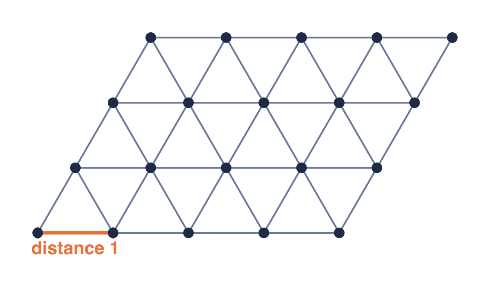

.](cover.jpg){fig-align="center"}

OpenAI [[1]](#ref-1) reports that an internal, general-purpose reasoning model resolved a longstanding question about the [planar unit distance problem](https://en.wikipedia.org/wiki/Erd%C5%91s_unit_distance_problem), which [Paul Erdős](https://en.wikipedia.org/wiki/Paul_Erd%C5%91s) first posed in 1946.

## The Unit Distance Problem

Placing $n$ points in the plane, at most how many pairs can be exactly distance 1 apart? Put concretely: scatter $n$ pins on a board and join every pair exactly an inch apart with a rigid one-inch rod, then count the rods. The count seems like it should climb freely as you add pins, but the plane is unforgiving: once a few pins are fixed, there are only so many spots left where a new pin can be an inch from several others at once.

{fig-align="center"}

Erdős conjectured an upper bound of $n^{1+o(1)}$ on this maximum, where the $o(1)$ in the exponent is a term that shrinks to 0 as $n$ grows. The best construction, a rescaled square grid, reaches $n^{1+C/\log\log n}$, whose $C/\log\log n$ excess shrinks the same way, only slightly faster than linear, and was widely believed to be essentially optimal. From the opposite side, the maximum is known to be no more than $O(n^{4/3})$, an upper bound Spencer, Szemerédi, and Trotter proved in 1984 [[2]](#ref-2).

## What OpenAI Reports

- **The result**: the conjecture was an upper bound, and the model disproved it from below. For infinitely many $n$, it constructs point configurations with at least $n^{1+\delta}$ unit-distance pairs for a *fixed* exponent $\delta > 0$ that does not shrink with $n$. That construction is a stronger lower bound, not a new upper bound, and it beats the old record by a factor of about $n^\delta$, a genuine power of $n$ rather than a vanishing one, which is the polynomial improvement that breaks the conjectured ceiling. The proof shows only that some such $\delta$ exists. A subsequent refinement by Princeton mathematician [Will Sawin](https://en.wikipedia.org/wiki/Will_Sawin) pins it at $\delta = 0.014$ [[3]](#ref-3). This disproves the conjecture without settling the problem. Writing $u(n)$ for the largest possible number of unit-distance pairs, the best bounds now known are $\Omega(n^{1.014}) \le u(n) \le O(n^{4/3})$, and the exact growth rate between them is still unknown.
- **The method**: the proof replaces the [Gaussian integers](https://en.wikipedia.org/wiki/Gaussian_integer) behind Erdős's original lower bound with deeper objects from [algebraic number theory](https://en.wikipedia.org/wiki/Algebraic_number_theory), using infinite [class field towers](https://en.wikipedia.org/wiki/Class_field_tower) and [Golod–Shafarevich theory](https://en.wikipedia.org/wiki/Golod%E2%80%93Shafarevich_theorem) to bring number theory to bear on an elementary geometry question.
- **Verification**: a group of external mathematicians checked the proof [[4]](#ref-4) and wrote a companion paper [[5]](#ref-5) explaining the argument and its significance, which OpenAI says "paints a substantially richer picture than the original solution alone." OpenAI describes this as an early glimpse of AI–human collaboration: the model generated and the proof was checkable, but the richer understanding came only with the second, human-written paper, the [generation-and-digestion split](/posts/20260422-proof-generation-vs-digestion/) Terence Tao has described.

## My Notes

- **A general model found a hidden cross-domain connection**: an elementary plane-geometry question fell to class field towers, machinery number theorists knew well but had no reason to point at distances in the plane. The notable thing is not that a 1946 conjecture fell but that the connection existed at all, and that a general reasoning model, run over a set of Erdős problems rather than scaffolded for proof search, found it. Whether the same machine intuition transfers to problems where no such hidden connection exists is the open question. [The Leiden Declaration's](/posts/20260602-leiden-declaration-ai-mathematics/) call for human oversight reads differently once the proof is checkable line by line.

---

## References

1. OpenAI. "An OpenAI Model Has Disproved a Central Conjecture in Discrete Geometry." May 20, 2026. <https://openai.com/index/model-disproves-discrete-geometry-conjecture/>
2. Spencer, Joel, Szemerédi, Endre, and Trotter, William T. "Unit distances in the Euclidean plane." In *Graph Theory and Combinatorics* (Béla Bollobás, ed.), London: Academic Press, 1984, pp. 293–308.
3. Sawin, Will. "An explicit lower bound for the unit distance problem." *arXiv preprint* (arXiv:2605.20579), May 20, 2026. <https://arxiv.org/abs/2605.20579>
4. OpenAI. The model's proof of the unit distance result (PDF). <https://cdn.openai.com/pdf/74c24085-19b0-4534-9c90-465b8e29ad73/unit-distance-proof.pdf>
5. Companion remarks on the proof, by the external mathematicians who checked it (PDF). <https://cdn.openai.com/pdf/74c24085-19b0-4534-9c90-465b8e29ad73/unit-distance-remarks.pdf>

## Related Posts

- [Even Experts Are Surprised by AI's Latest 'Vibe-Mathing' Advance](/posts/20260427-chatgpt-vibe-math-proof/): the closest precedent, an AI cracking a long-open conjecture by a route no human tried, where the transferable technique mattered more than the single result.
- [Advancing Mathematics Research with AI-Driven Formal Proof Search](/posts/20260606-ai-formal-proof-search/): the formal counterpart, closing open Erdős problems with machine-checked Lean proofs instead of an informal proof a human committee verifies.
- [Math Is AGI: Carina Hong on Axiom and Formal Reasoning](/posts/20260514-carina-hong-axiom-math-is-agi/): the generation-plus-verification paradigm, with this result's external mathematicians in the verifier role.
