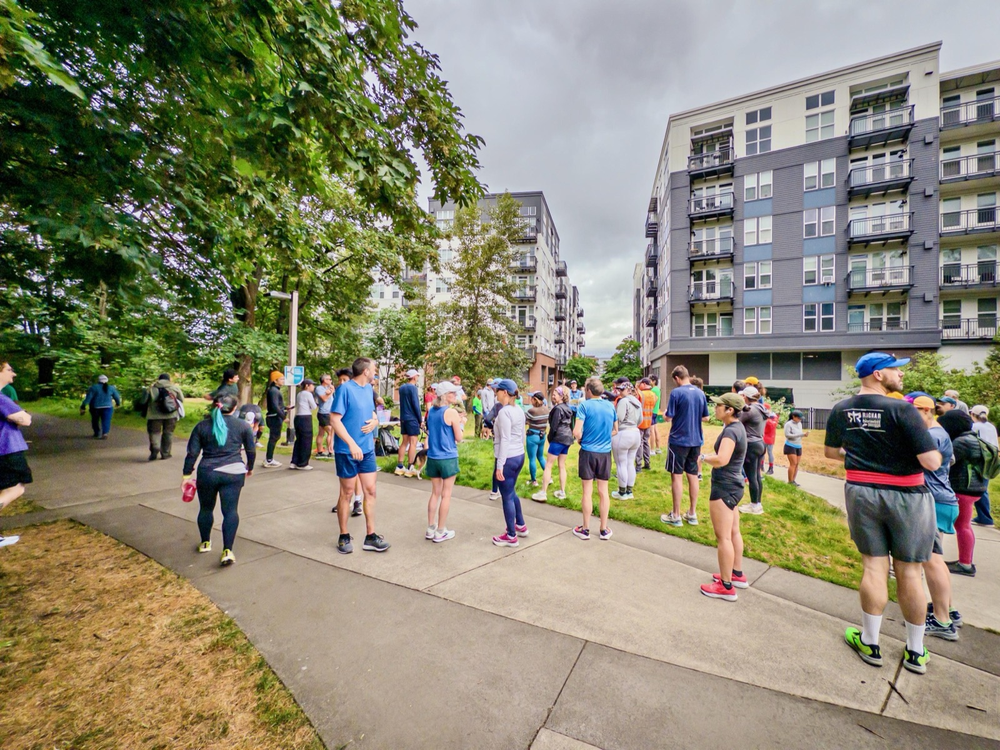
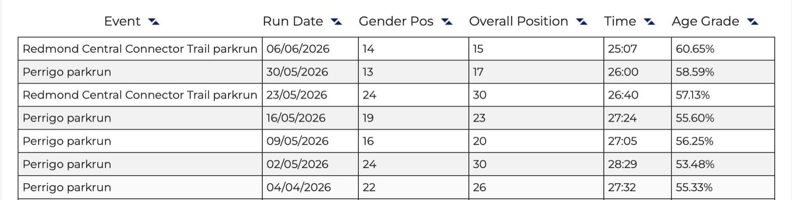
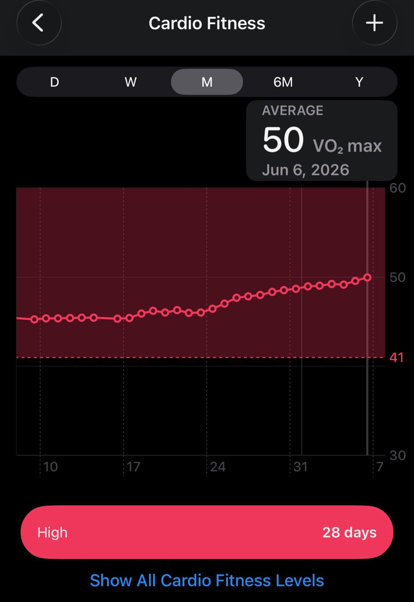

My 102nd parkrun today: 51F with a bit drizzle. Nothing to write home about, but I did get a minute faster than last time, and avg pace is 8'09"/mi approaching sub-8’. Still a long way to go from my PR 21:05, but hey one small step a time!

And with that, my VO2max is back to 50!

{data-lightbox-src="image-1-full.jpeg"}

{data-lightbox-src="image-2-full.jpeg"}

{data-lightbox-src="image-3-full.jpeg"}

---

*Originally posted on [Mastodon](https://sigmoid.social/@BenjaminHan/116704557456332560).*
