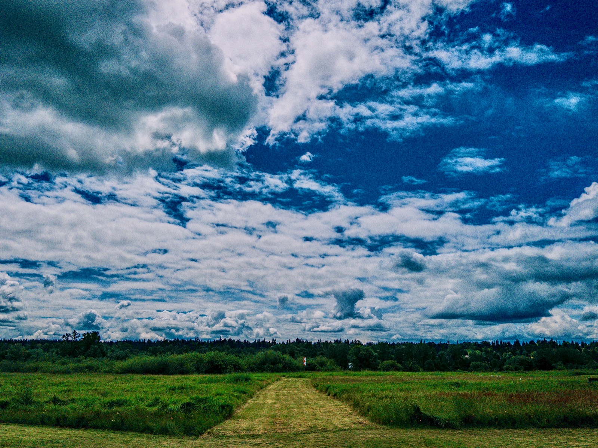
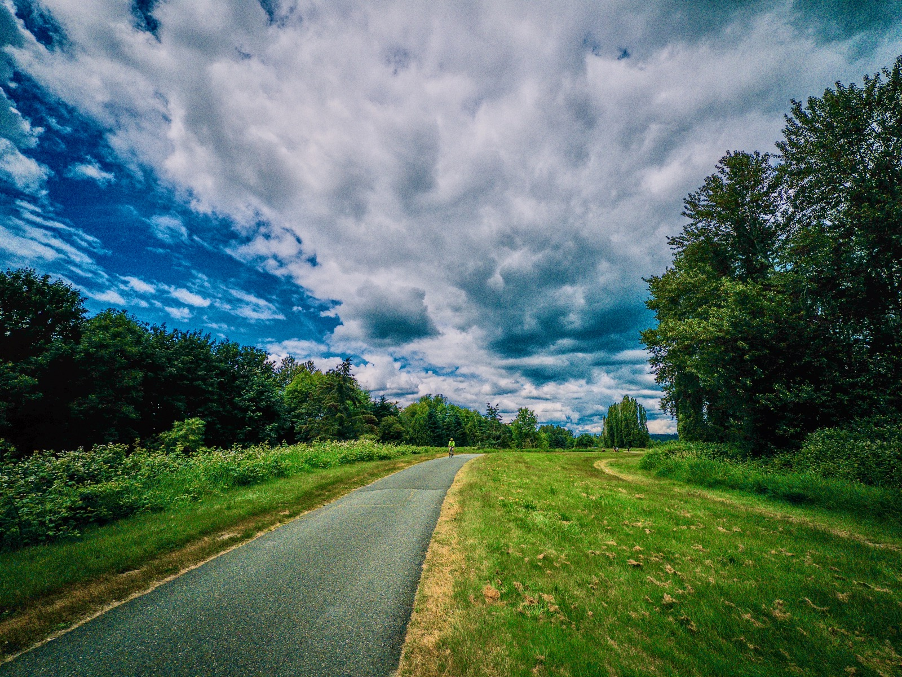
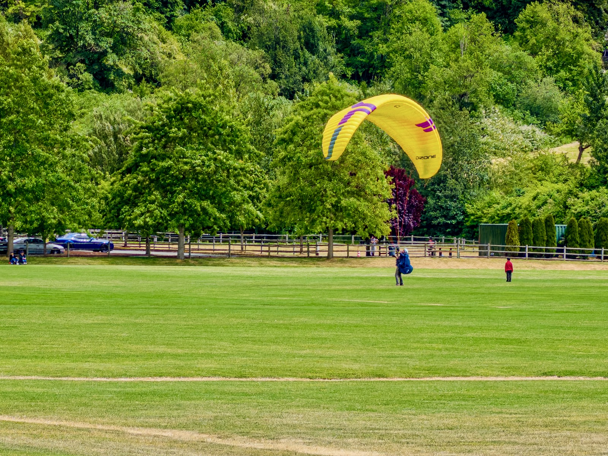
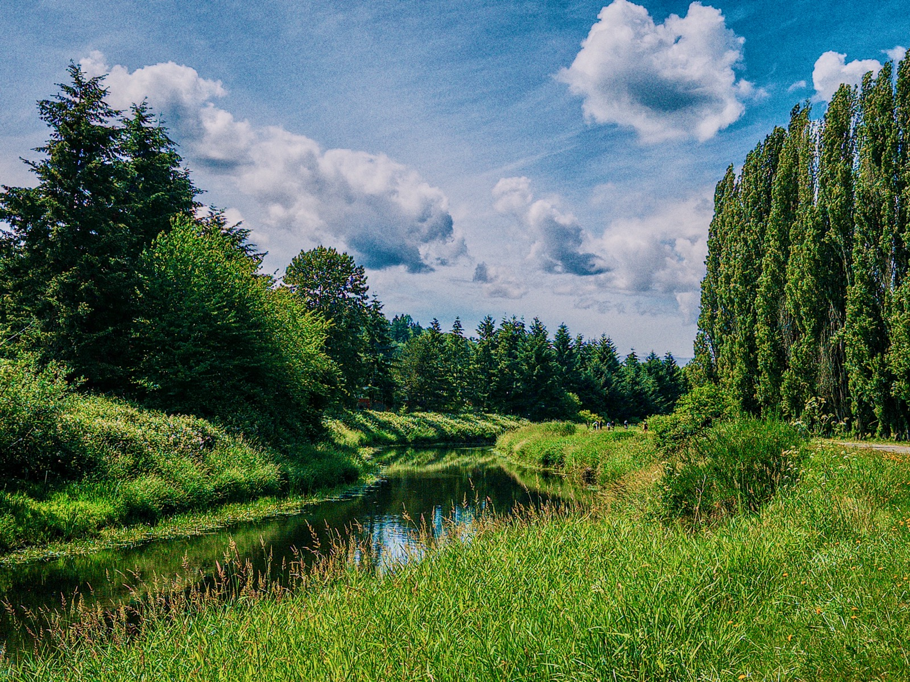
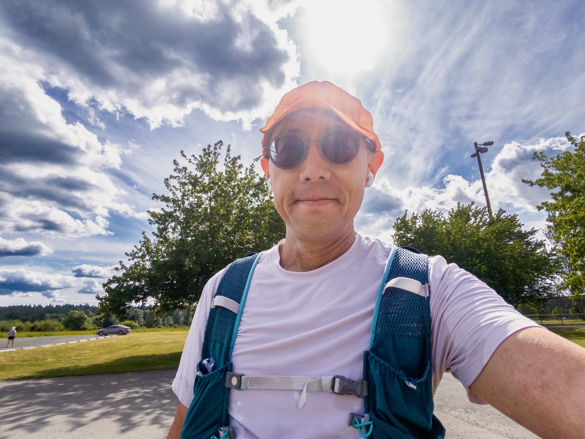
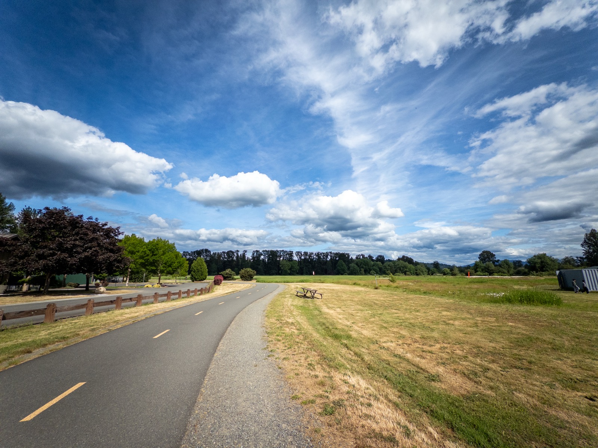
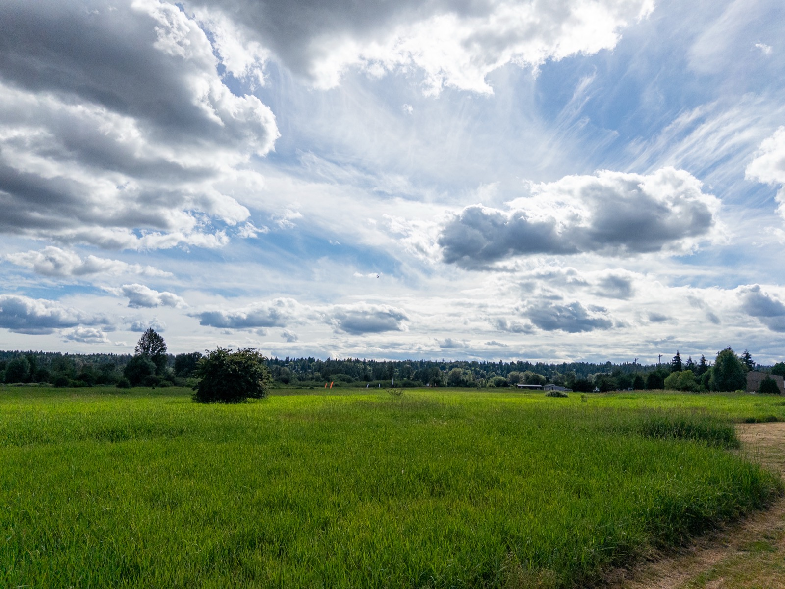
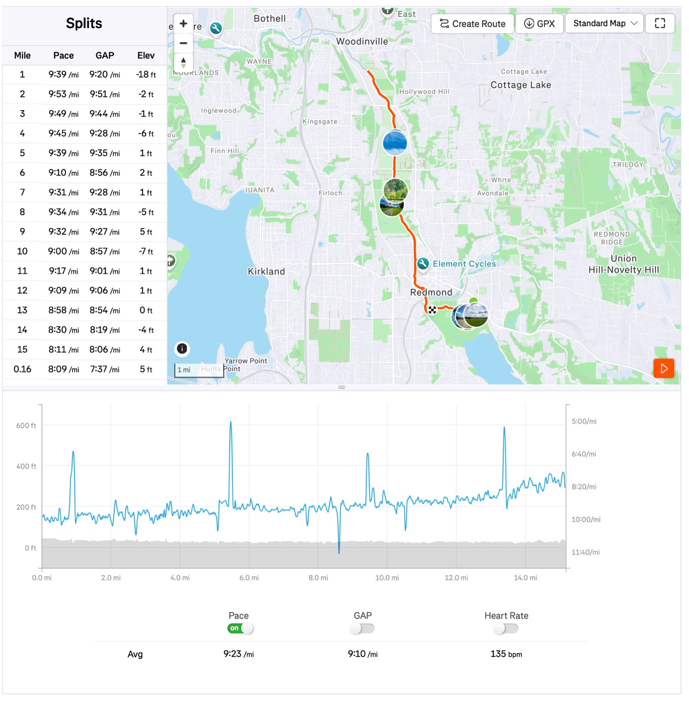

This Long Run Sunday I'm back to a oldie-but-goodie route for my 81st HM: running across Marymoor park and continuing on Sammamish River Trail up north and back. Total distance 15mi, moving time 2:20:55 pace 9'23"/mi.

Weather was super nice: 58F with mild wind 4.7mph SSW. I consumed all of my 12oz electrolyte and two gels. I was in no hurry, just stop and go for photos whenever I felt like it. Avg HR 135bpm.

Towards the end I sped up a little: the last 3 miles were sub-9'.

The entire time I was feasting on a gorgeous light show orchestrated by Mother Nature. I can never get tired of it!

{data-lightbox-src="cover-full.jpeg"}

{data-lightbox-src="image-2-full.jpeg"}

{data-lightbox-src="image-3-full.jpeg"}

{data-lightbox-src="image-4-full.jpeg"}

{data-lightbox-src="image-5-full.jpeg"}

{data-lightbox-src="image-6-full.jpeg"}

{data-lightbox-src="image-7-full.jpeg"}

{data-lightbox-src="image-8-full.jpeg"}

{data-lightbox-src="image-9-full.jpeg"}

{data-lightbox-src="image-10-full.jpeg"}

{data-lightbox-src="image-11-full.jpeg"}

{data-lightbox-src="image-12-full.jpeg"}

---

*Originally posted on [Mastodon](https://sigmoid.social/@BenjaminHan/116712351595144817).*
