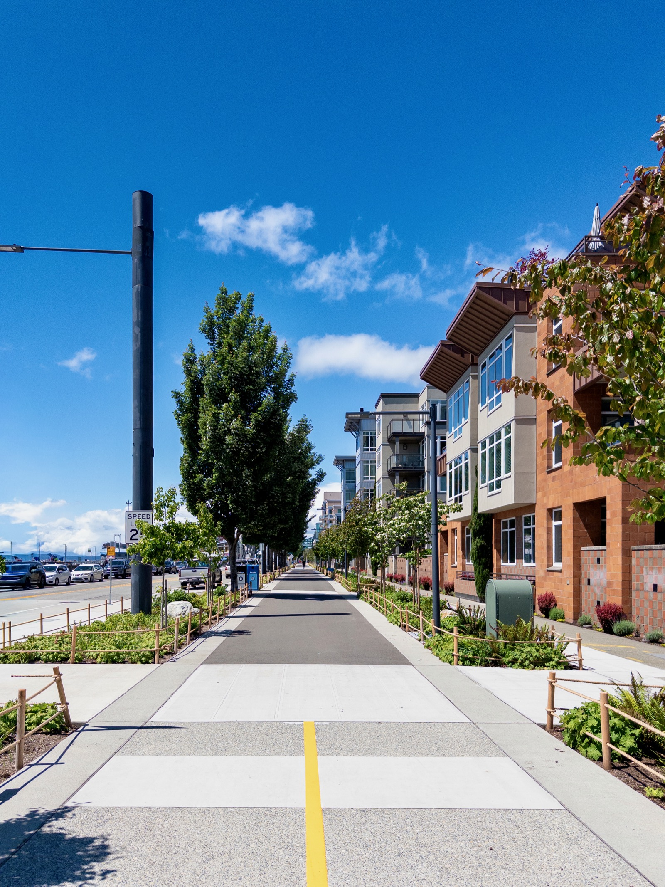
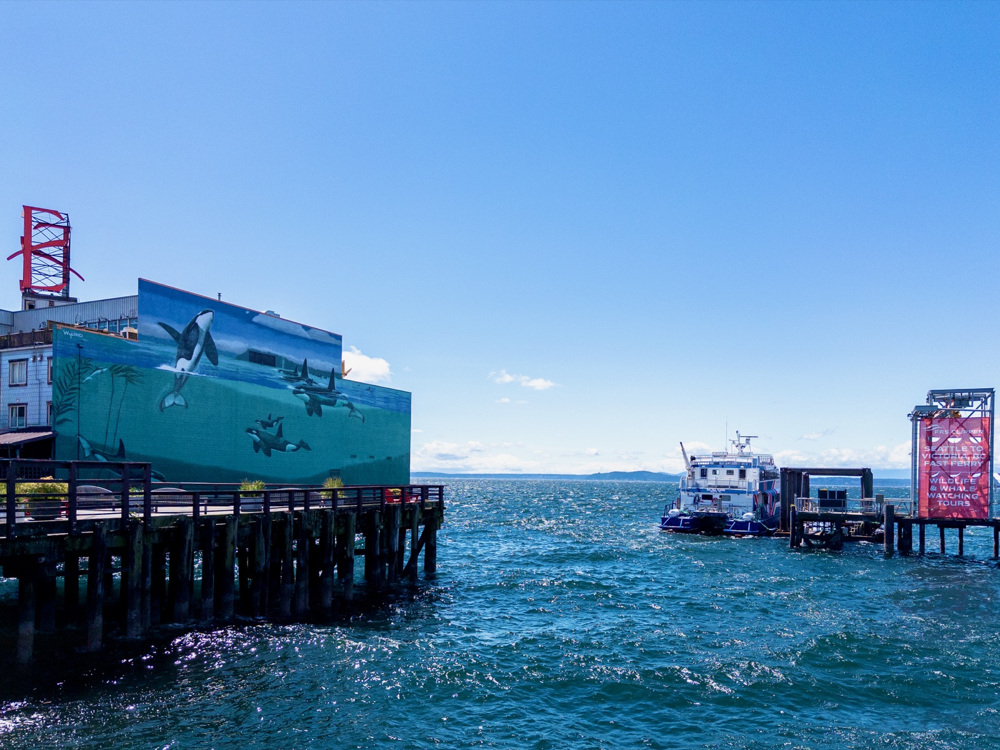
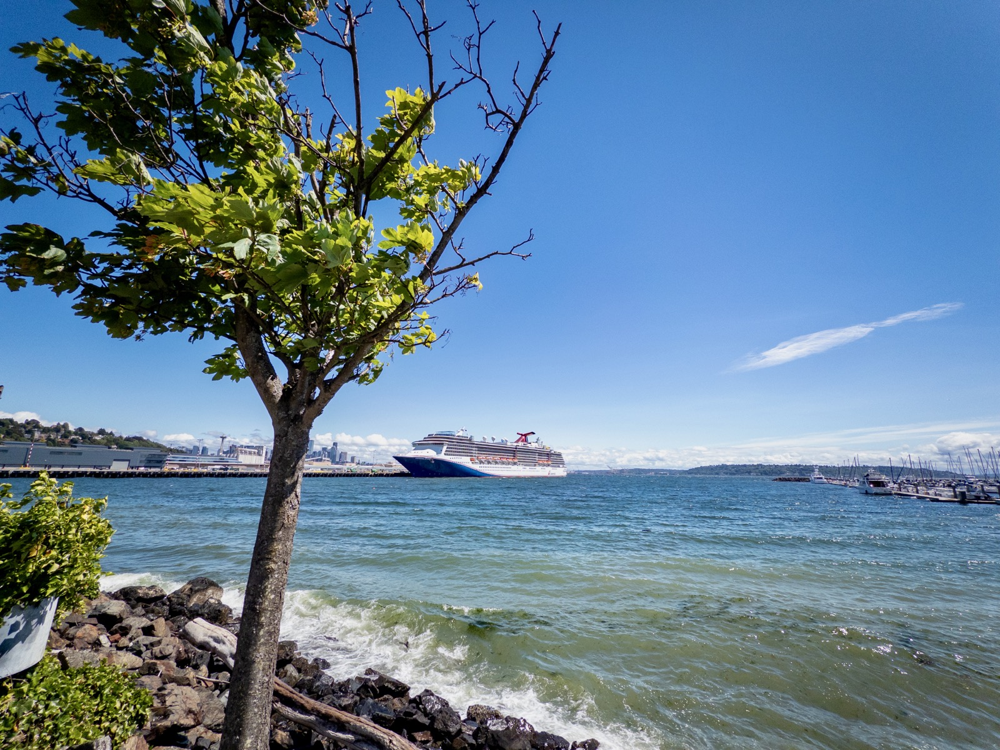
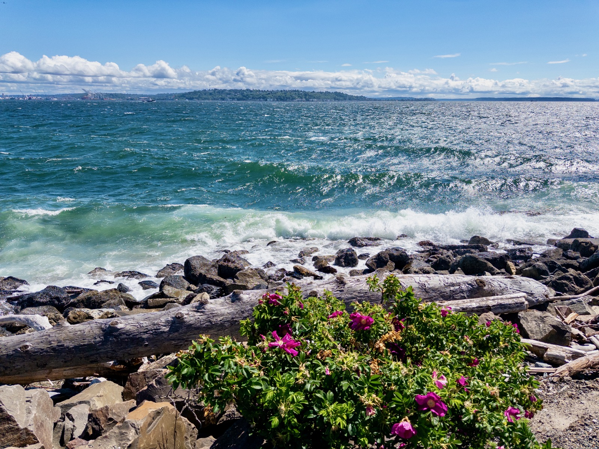
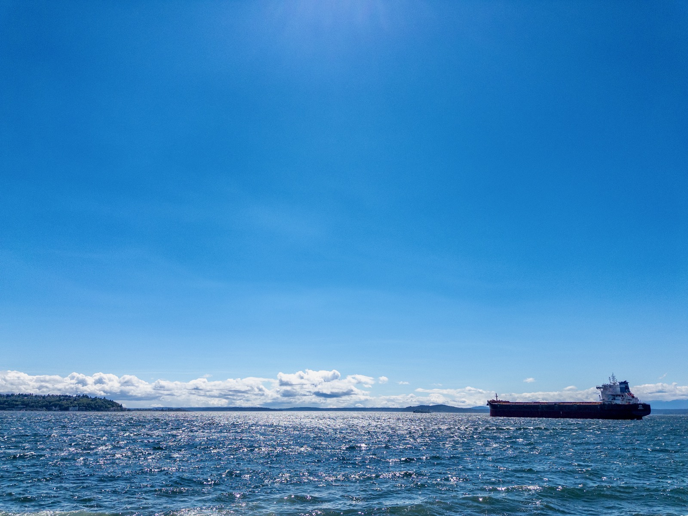
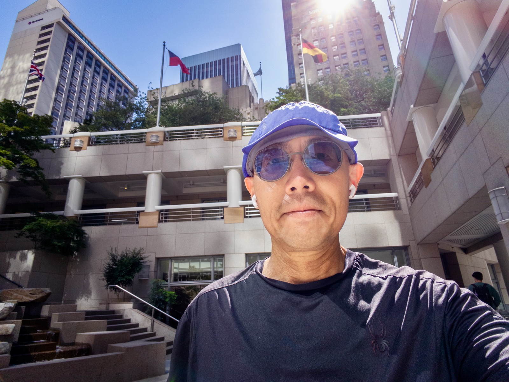
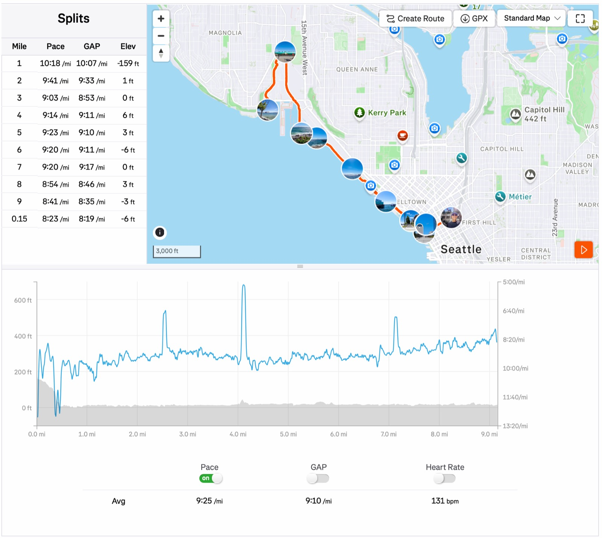

Today's 9mi run on Elliot Bay Trail: time 1:25:13 pace 9'25"/mi.

Last time I ran on Elliott Bay Trail was [when it opened after 15-month construction](/posts/20260424-elliott-bay-trail-run/), but the weather was cloudy and gloomy. Today started even worse: rainy and windy, but by lunch time rain had disappeared and sun came back, so I knew what I needed to do!

Weather was super nice: felt like 56F, sunny with cloud cover, but wind was robust -- 12.5mph SW. At times I was fighting with the wind and felt my inner-ear pressure was off balance between the right and the left ear (wind blew in one but not the other)!

I sped up a little bit in the last 2mi, otherwise it was EZ. This approaches the longest distance I usually run w/o water. We'll see!

{data-lightbox-src="cover-full.jpeg"}

{data-lightbox-src="image-2-full.jpeg"}

{data-lightbox-src="image-3-full.jpeg"}

{data-lightbox-src="image-4-full.jpeg"}

{data-lightbox-src="image-5-full.jpeg"}

{data-lightbox-src="image-6-full.jpeg"}

{data-lightbox-src="image-7-full.jpeg"}

{data-lightbox-src="image-8-full.jpeg"}

{data-lightbox-src="image-9-full.jpeg"}

{data-lightbox-src="image-10-full.jpeg"}

{data-lightbox-src="image-11-full.jpeg"}

{data-lightbox-src="image-12-full.jpeg"}

*Originally posted on [Mastodon](https://sigmoid.social/@BenjaminHan/116724116158259618).*
