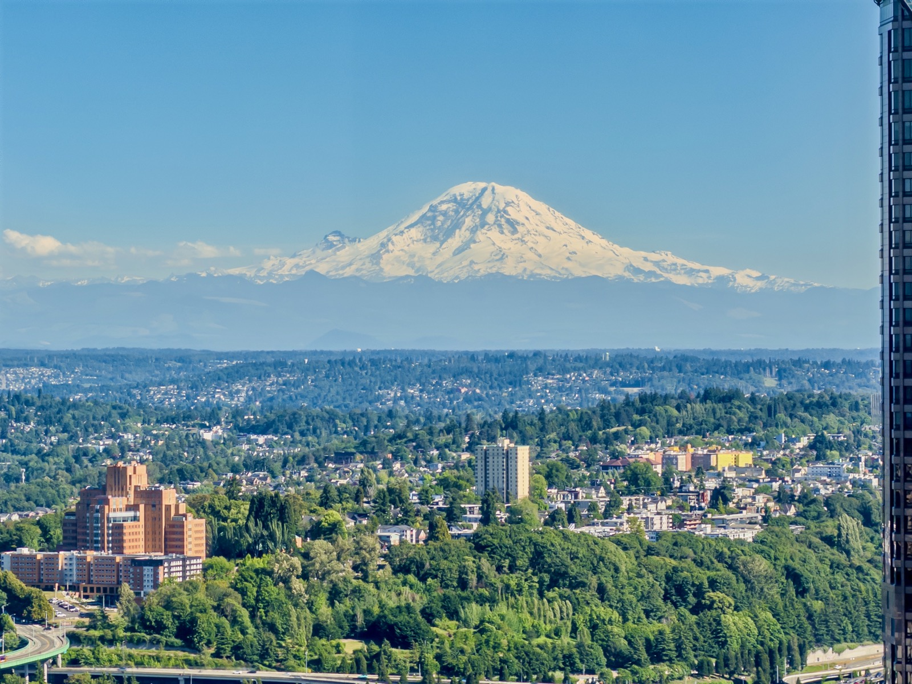
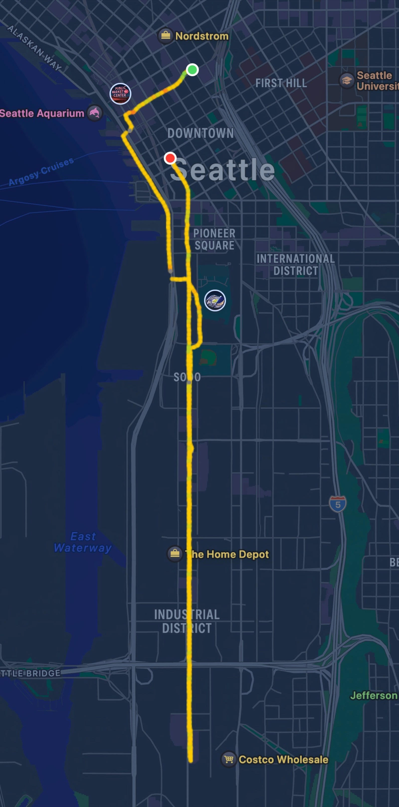
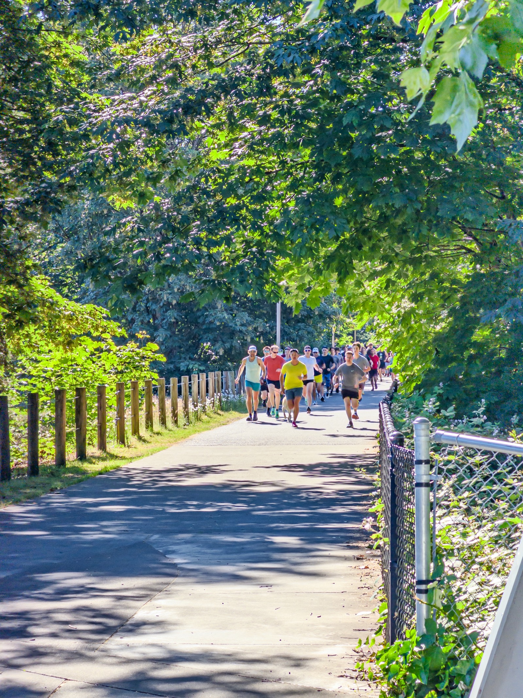

Last week's parkrun.

{data-lightbox-src="image-1-full.jpeg"}

{data-lightbox-src="image-2-full.jpeg"}

This week's parkrun is a long story: two days ago I wanted to explore the south side of Seattle. As I just started running into the industrial district, I tripped over on the sidewalk. This is the first time I fell w/o any anticipation - I was in a zone and only realized I fell after I hit the ground! With bloody knees I still managed to finish 6.4mi.

But my swollen knees today prevented me from running -- so I only walked 5K. 😢

I shall come back tomorrow for Long Run Sunday!

{data-lightbox-src="image-3-full.jpeg"}

{data-lightbox-src="image-4-full.jpeg"}

{data-lightbox-src="image-5-full.jpeg"}

---

*Originally posted on [Mastodon](https://sigmoid.social/@BenjaminHan/116744108043167053).*
