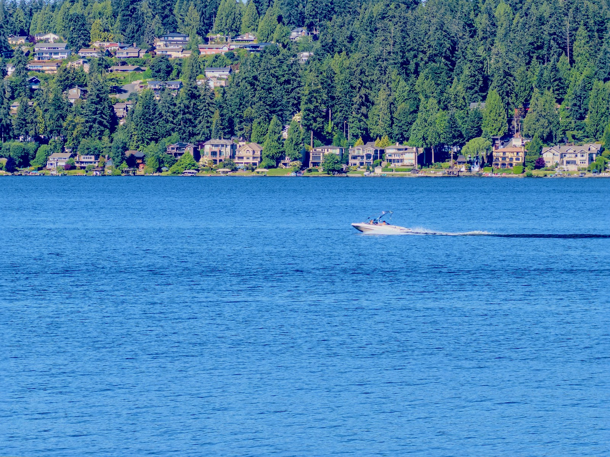
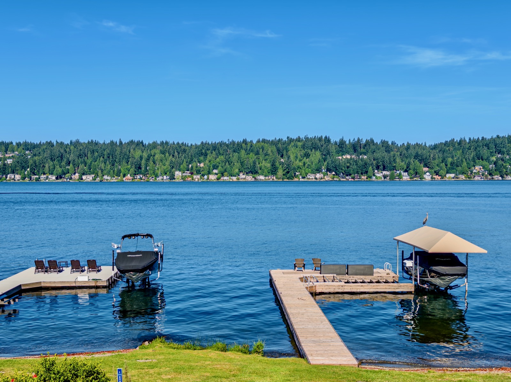
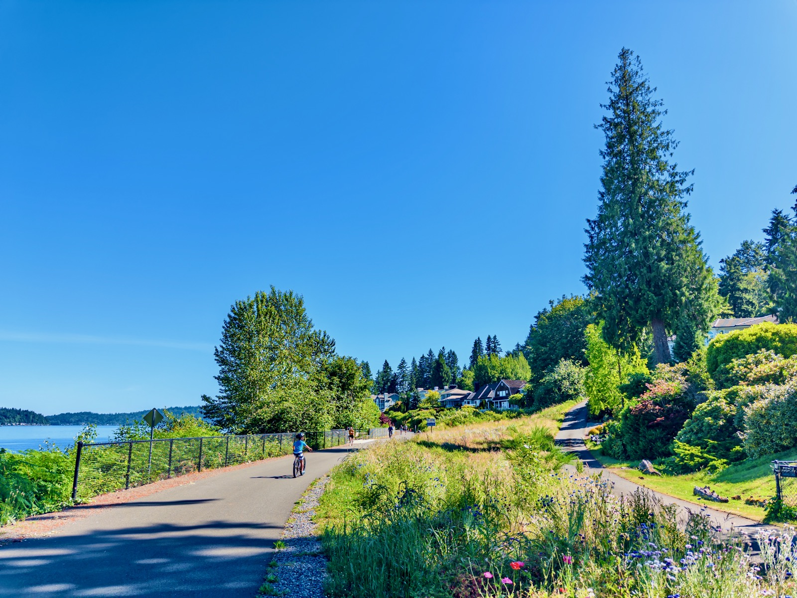
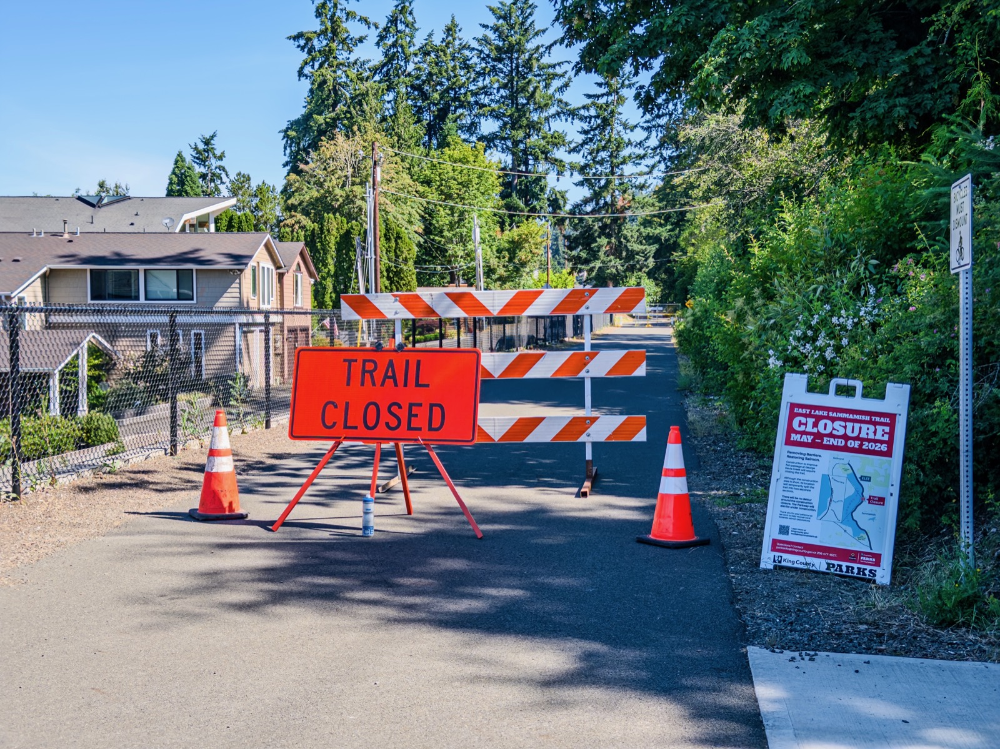
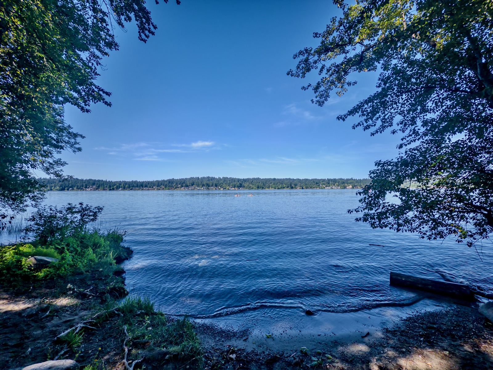
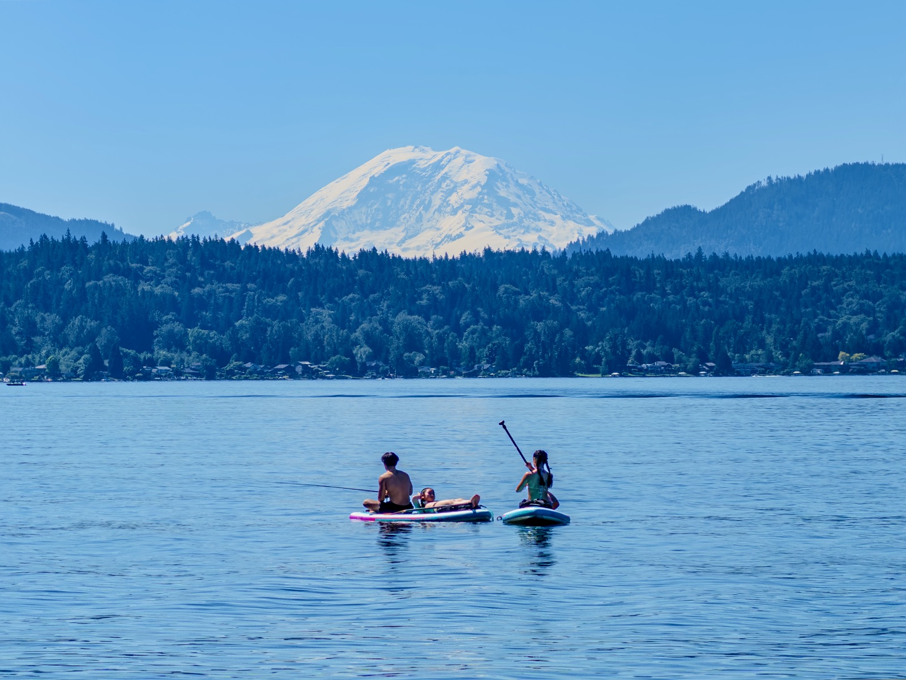
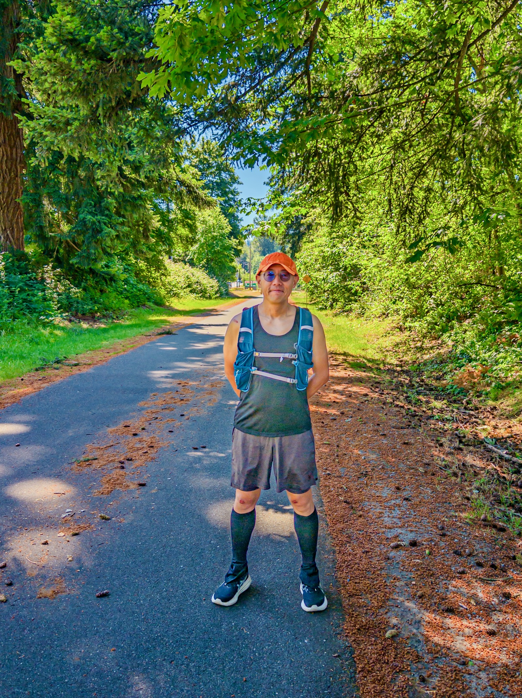
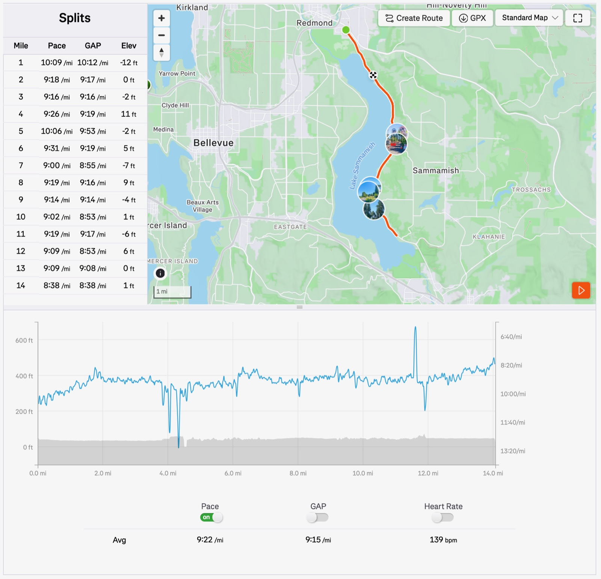

This Long Run Sunday I ran my 82nd HM on East Sammamish Lake Trail: distance 14mi, moving time 2:11:12, pace 9'22"/mi.

There's a heat advisory and by the time I finished it felt like 80F. And no wind (0.2mph). I brought my usual 8oz eletrolyte and 2 gels and consumed them all.

(but I should feel lucky because much of the world is suffering from even higher temperature)

There was a trail closure at 3.9mi and I had to detour to road for .5mi and came back.

My swollen knees from [the fall 2 days ago](/posts/20260613-a-fall-on-seattles-south-side/) are *mostly* gone, and the wounds are "mostly" dried -- that's why I decided to give it a go. Turned out it went pretty well: my avg/max HR was 139/155bpm (sped up a bit in the last mile), and VO2max is now 51.2.

We'll see how I feel tomorrow morning. 😛

{data-lightbox-src="image-1-full.jpeg"}

{data-lightbox-src="image-2-full.jpeg"}

{data-lightbox-src="image-3-full.jpeg"}

{data-lightbox-src="image-4-full.jpeg"}

{data-lightbox-src="image-5-full.jpeg"}

{data-lightbox-src="image-6-full.jpeg"}

{data-lightbox-src="image-7-full.jpeg"}

{data-lightbox-src="image-8-full.jpeg"}

---

*Originally posted on [Mastodon](https://sigmoid.social/@BenjaminHan/116750625182400958).*
