This Long Run Sunday I ran an accidental HM, and it was my 84th!

My goal was to just run 10mi, because I already ran [~14mi two days ago to Alki beach](/posts/20260619-juneteenth-run-lincoln-park/), and 7mi yesterday including my 103rd parkrun. Plan was simple: 4mi run to a nearby McDonald's to get my ice cream and iced coffee fix, and then wander around until I hit 10mi!

But what do you know, runners? Next moment you realize you're deep in the woods, and the weather and the world were just too wonderful to stop! I ended up running into Redmond Watershed Preserve, which I'd never properly run through before. So this time I did!

All told, the damage done was 14.40mi with moving time 2:28:23 pace 10'18"/mi, and EG 1,269ft! And I closed this week with the highest weekly mileage and EG year-to-date: 69.45mi and 3,793ft!

But who cares — those beautiful sights are part of my happy memories now! 🙂

Oh and happy summer and happy father's day!

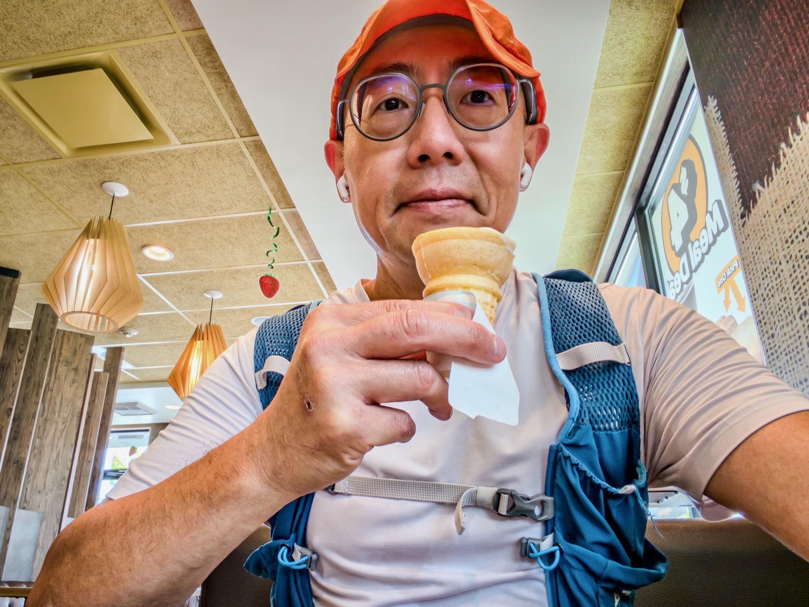{data-lightbox-src="cover-full.jpeg"}

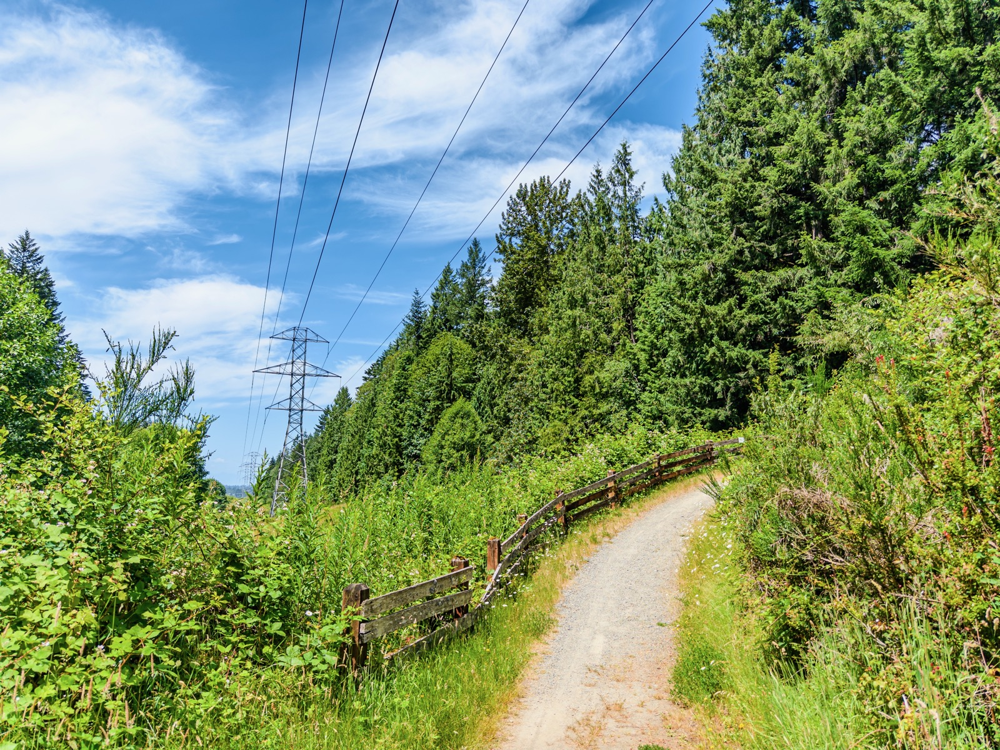{data-lightbox-src="image-2-full.jpeg"}

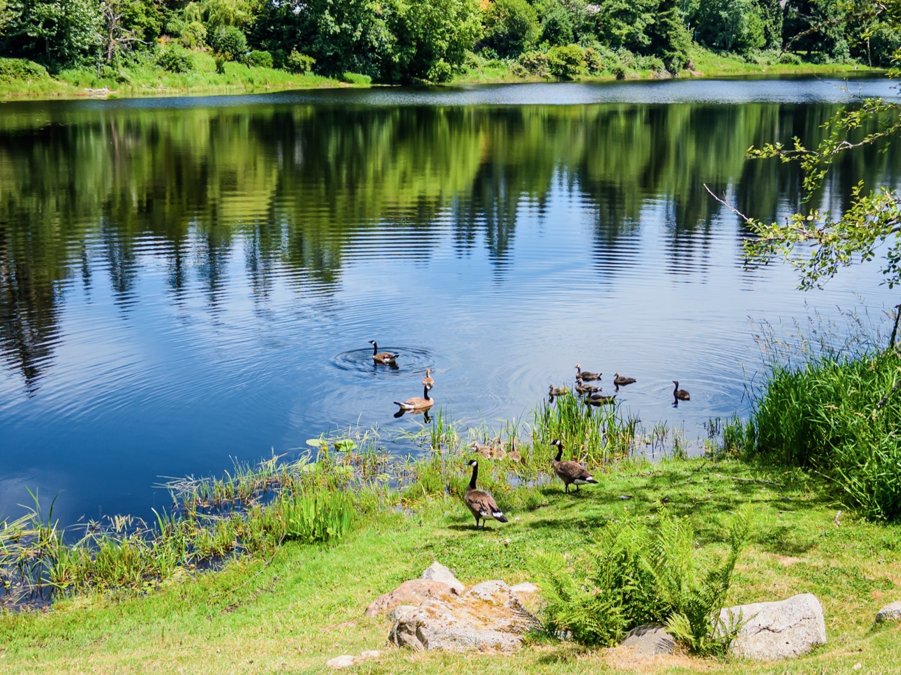{data-lightbox-src="image-3-full.jpeg"}

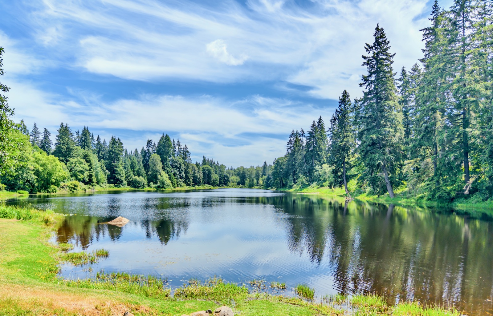{data-lightbox-src="image-4-full.jpeg"}

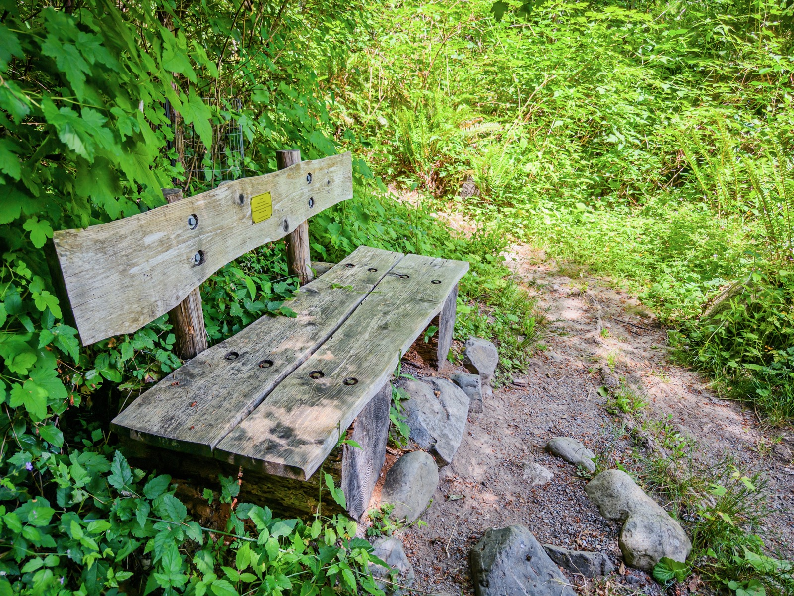{data-lightbox-src="image-5-full.jpeg"}

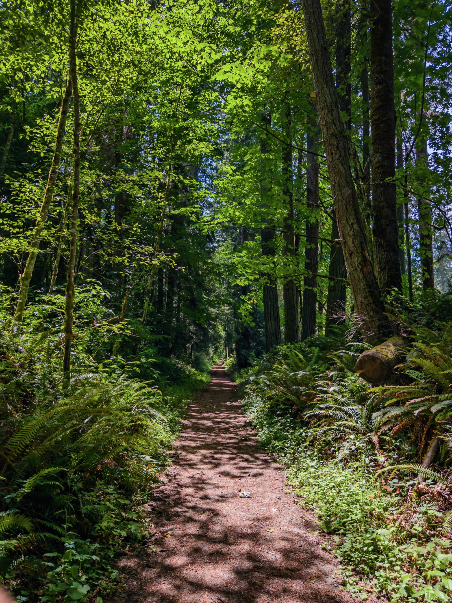{data-lightbox-src="image-6-full.jpeg"}

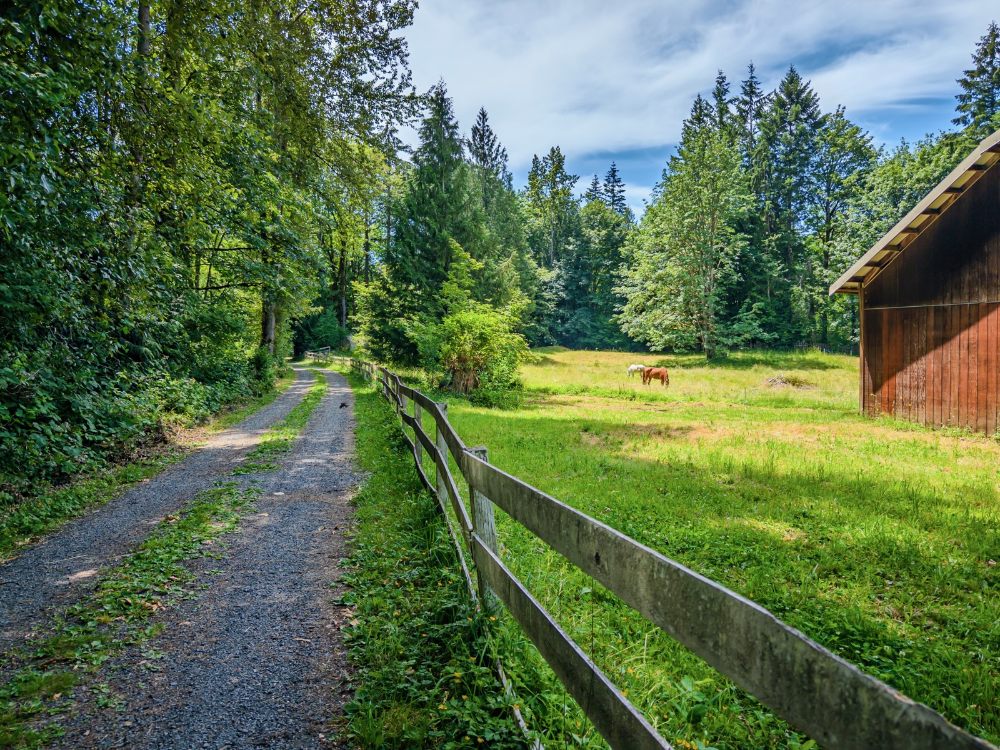{data-lightbox-src="image-7-full.jpeg"}

{data-lightbox-src="image-8-full.jpeg"}

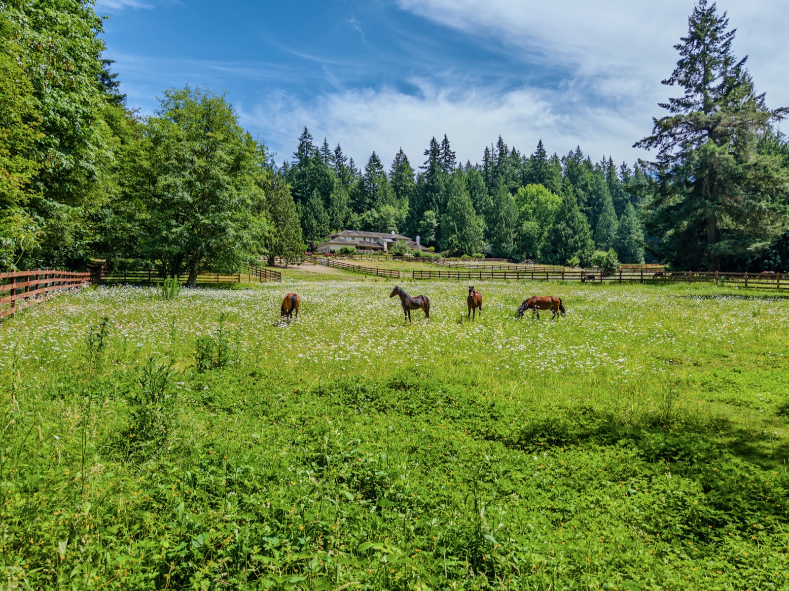{data-lightbox-src="image-9-full.jpeg"}

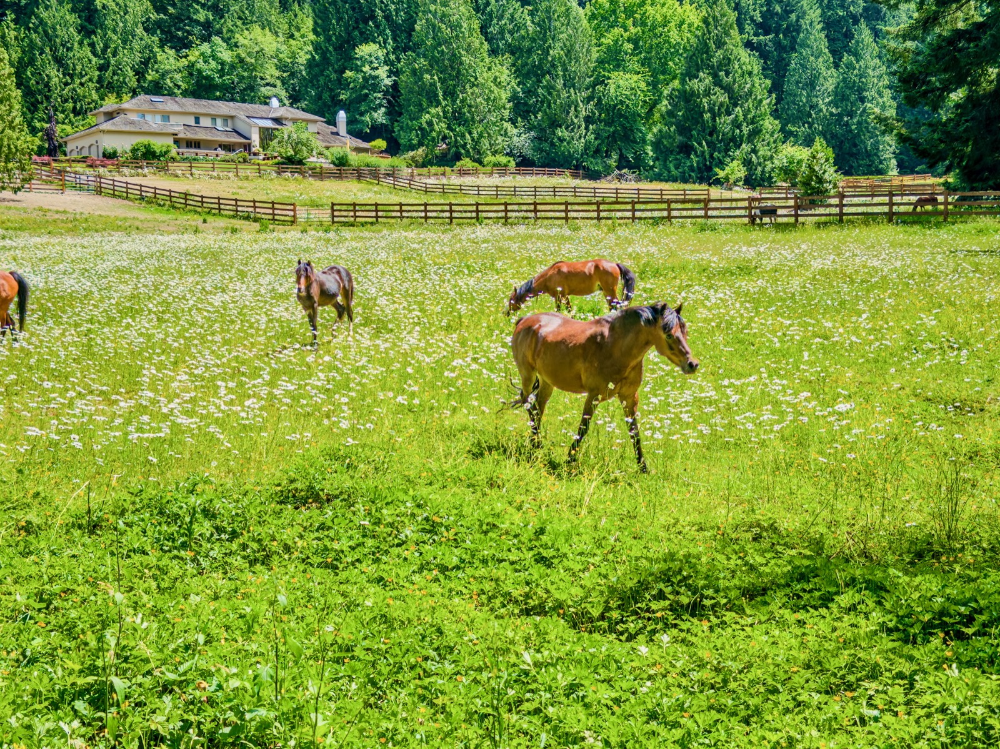{data-lightbox-src="image-10-full.jpeg"}

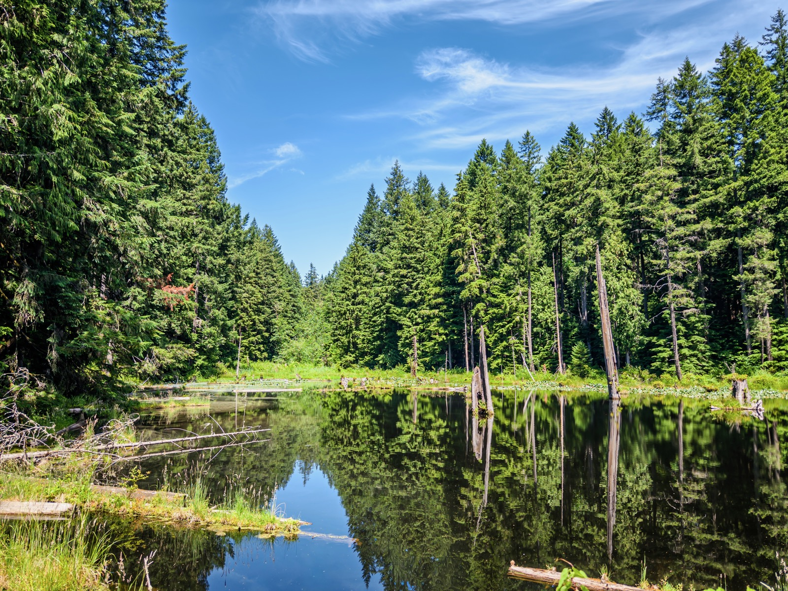{data-lightbox-src="image-11-full.jpeg"}

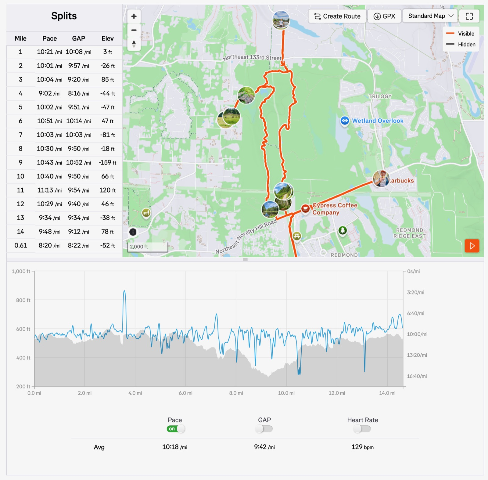{data-lightbox-src="image-12-full.jpeg"}

---

*Originally posted on [Mastodon](https://sigmoid.social/@BenjaminHan/116791316042045275).*
