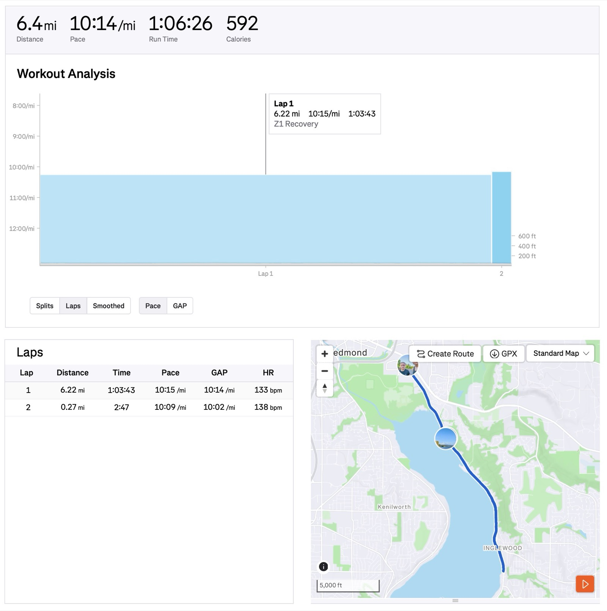
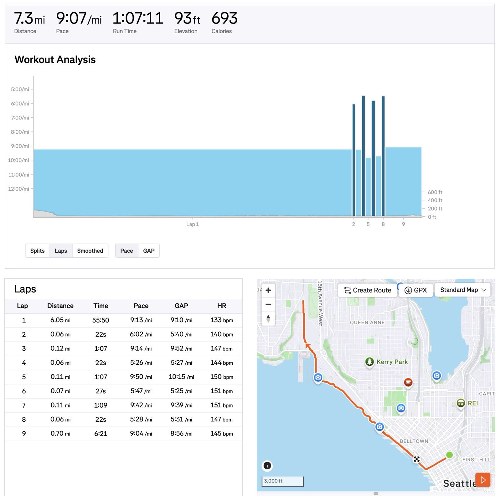

I finally got data to back it up on temperature's effect to my running efficiency:

- Yesterday 89F: 6.22mi pace 10’15"/mi w/ avg HR 133bpm
- Today 61F: 6.05mi pace 9’13”/mi w/ avg HR 133bpm (same)

So 28F increase cost 1’02"/mi pace w/ HR constant! Both routes are equally flat (East Sammamish Lake Trail vs Elliott Bay Trail).

For today's run I even did 4x20s strides clocking max 5’26”/mi!

Photos were yesterday's run and today in office.

{data-lightbox-src="cover-full.jpeg"}

{data-lightbox-src="image-2-full.jpeg"}

{data-lightbox-src="image-3-full.jpeg"}

{data-lightbox-src="image-4-full.jpeg"}

---

*Originally posted on [Mastodon](https://sigmoid.social/@BenjaminHan/116814180367516991).*
