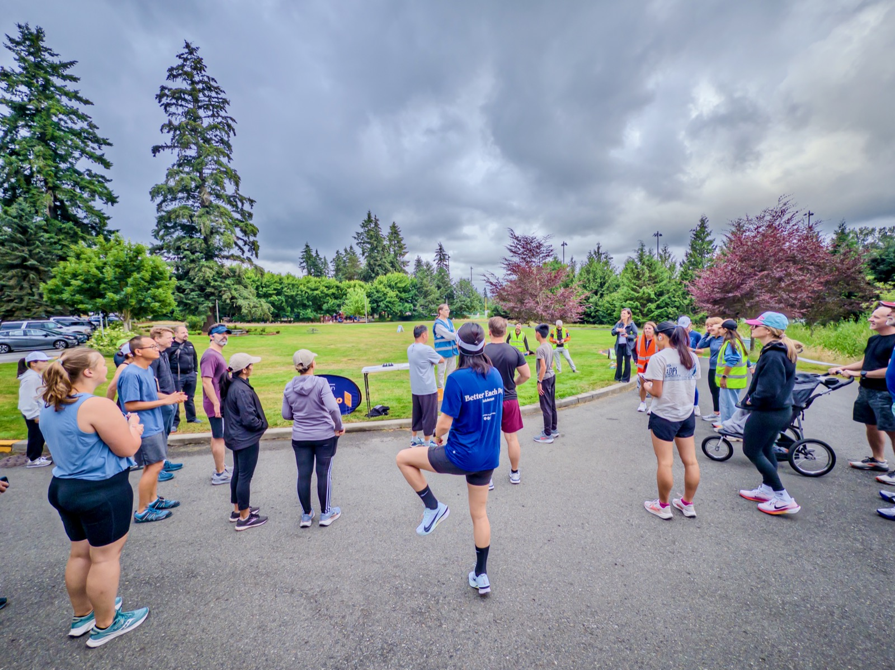
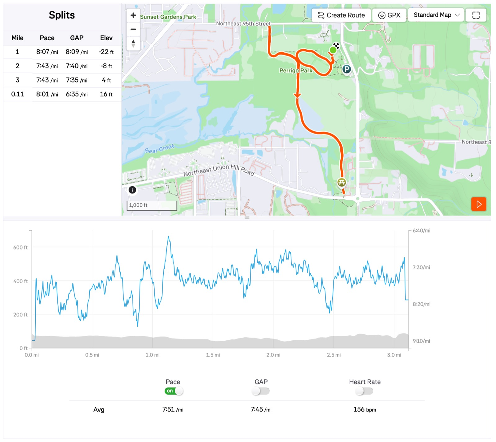

Finally getting pace back to sub-8'/mi in today's parkrun: 7’51”/mi (official time 24:25). Fastest in 2026 but still a way to go to regain my 21:05 PR!

(my hope is to get back to under 22 min before end of this year)

{data-lightbox-src="image-1-full.jpeg"}

{data-lightbox-src="image-2-full.jpeg"}

---

*Originally posted on [Mastodon](https://sigmoid.social/@BenjaminHan/116824634727309411).*
