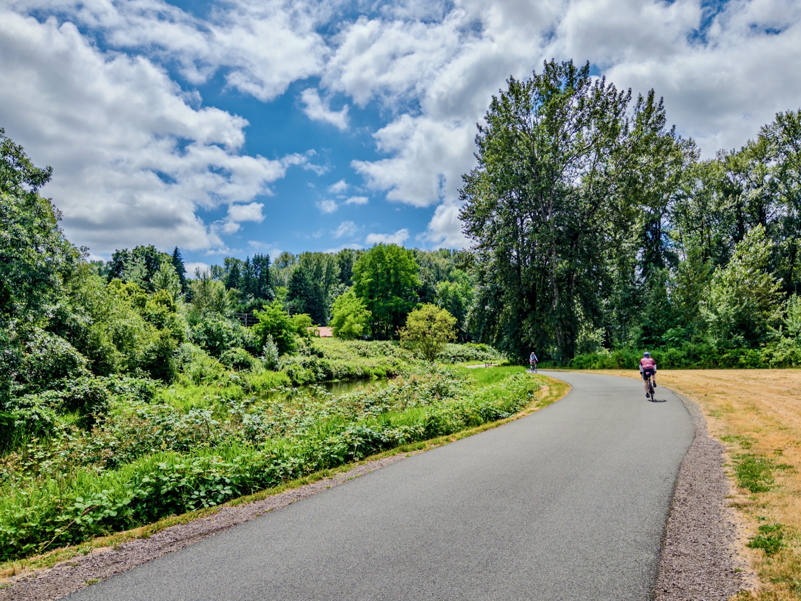
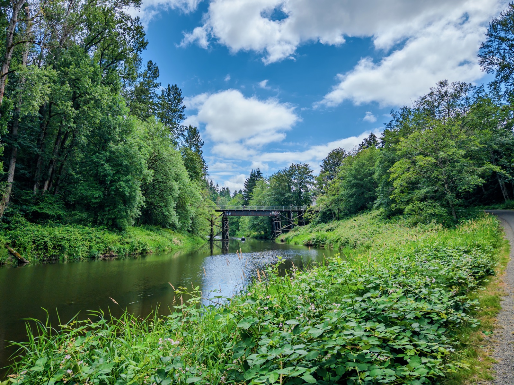
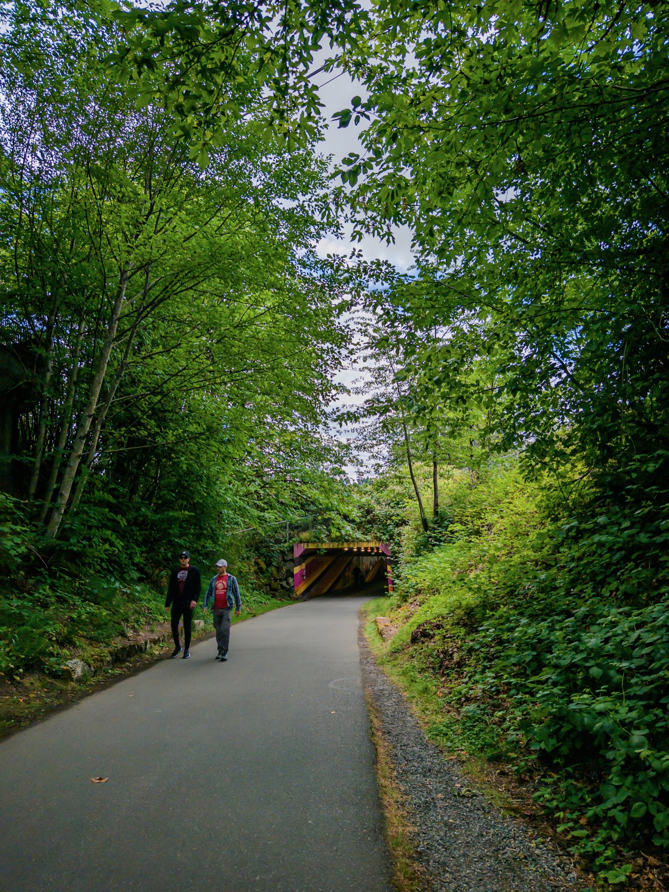
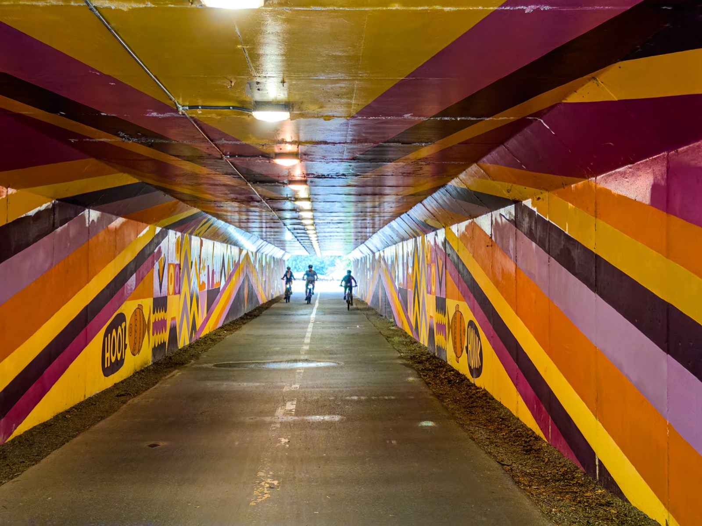
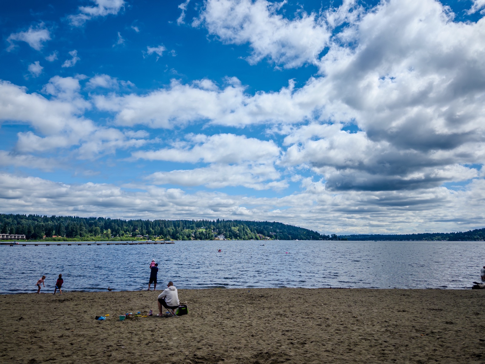
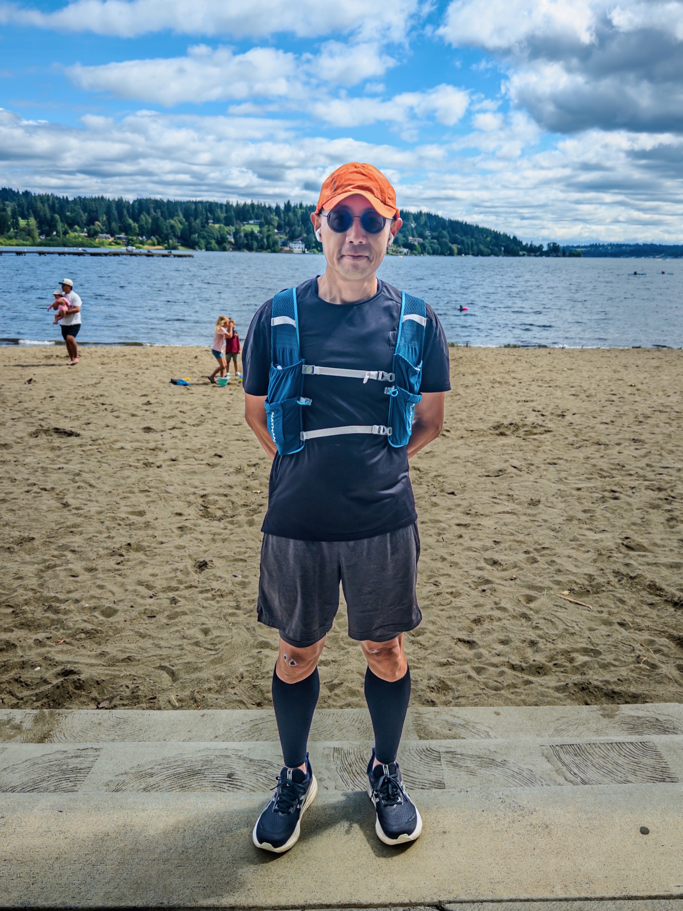
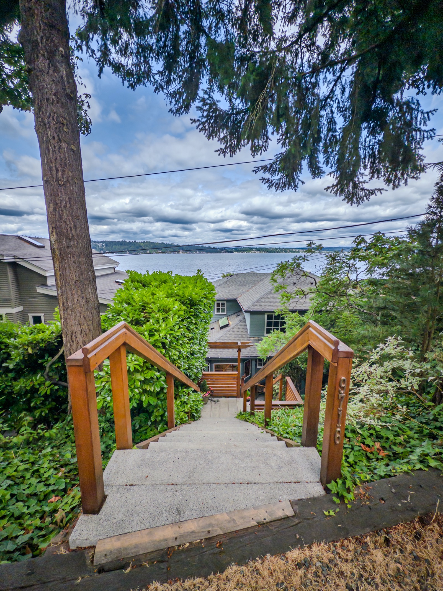
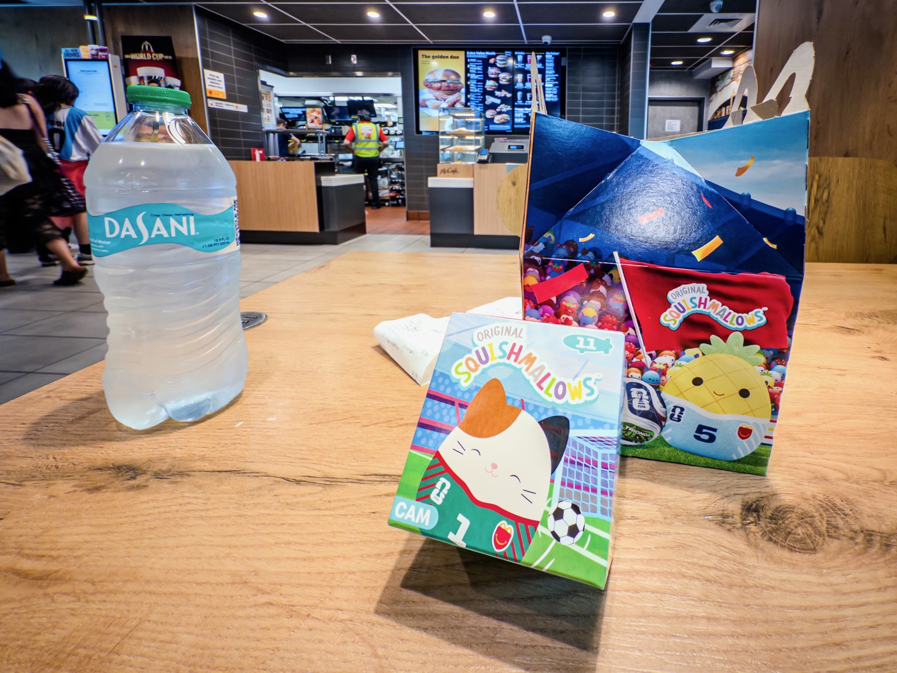
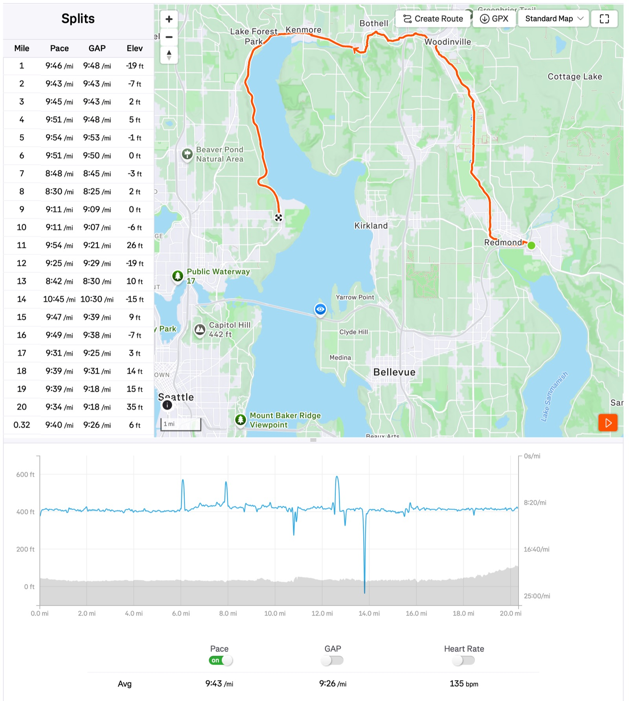

This Long Run Sunday I started extending my range to 20mi, running from [Marymoor Light Rail Station](https://www.soundtransit.org/ride-with-us/stations/downtown-redmond-station) in Redmond to somewhere near [UW](https://en.wikipedia.org/wiki/University_of_Washington)! My moving time was 3:14:21 pace 9'43"/mi.

I stopped at 12mi mark at McDonald's to get my usual — iced coffee and apple pie. I also stopped at random places for photo. Weather was 59F with clouds, wind ~4mph. Super nice weather!

I used to run 20+mi every Long Run Sunday. But since multiple running accidents early this year I haven't done much. My plan is to get the regular rhythm back before September race season: I have one HM and 2 marathon races lining up all the way to November!

I stopped at another McDonald's near UW -- this time was to get a Happy Meal toy for my daughter. Too bad I couldn't get the strawberry cat she wants. Then it's light rail all the way back where I started!

{data-lightbox-src="image-1-full.jpeg"}

{data-lightbox-src="image-2-full.jpeg"}

{data-lightbox-src="image-3-full.jpeg"}

{data-lightbox-src="image-4-full.jpeg"}

{data-lightbox-src="image-5-full.jpeg"}

{data-lightbox-src="image-6-full.jpeg"}

{data-lightbox-src="image-7-full.jpeg"}

{data-lightbox-src="image-8-full.jpeg"}

{data-lightbox-src="image-9-full.jpeg"}

{data-lightbox-src="image-10-full.jpeg"}

{data-lightbox-src="image-11-full.jpeg"}

{data-lightbox-src="image-12-full.jpeg"}

---

*Originally posted on [Mastodon](https://sigmoid.social/@BenjaminHan/116831936536187637).*
