Tomorrow is a holiday, so I decided to take a longer route in my lunch run today: total distance 12.36mi, EG 739ft, moving time 2:04:21 pace 10'03"/mi.

I basically connected several usual office-run routes into one:

1. Run west to Waterfront park
2. Turn north on Elliott Bay Trail
3. Cross Interbay to east
4. Run across North Queen Anne
5. Cross Fremont Bridge
6. Run around north and east Lake Union
7. Return on 6th Ave

North Queen Anne was the most challenging part, but I love running through the nooks and crannies of all the little places!

Weather was actually cool: felt like 54F with wind 8.1mpg S. Toward the end there was some drizzle -- just enough to make sure runners are cooled properly! Love the weather!

Today I didn't put on compression socks as I usually do when running, and the effect of w/ and w/o sun exposure is quite dramatic! 🙂

A good run to wrap up the week!

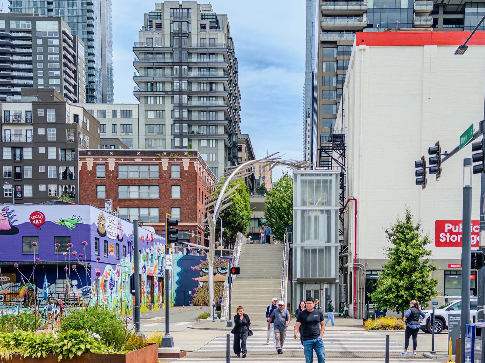{data-lightbox-src="image-1-full.jpeg"}

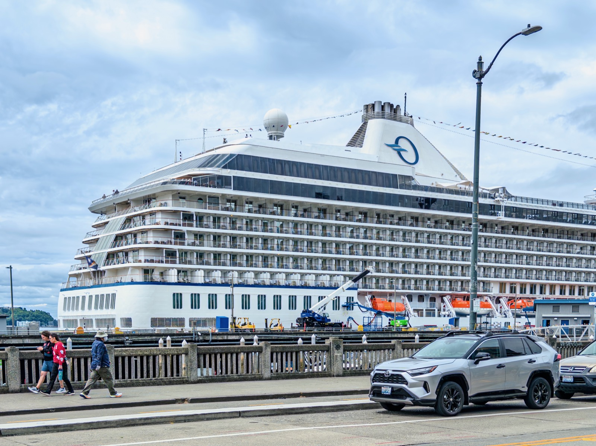{data-lightbox-src="image-2-full.jpeg"}

{data-lightbox-src="image-3-full.jpeg"}

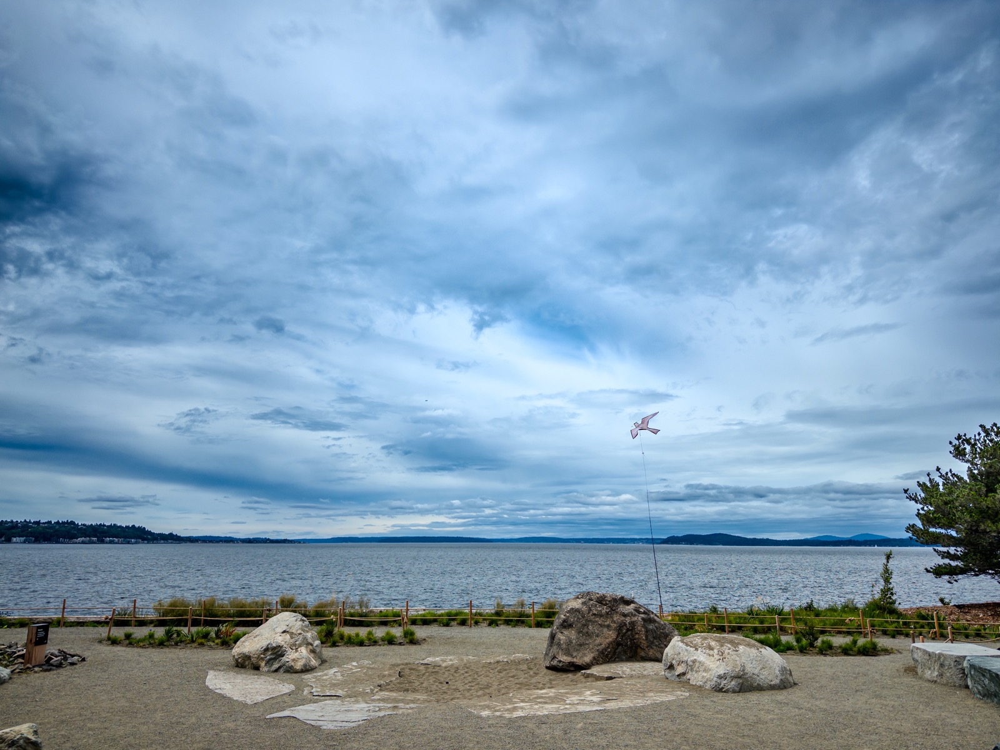{data-lightbox-src="image-4-full.jpeg"}

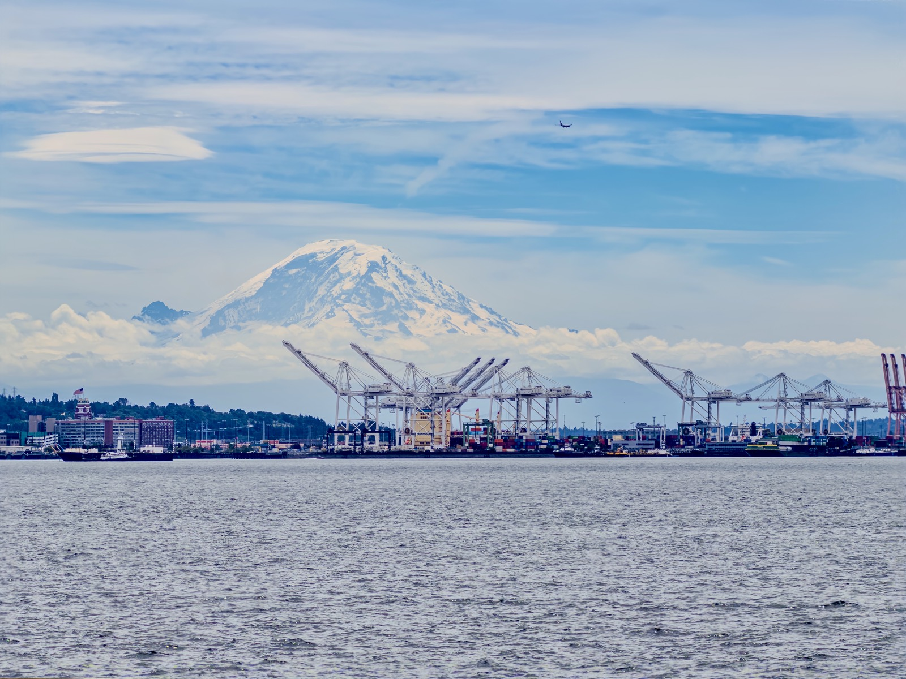{data-lightbox-src="image-5-full.jpeg"}

{data-lightbox-src="image-6-full.jpeg"}

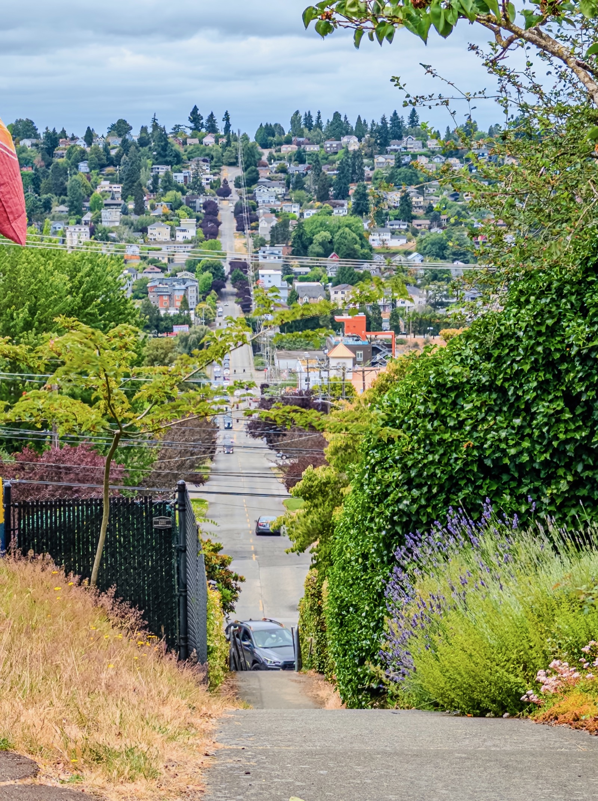{data-lightbox-src="image-7-full.jpeg"}

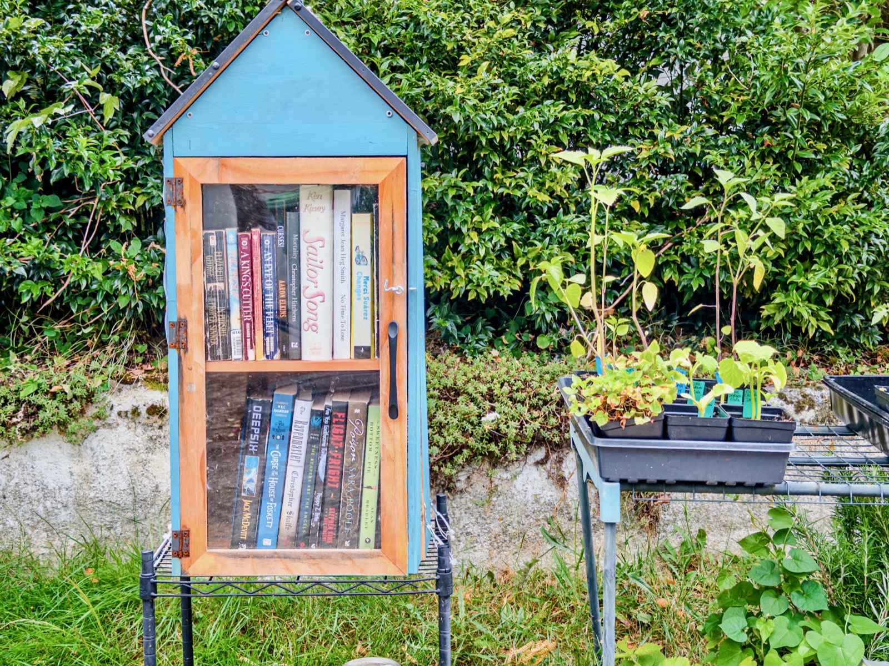{data-lightbox-src="image-8-full.jpeg"}

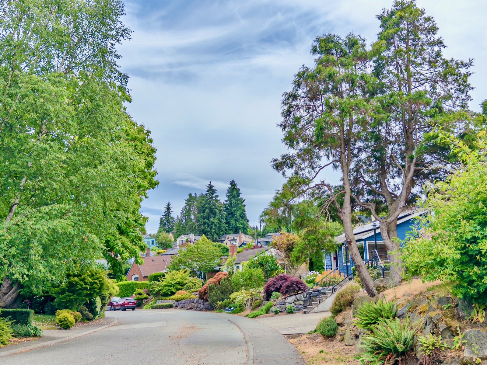{data-lightbox-src="image-9-full.jpeg"}

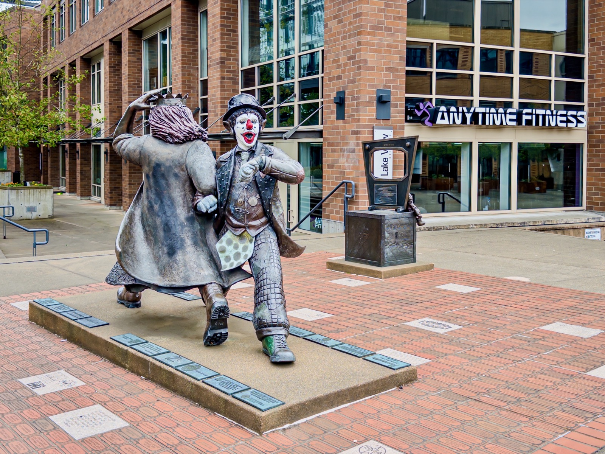{data-lightbox-src="image-10-full.jpeg"}

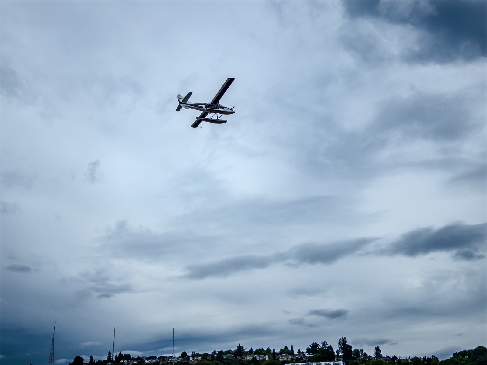{data-lightbox-src="image-11-full.jpeg"}

{data-lightbox-src="image-12-full.jpeg"}

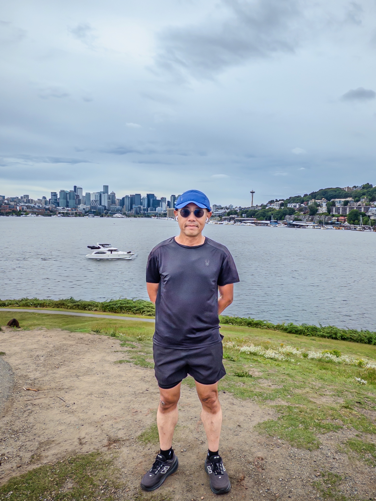{data-lightbox-src="image-13-full.jpeg"}

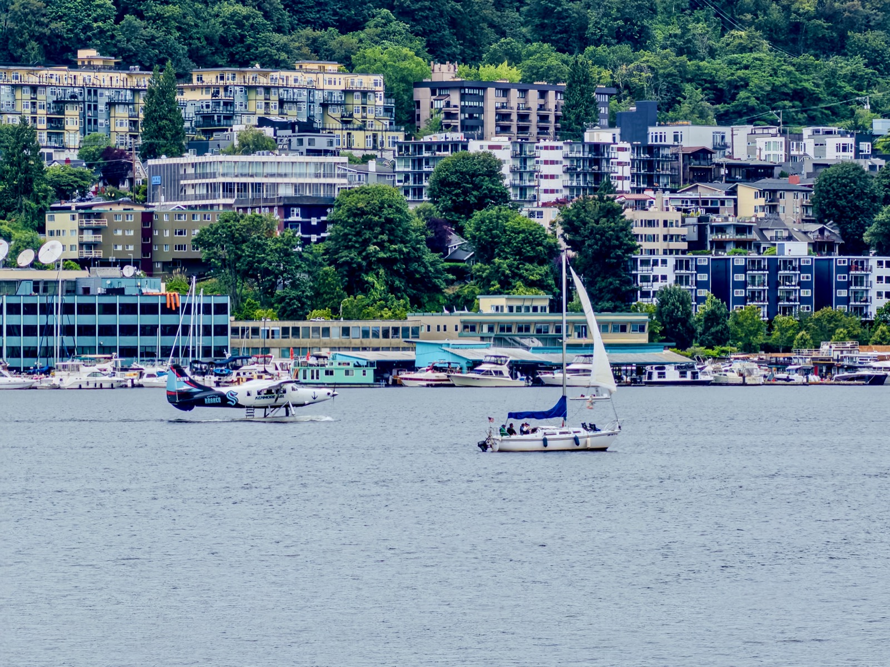{data-lightbox-src="image-14-full.jpeg"}

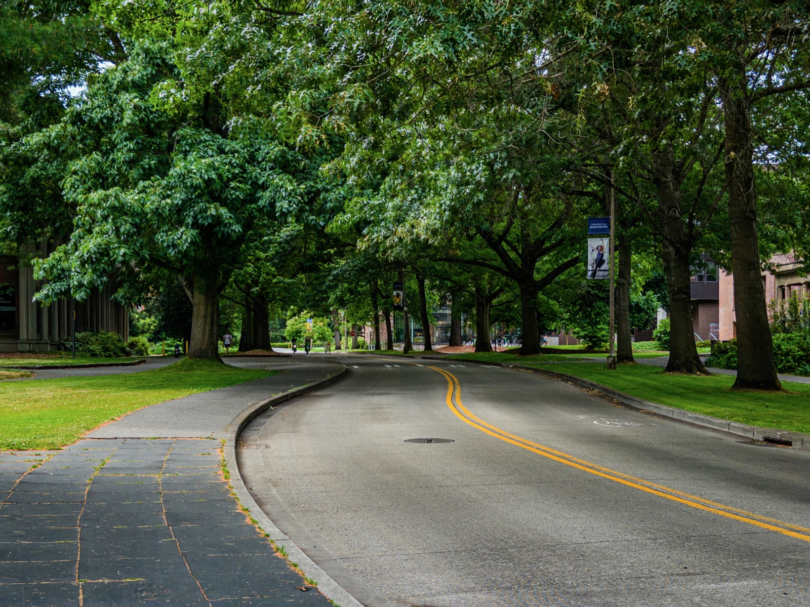{data-lightbox-src="image-15-full.jpeg"}

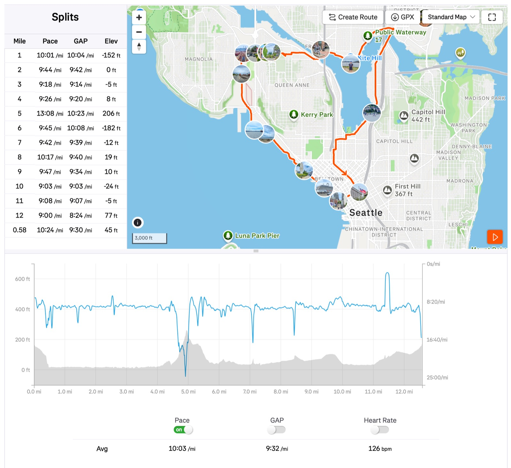{data-lightbox-src="image-16-full.jpeg"}

---

*Originally posted on [Mastodon](https://sigmoid.social/@BenjaminHan/116854235824320617).*
