🏃🏻‍♂️‍➡️ [WARNING: running] June recap: my biggest month of the year! 194.6 → 277.6mi, EG 7,057 → 12,328ft, time 35.5 → 50.2hrs. 📈

After a rough April and a rebuilding May, June finally came together. Four steady weeks (63, 58, 70, 71mi), all well over quota, and I capped the month with my first 20-miler of the buildup — everything now officially points at a fall race season! I even survived a full faceplant in Seattle's industrial district (bloody knees, still finished 6.4mi 😅) and bounced right back!

Highlights: 5 half-marathon-or-longer runs (HM #81–84 + that 20-miler), Elliott Bay Trail's opening day, a Juneteenth half running from Waterfront to Lincoln Park to pay my respects (then caught the USMNT's 2–0 World Cup win over Australia — sorry mate ⚽🇺🇸), some easy miles with my daughter, and 3 more parkruns — 104 total now.

And my VO2max recovered from 48.7 → 52.3, approaching my all-time high of 54!

About the decision I promised to make in last month's recap — whether I need to downgrade my 2,500mi yearly goal? I'm keeping it! I'm at 1,161mi — ~89mi behind an even split, but the remaining 1,339mi is just 223/month (~15 over quota). I ran 277 in June, and with marathon season ahead, that's well within reach if I stay healthy. Onward! 💪

📊 Charts: monthly mileage + elevation, HR + VO2max, and my progress toward the 2,500mi yearly goal.\
📸 Photos are the beautiful places I ran last month!

(follow my running at [benjaminhan.net/archive/#category=running](/archive/#category=running))

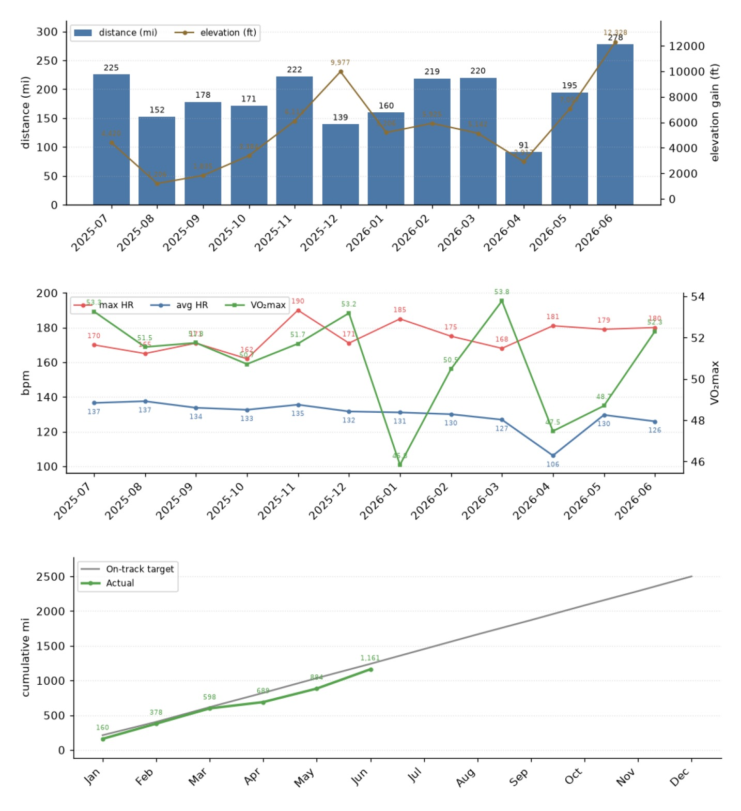{data-lightbox-src="image-1-full.jpeg"}

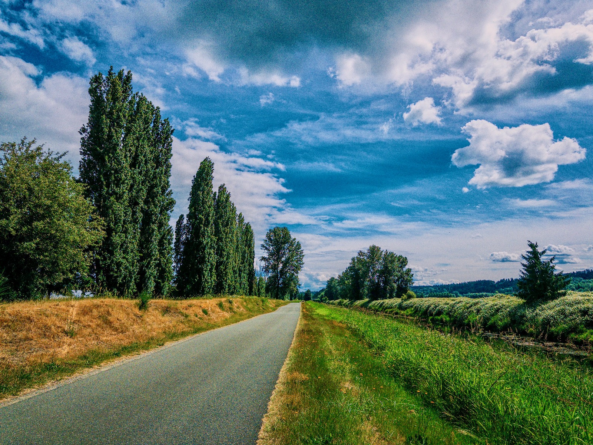{data-lightbox-src="image-2-full.jpeg"}

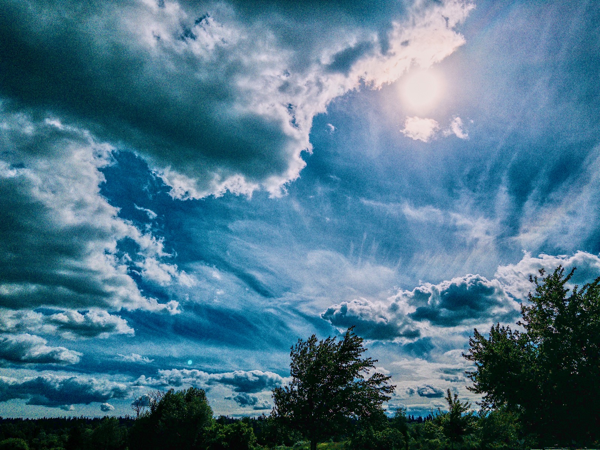{data-lightbox-src="image-3-full.jpeg"}

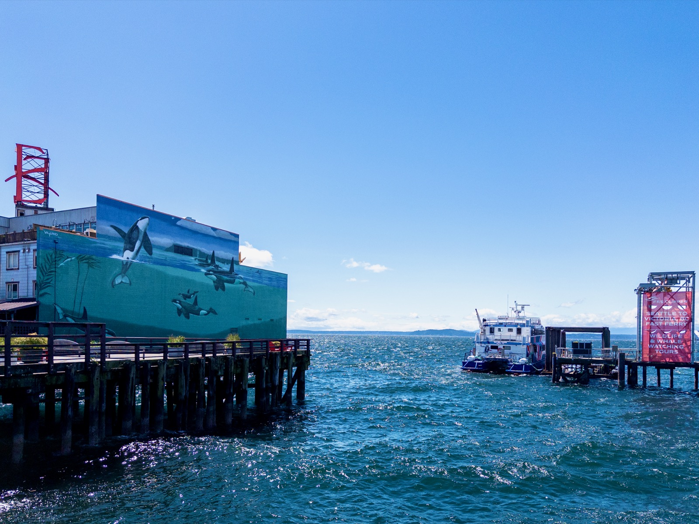{data-lightbox-src="image-4-full.jpeg"}

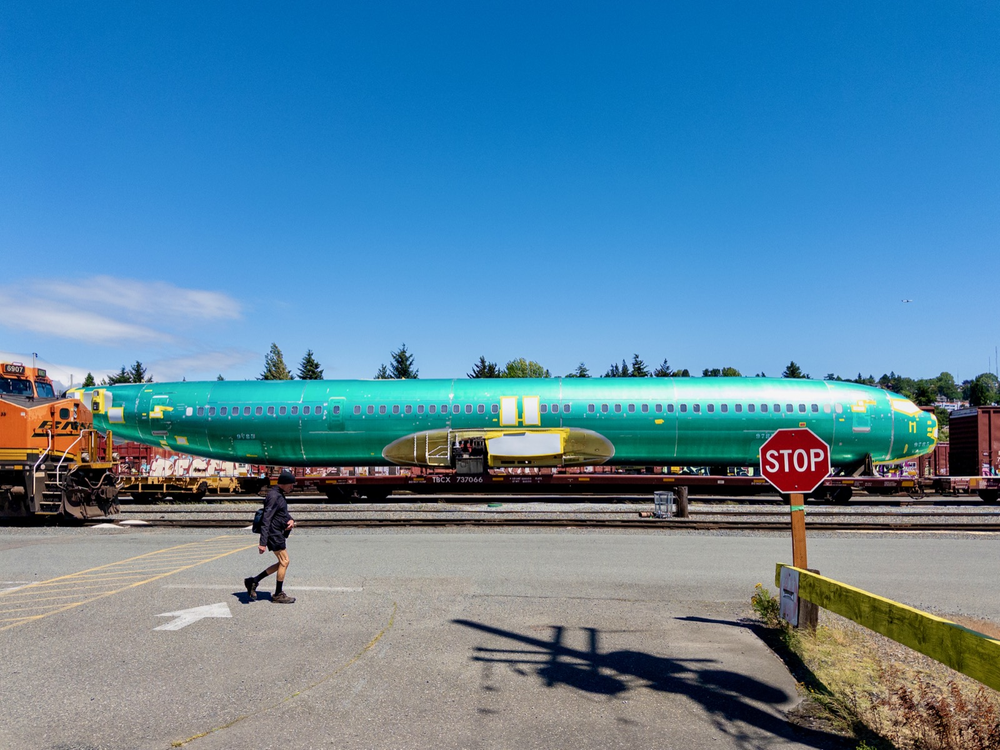{data-lightbox-src="image-5-full.jpeg"}

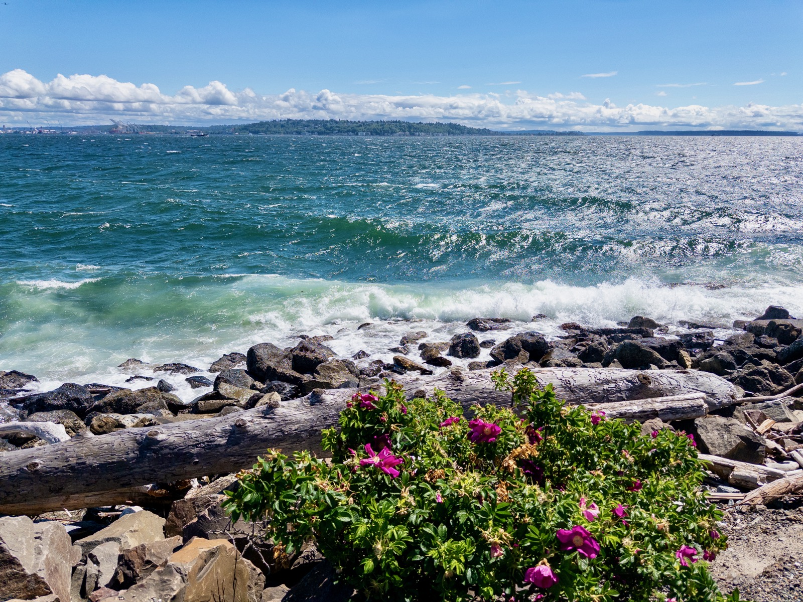{data-lightbox-src="image-6-full.jpeg"}

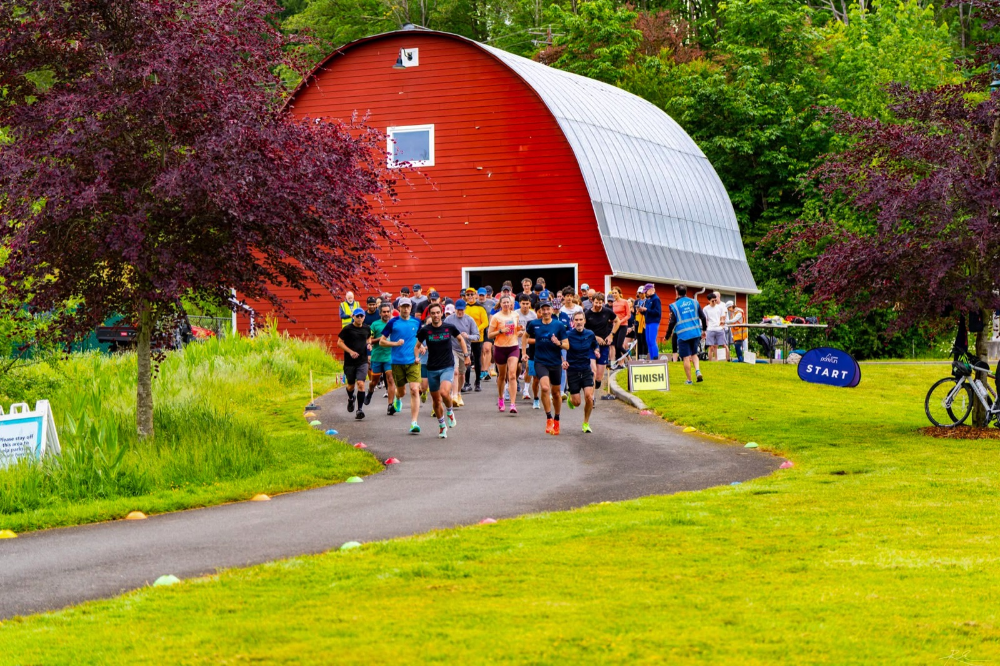{data-lightbox-src="image-7-full.jpeg"}

{data-lightbox-src="image-8-full.jpeg"}

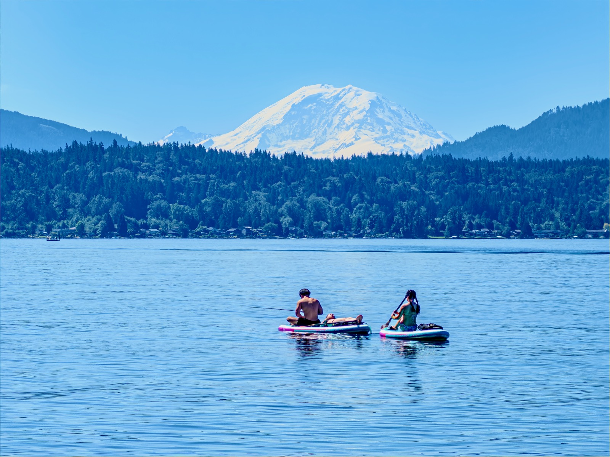{data-lightbox-src="image-9-full.jpeg"}

{data-lightbox-src="image-10-full.jpeg"}

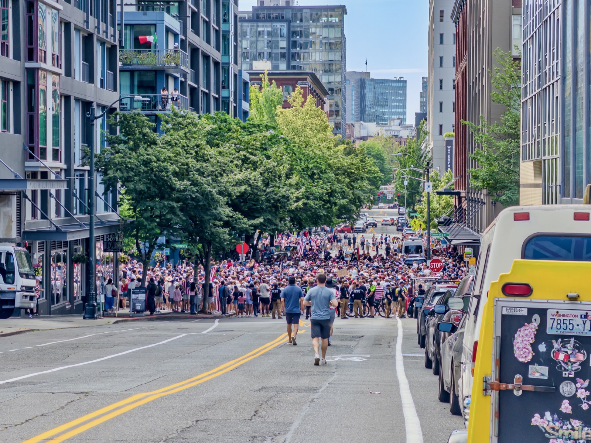{data-lightbox-src="image-11-full.jpeg"}

{data-lightbox-src="image-12-full.jpeg"}

{data-lightbox-src="image-13-full.jpeg"}

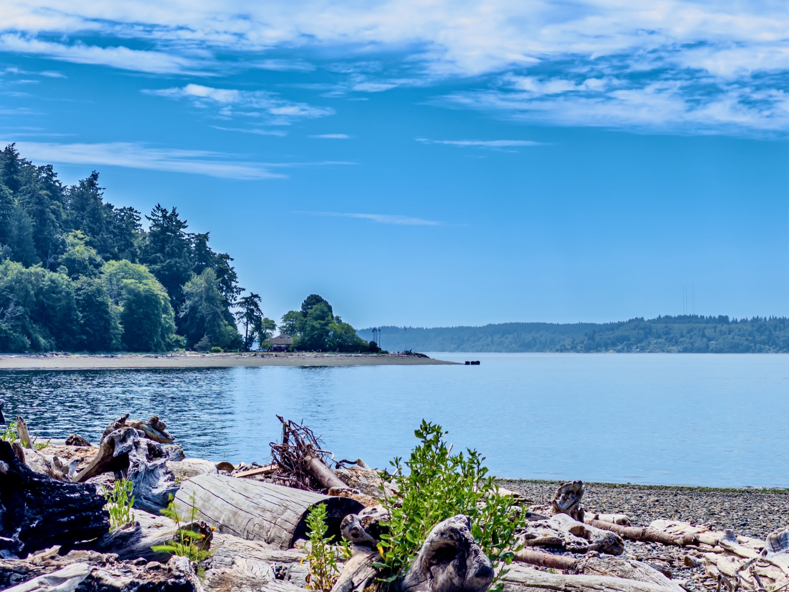{data-lightbox-src="image-14-full.jpeg"}

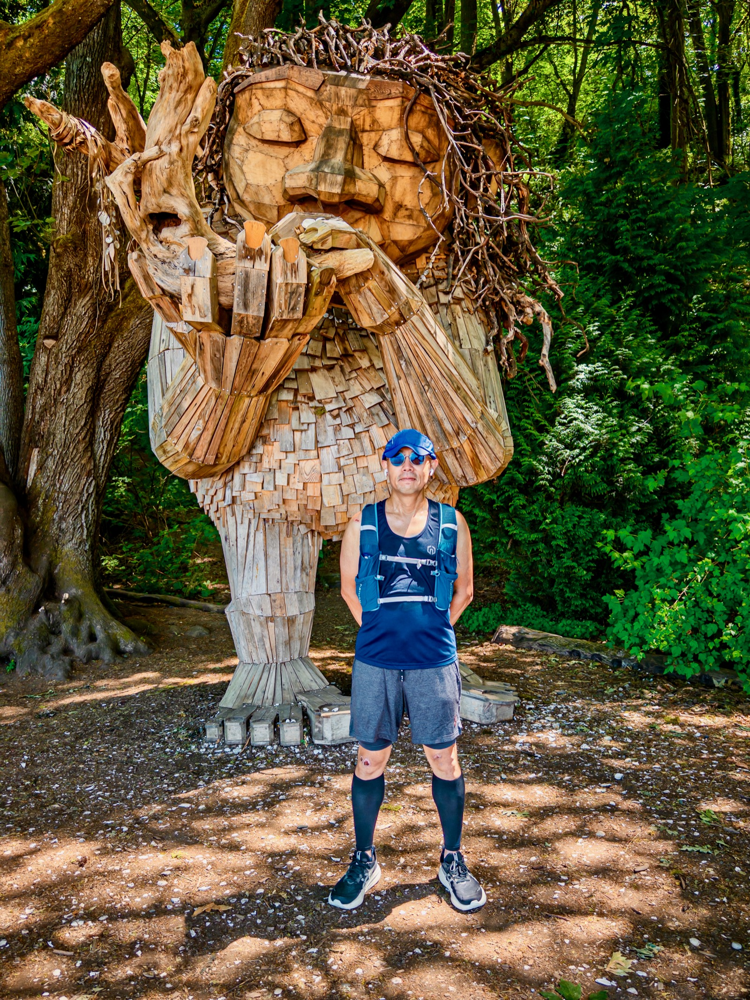{data-lightbox-src="image-15-full.jpeg"}

{data-lightbox-src="image-16-full.jpeg"}

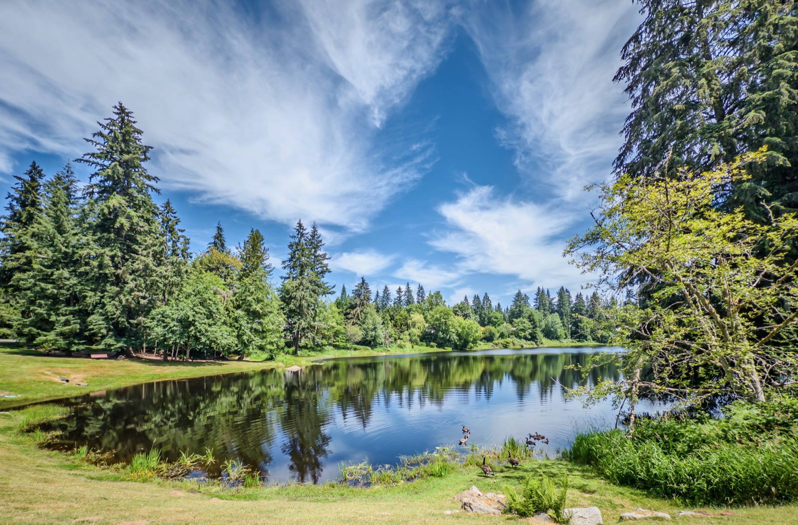{data-lightbox-src="image-17-full.jpeg"}

{data-lightbox-src="image-18-full.jpeg"}

{data-lightbox-src="image-19-full.jpeg"}

{data-lightbox-src="image-20-full.jpeg"}

---

*Originally posted on [LinkedIn](https://www.linkedin.com/posts/benjaminhan_running-juneteenth-worldcup-activity-7479040663880364032-x4WY).*
