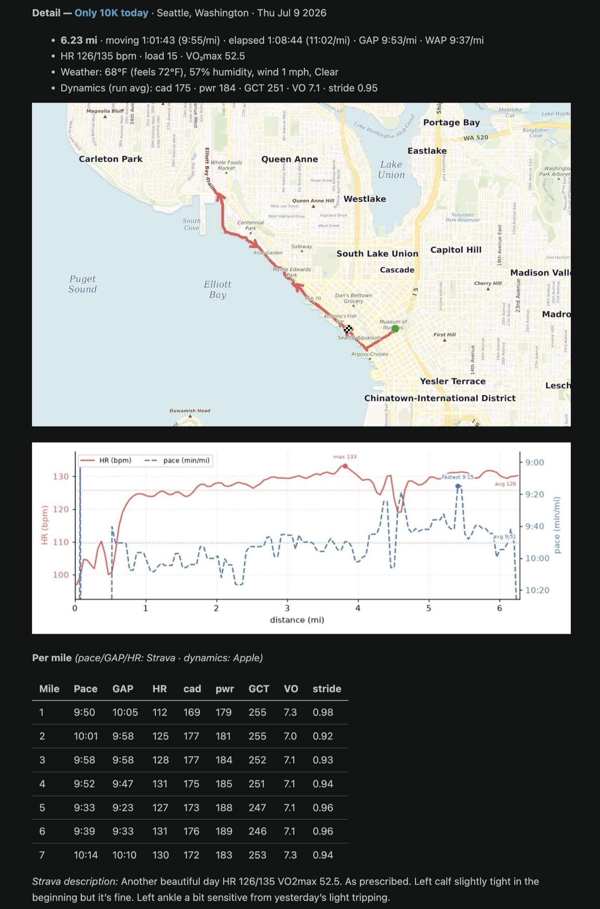
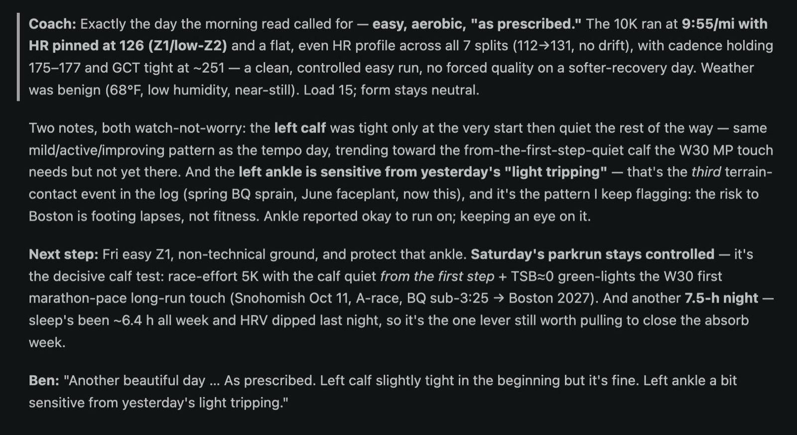

CoachClaude is coming up nicely. This was yesterday's EZ run on Elliott Bay Trail, prescribed and captured by the coach (first two pics). Even the map was drawn by my new system now, so I have the full freedom to choose how I can represent the run!

One step a time!

{data-lightbox-src="image-1-full.jpeg"}

{data-lightbox-src="image-2-full.jpeg"}

{data-lightbox-src="image-3-full.jpeg"}

{data-lightbox-src="image-4-full.jpeg"}

---

*Originally posted on [Mastodon](https://sigmoid.social/@BenjaminHan/116898066481098853).*
