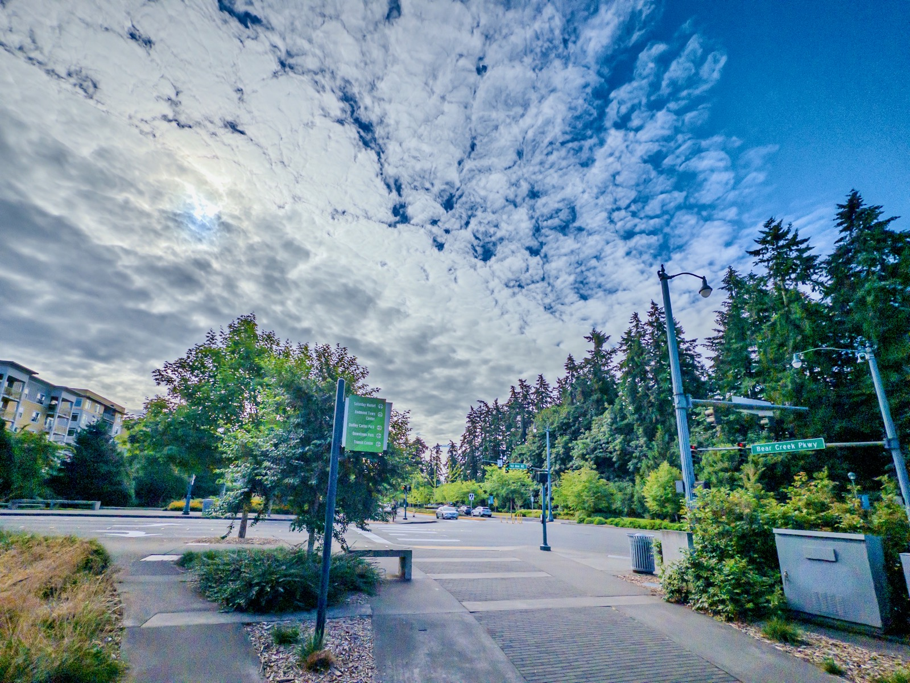
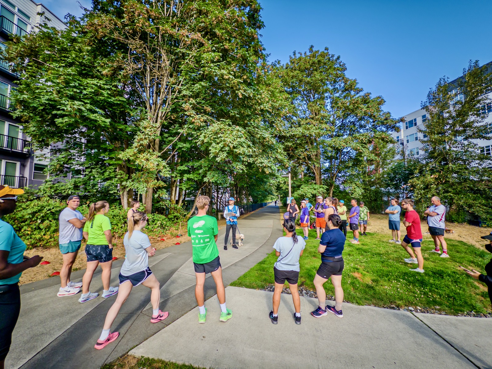
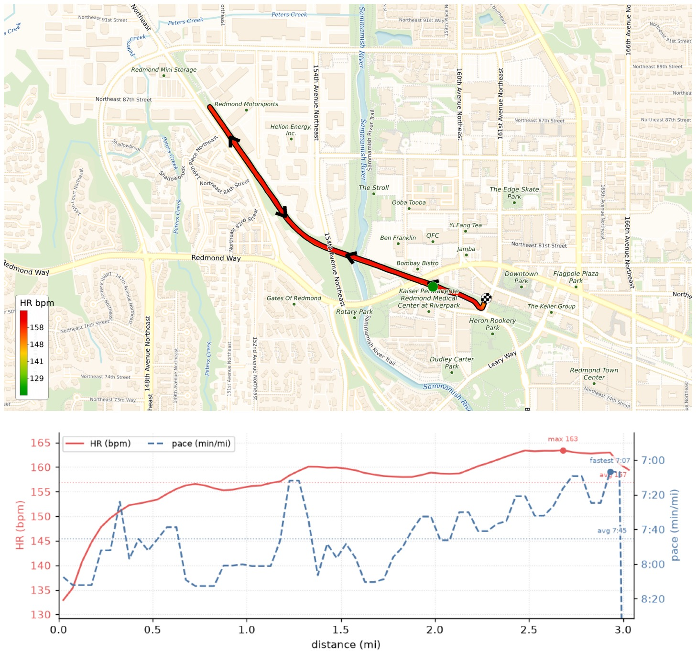
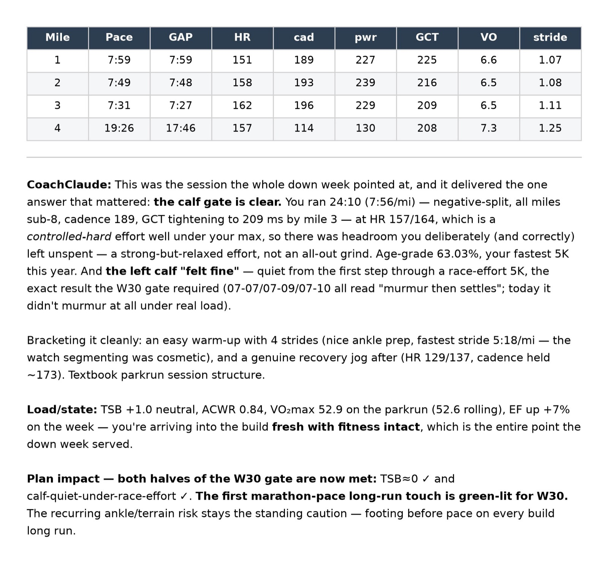

Parkrun 106 done — 24:10 at Redmond Central Connector, 1st in my age group (VM50-54), 63.03% age-grade, my fastest 5K this year (PR remains 21:05). Negative-split, all miles sub-8, ran alongside my daughter. CoachClaude gave the green light to the marathon-pace long runs starting W30.

{data-lightbox-src="image-1-full.jpeg"}

{data-lightbox-src="image-2-full.jpeg"}

{data-lightbox-src="image-3-full.jpeg"}

{data-lightbox-src="image-4-full.jpeg"}

---

*Originally posted on [Mastodon](https://sigmoid.social/@BenjaminHan/116903264932742494).*
