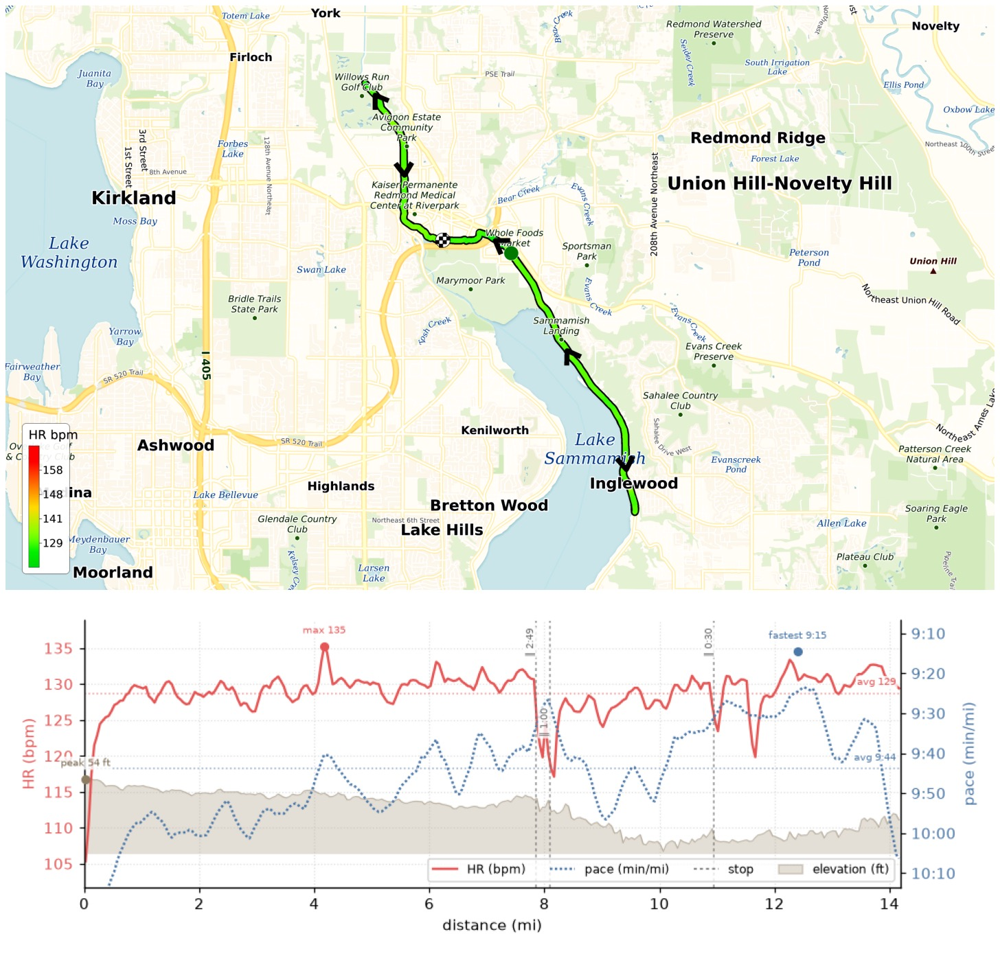
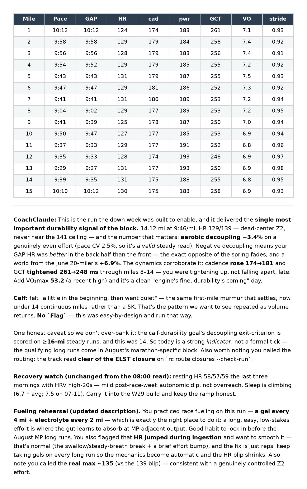

This Long Run Sunday I ran my HM 87, an EZ one as prescribed by CoachClaude: distance 14.12 mi, time 2:17:59, pace 9:46/mi, HR 129/135, VO2max 53.2. It started overcast and then turned sunny w/ blue sky! I stopped briefly at 8mi mark to get water. Felt in control and ready for the W29 buildup week!

{data-lightbox-src="image-1-full.jpeg"}

{data-lightbox-src="image-2-full.jpeg"}

{data-lightbox-src="image-3-full.jpeg"}

{data-lightbox-src="image-4-full.jpeg"}

---

*Originally posted on [Mastodon](https://sigmoid.social/@BenjaminHan/116909551275087345).*
