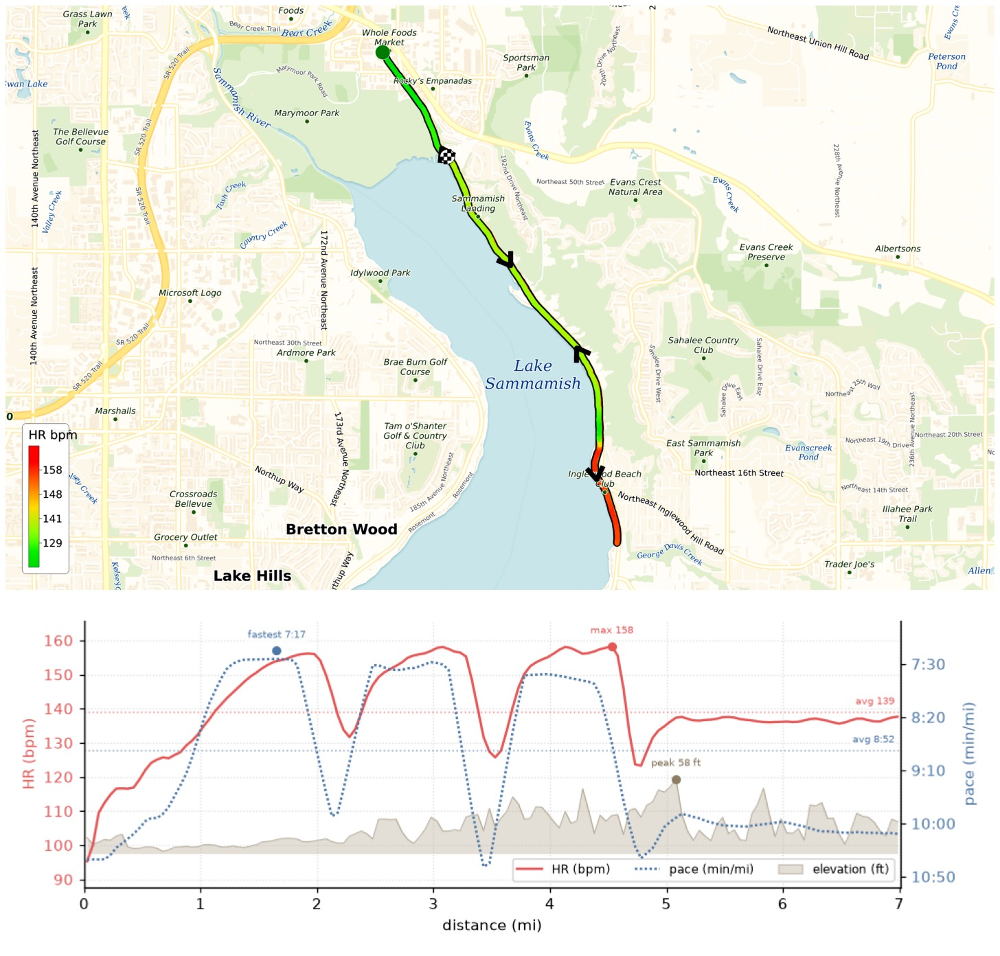
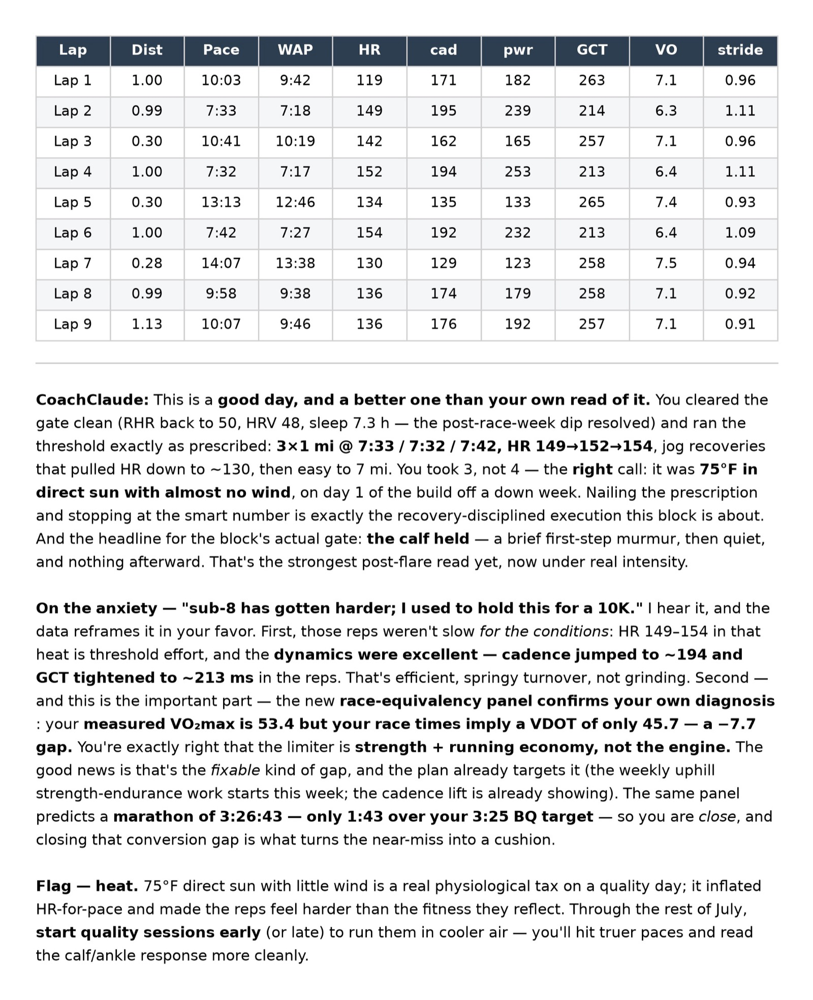
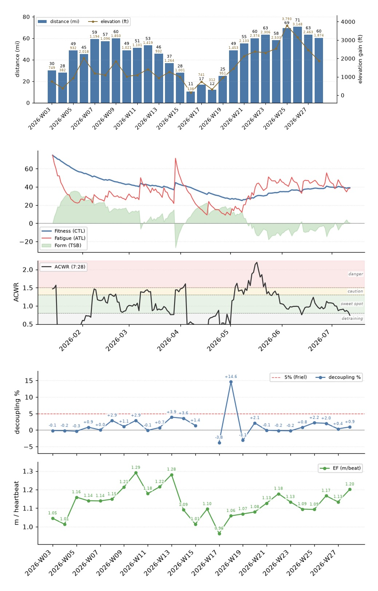

W29 build week started! Coming off a fresh down week — VO₂max up to 53.2, efficiency +7%, and a 14-miler that decoupled −3.4% (durability finally trending the right way) — day 1 was a 3×1mi threshold: 7:33/7:32/7:42 in 75F direct sun. Felt hard and out-of-shape, but CoachClaude assured me it's all good! Time to build back better!

{data-lightbox-src="image-1-full.jpeg"}

{data-lightbox-src="image-2-full.jpeg"}

{data-lightbox-src="image-3-full.jpeg"}

---

*Originally posted on [Mastodon](https://sigmoid.social/@BenjaminHan/116916769270093749).*
