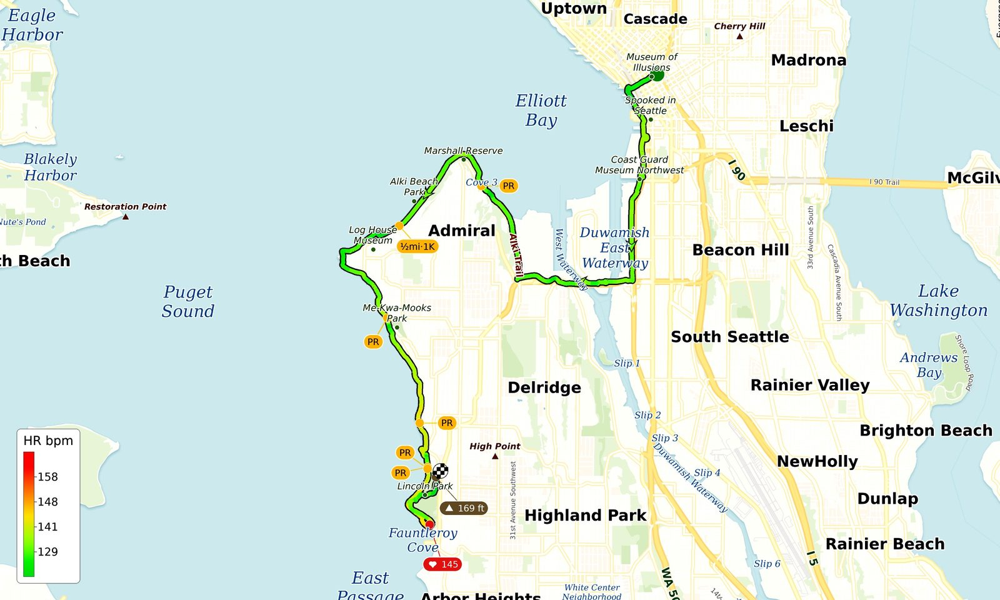{fig-align="center" data-lightbox-src="cover-full.jpg"}

I have a little side project. Every run I do gets pulled into a local database that stitches together a few sources: the activity itself from [Strava](https://www.strava.com/), plus readiness and recovery data from Apple Health and my watch's FIT files. A script then draws a map of the route that ends up in my [CoachClaude](/posts/20260710-coachclaude-is-coming-up-nicely/) coaching notes. It started as a red squiggle on a stock basemap. Over about ten days of tinkering it turned into something I actually *read*: effort, landmarks, PRs, and even which direction I ran each stretch, all on one picture.

Because every version regenerates over the whole history, I can re-draw *any* past run with *any* version of the code. So here are the same two runs at each stage.

I picked two runs on purpose:

- [**My Juneteenth half marathon**](/posts/20260619-juneteenth-run-lincoln-park/) (13.8 mi down the Seattle waterfront), a point-to-point with lots of named landmarks and several PRs (personal records). A good test of the labels and callouts.
- [**The Bridle Trails 50K**](/posts/20260112-bridle-trails-50k/) (29.5 mi of looping horse trails), where I ran a lot of the same singletrack more than once. That turns out to be the hard case that motivated the very last change.

## Stage 1: a line on a map

::: {layout-ncol=2}
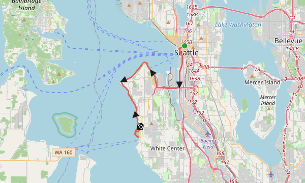

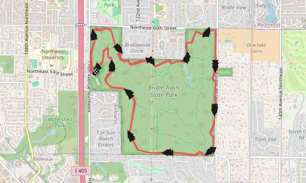
:::

The first version draws the route as a flat red line over an off-the-shelf [OpenStreetMap](https://www.openstreetmap.org/) tile, with start and finish markers. That's it.

The half marathon is framed loosely, with a lot of open water and eastside street grid the run never touches, and the basemap piles on dashed ferry lanes, freeway shields, and tiny labels. It's a map with my run on it, not a map of my run.

## Stage 2: frame it tight, and mark the PRs

::: {layout-ncol=2}
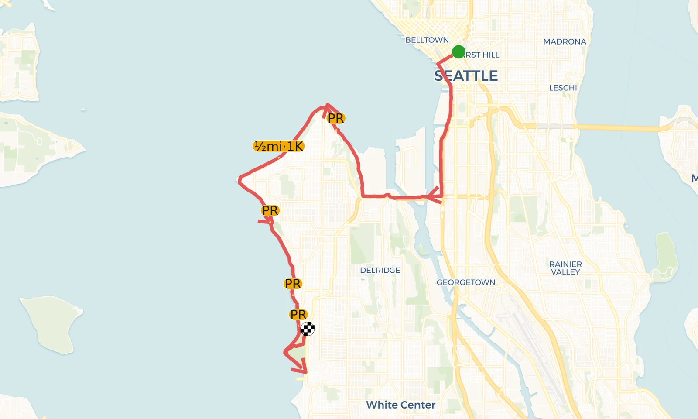{data-lightbox-src="juneteenth-2-framing-pr-full.png"}

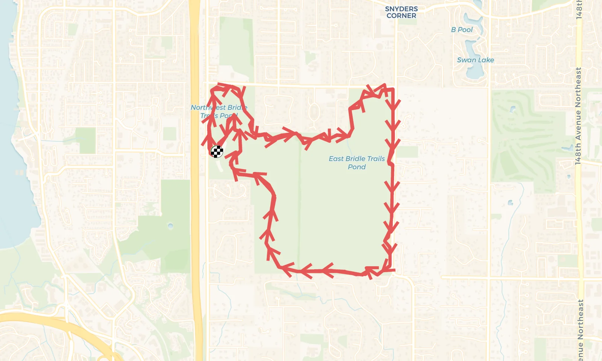{data-lightbox-src="bridle-2-framing-pr-full.png"}
:::

Two changes here. First, the map now zooms to fit the route and swaps the raw OpenStreetMap tiles for [CARTO](https://carto.com/)'s cleaner Voyager basemap, rendered at retina resolution so the labels stay crisp. They're still CARTO's labels, but there's far less clutter to fight. Second, and the actual reason for this version, it pulls my Strava PRs and segment splits and drops little pills on the map (`PR`, `½mi·1K`) right where they happened. The direction arrows got clearer too, so on the 50K you can now follow the flow of the loop.

Marking a personal best is the first bit of story added to the bare route. And tight framing means each run fills its own frame.

## Stage 3: draw my own labels

::: {layout-ncol=2}
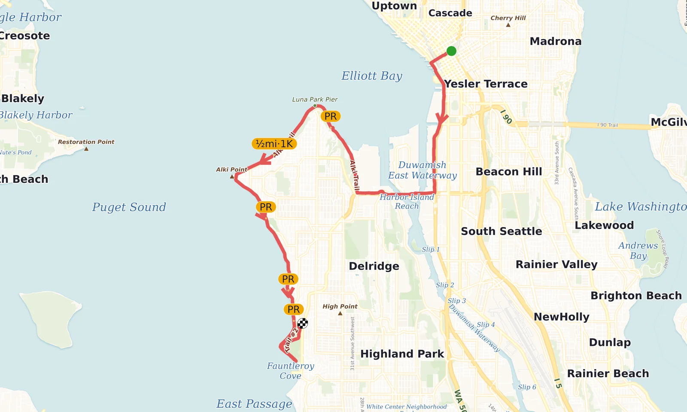{data-lightbox-src="juneteenth-3-labels-full.png"}

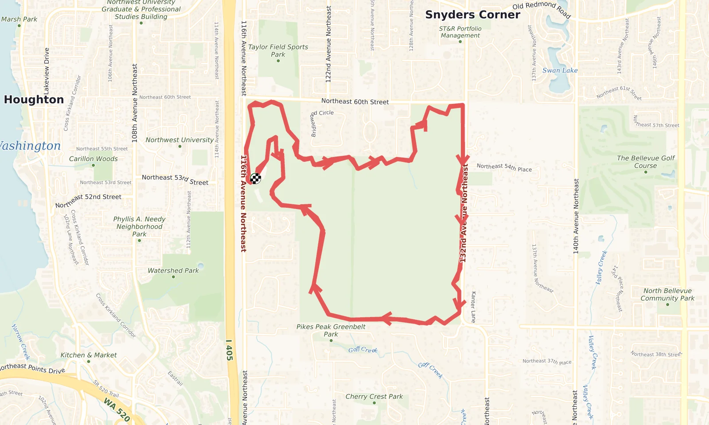{data-lightbox-src="bridle-3-labels-full.png"}
:::

Next I dropped the pre-labeled basemap entirely and started drawing the place names myself over a blank canvas: italic water names (*Elliott Bay*, *Puget Sound*, *Fauntleroy Cove*), neighborhood names, the parks the route runs through (Alki Beach Park, Me-Kwa-Mooks Park, Lincoln Park), and small brown triangles for nearby landmarks. On the 50K the street grid and green space come in as gentle context instead of clutter.

With someone else's labels I couldn't control what showed up or how loud it was. I'd get a gas station named but not the park I ran through. Drawing them myself means the map emphasizes what's on my route, at a density I choose.

## Stage 4: color the line by heart rate

::: {layout-ncol=2}
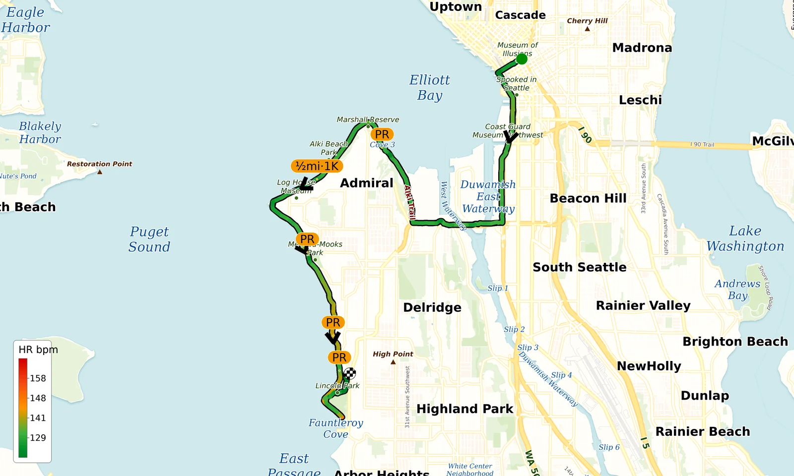{data-lightbox-src="juneteenth-4-hr-full.png"}

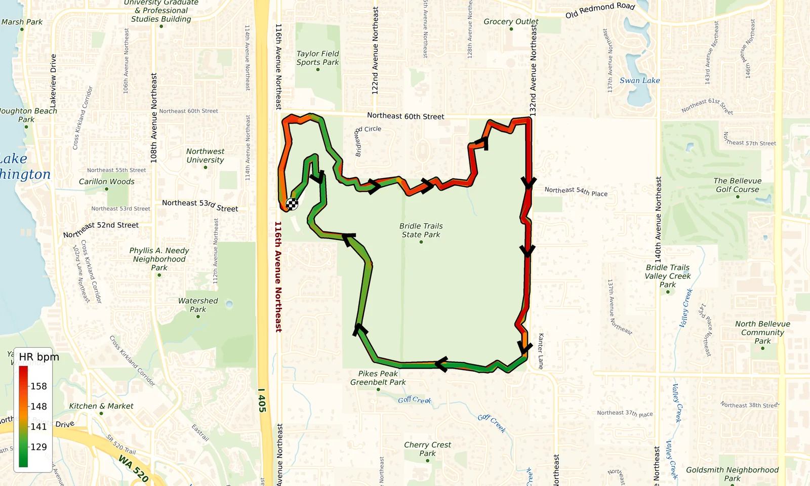{data-lightbox-src="bridle-4-hr-full.png"}
:::

Now the route line is no longer one color. It runs on a gradient from green (easy) through yellow to red (hard), driven by my heart-rate zones, with a new legend in the corner to read it by.

The map now shows effort in place. On the Juneteenth half you can see it's almost all calm green, a controlled aerobic day, with only a couple of warmer patches near the end. On the 50K the difference between the runnable flats (green) and the grinding hills (orange and red) jumps right out.

## Stage 5: call out the extremes

::: {layout-ncol=2}
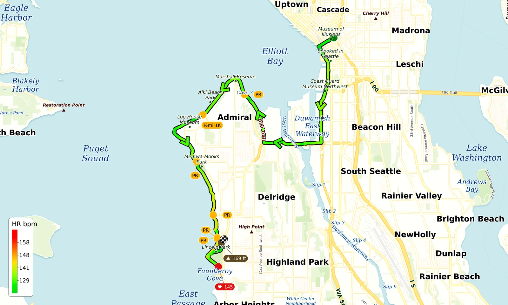{data-lightbox-src="juneteenth-5-callouts-full.png"}

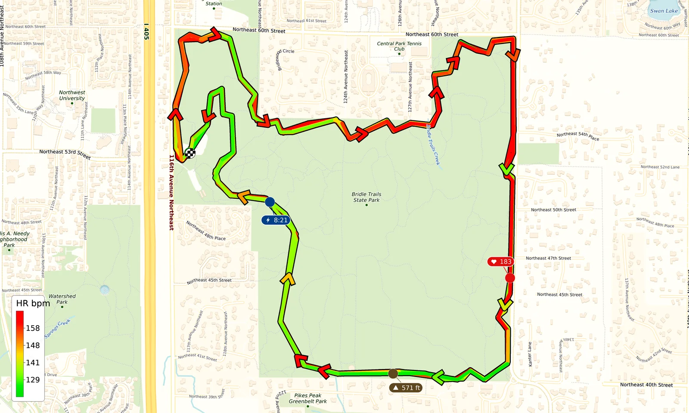{data-lightbox-src="bridle-5-callouts-full.png"}
:::

Here I added off-route callout pills for the per-run extremes: a brown `▲` pill at the peak-elevation point and a red `♥` pill at max heart rate, each with a thin leader line pointing to exactly where on the course it happened. The PR pills from stage 2 are still there.

The heart-rate gradient tells you roughly where it got hard. These pins tell you exactly where the hardest single moment was and what it cost. On the 50K the `♥ 183` is out on the east side.

## Stage 6: split the retraced sections into lanes

::: {layout-ncol=2}
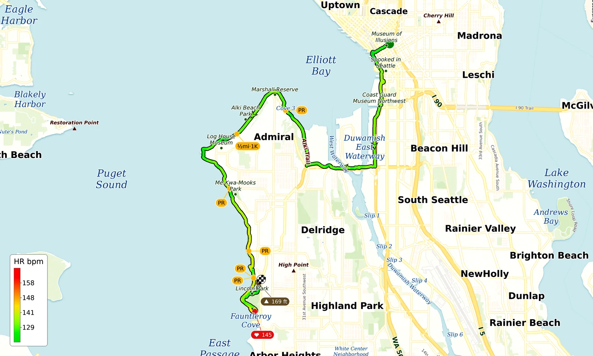{data-lightbox-src="juneteenth-6-lanes-full.png"}

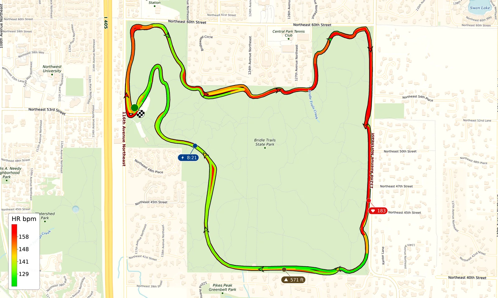{data-lightbox-src="bridle-6-lanes-full.png"}
:::

The last change (for now): where I ran the same ground more than once (an out-and-back, a lap, a figure-8), the map now draws each pass as its own parallel lane beside the other, instead of one pass painting over the earlier one.

This is barely visible on the half but changes the 50K completely. The Juneteenth run almost never retraces itself, so it looks about the same as stage 5, which is exactly why I show both. But the 50K is full of repeated singletrack. In every earlier version, the last time I ran a trail simply painted over every earlier time, so a stretch I ran three times looked identical to one I ran once, and the effort colors from the earlier passes were hidden under the last. Now those sections read as thin loops with two colored lanes side by side, each keeping its own effort color and its own direction arrow. You can finally see that it was a lapped course, and how my effort on the same trail changed between passes.

## Where it ended up

None of the underlying GPS changed across the six versions, only how much of the run the map shows.

There's plenty left to do (shade, weather, surface type), but I like that I can point the newest version at a run from months ago and see it fresh. Onward.

---

## Related Posts

- [CoachClaude Is Coming Up Nicely](/posts/20260710-coachclaude-is-coming-up-nicely/) — the running-coach project these maps feed into.
- [A Juneteenth Run to Lincoln Park](/posts/20260619-juneteenth-run-lincoln-park/) — the half marathon in the left column of every map above.
- [Bridle Trails 50K: Hot Cocoa, Sprained Ankle, No Horseshit](/posts/20260112-bridle-trails-50k/) — the looping trail 50K that motivated the lane-split rendering.
- [A Rube Goldberg Pipeline for Sharing Links](/posts/20260420-rube-goldberg-publishing/) — another walk through the personal tooling behind this blog.
