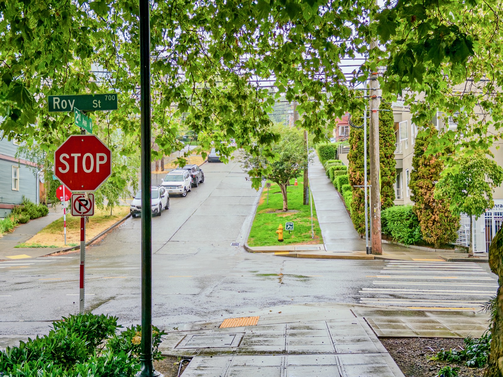
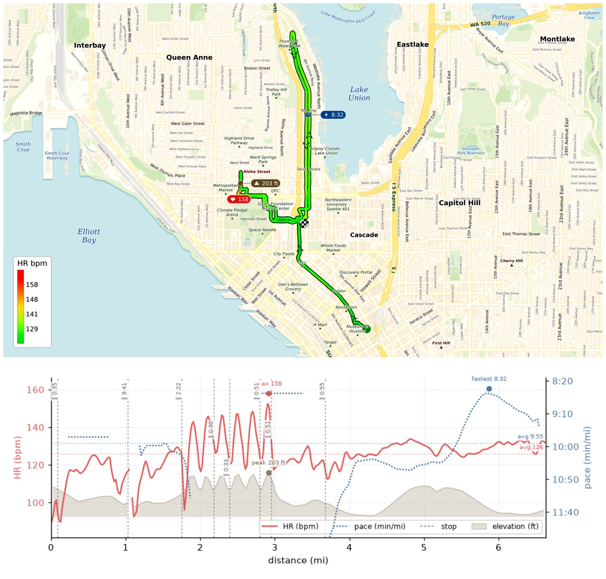
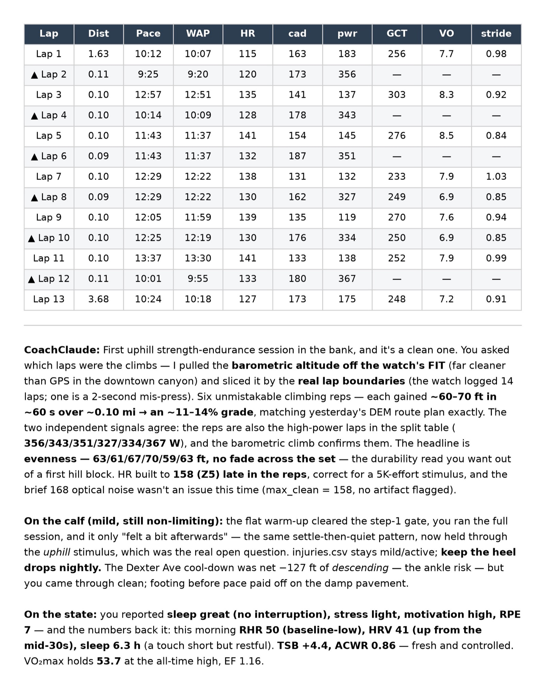

First real hill session ever, and barely outran the thunder! 6×60s uphill on a ~12% Queen Anne stretch, easy jog back down between. The reps came out dead even: +63/61/67/70/59/63 ft, not much fade across the set, but pace can be better. Max HR 158. Ran another 3.7mi EZ recovery along a new route (Dexter Ave N)! Total 6.47mi, EG 734ft, moving pace 10'28"/mi.

{data-lightbox-src="image-1-full.jpeg"}

{data-lightbox-src="image-2-full.jpeg"}

{data-lightbox-src="image-3-full.jpeg"}

{data-lightbox-src="image-4-full.jpeg"}

---

*Originally posted on [Mastodon](https://sigmoid.social/@BenjaminHan/116932949875314604).*
