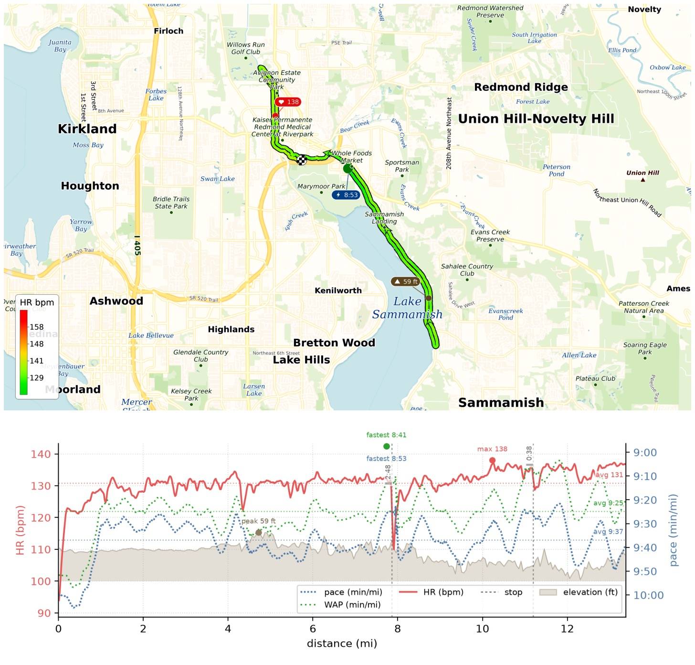
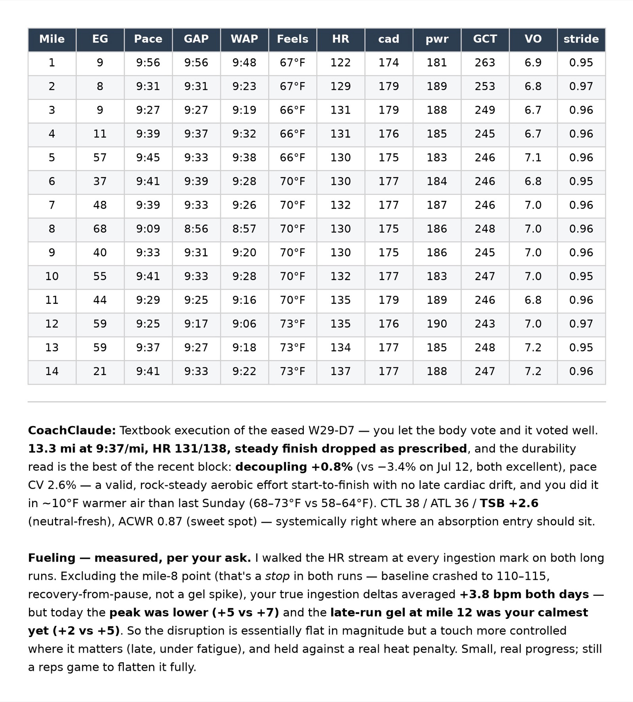

HM 88 in the books — 13.3 mi easy at 9:37/mi, HR 131/138. Hips and left calf finally settling down, and I ran it steady start-to-finish in ~10°F warmer air than last Sunday.

WAP earned its keep today as the temperature rose from 67 to 73°F — now I can see my grade- and temperature-normalized pace all the way along.

{data-lightbox-src="image-1-full.jpeg"}

{data-lightbox-src="image-2-full.jpeg"}

{data-lightbox-src="image-3-full.jpeg"}

---

*Originally posted on [Mastodon](https://sigmoid.social/@BenjaminHan/116949379577940275).*
