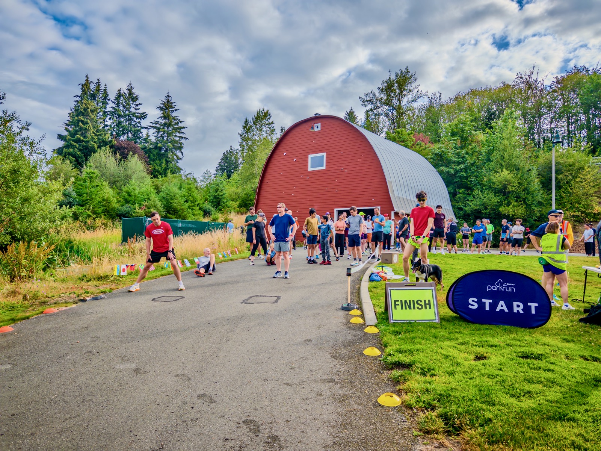
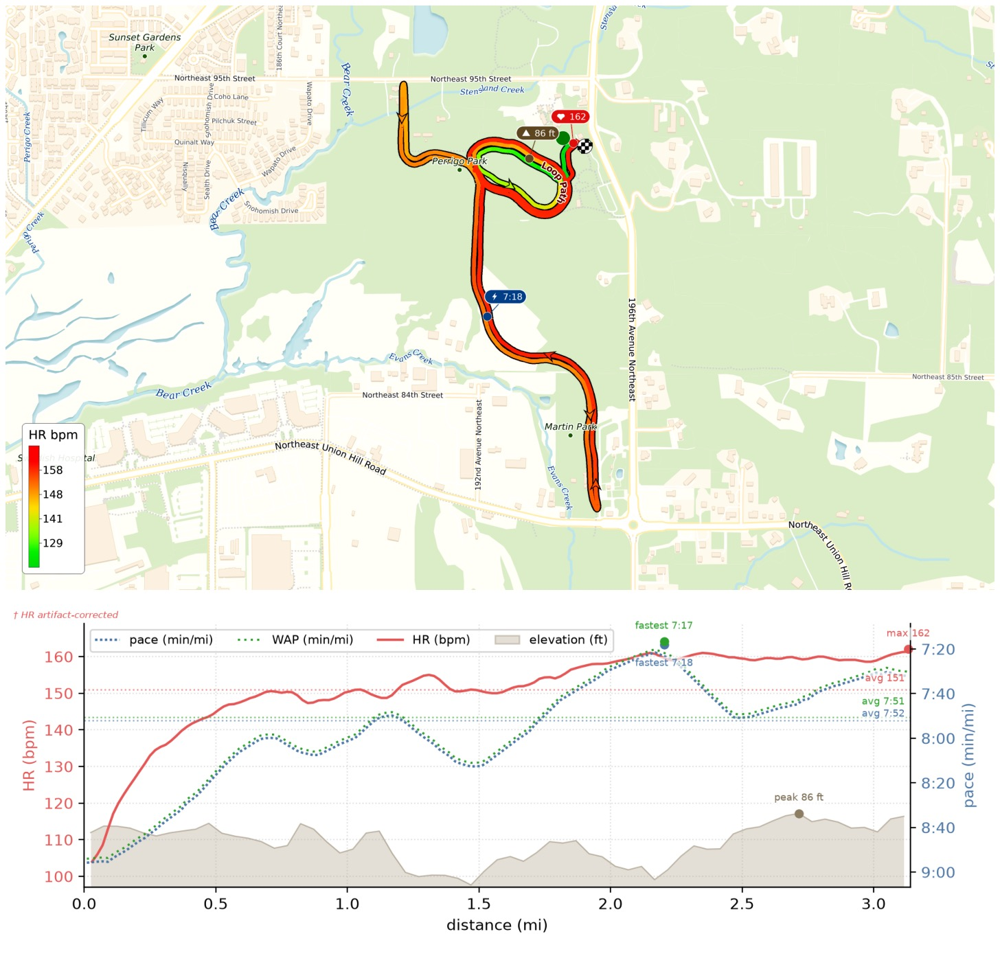
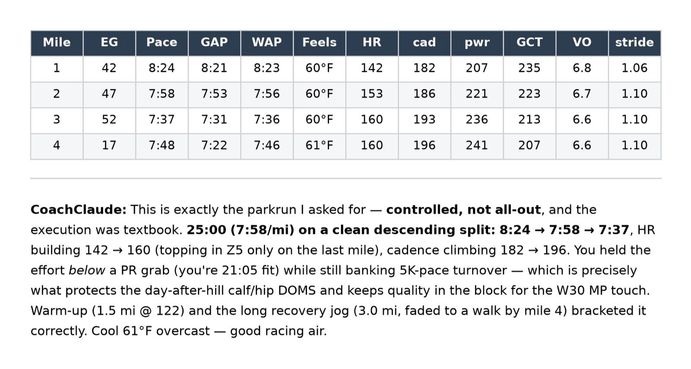

My 14th parkrun this year — almost the midpoint of my 30-parkrun yearly goal! Butt still hurts from the hill repeats, so I ran controlled-hard and got a clean negative split! Still felt my left calf, but not to the point of interfering.

For the charts I also added per-mile Feels (apparent temp) and WAP (weather-adjusted pace), so I can see how the heat built through the run and what it cost my pace.

{data-lightbox-src="image-1-full.jpeg"}

{data-lightbox-src="image-2-full.jpeg"}

{data-lightbox-src="image-3-full.jpeg"}

---

*Originally posted on [Mastodon](https://sigmoid.social/@BenjaminHan/116949355295280369).*
