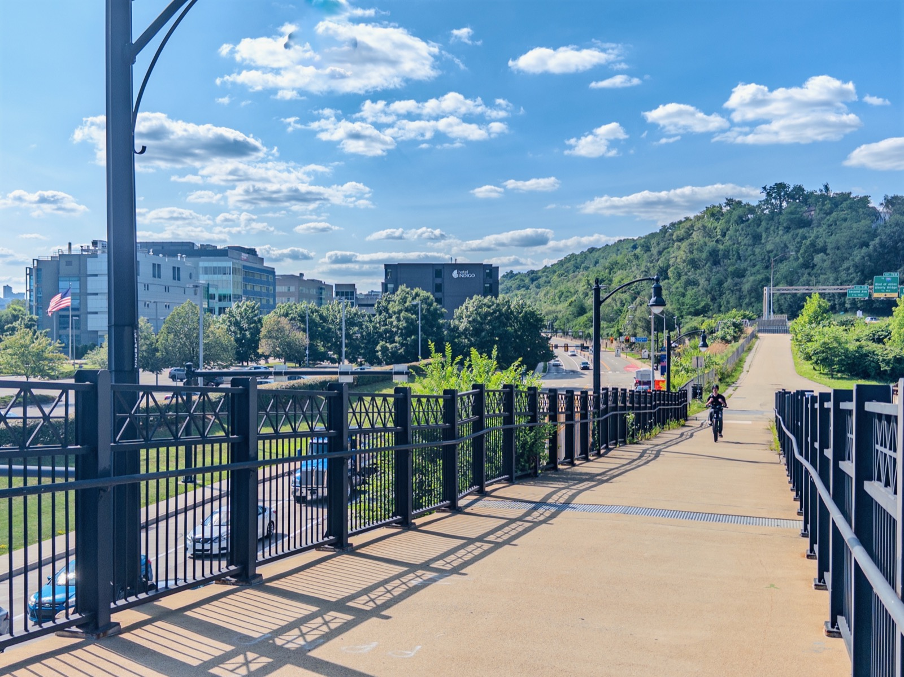
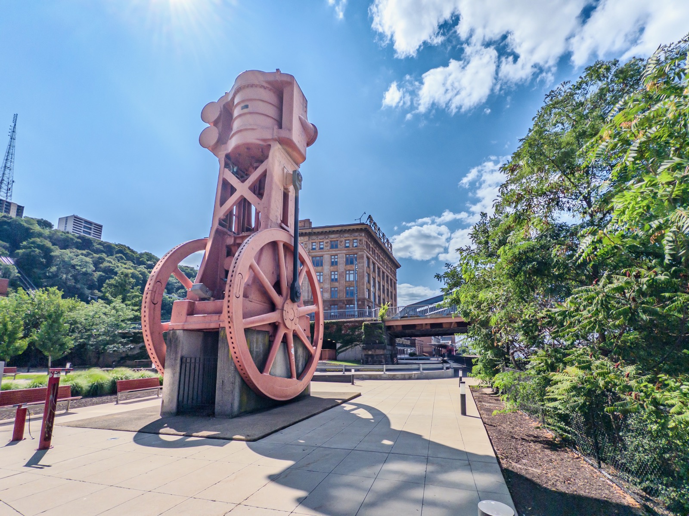
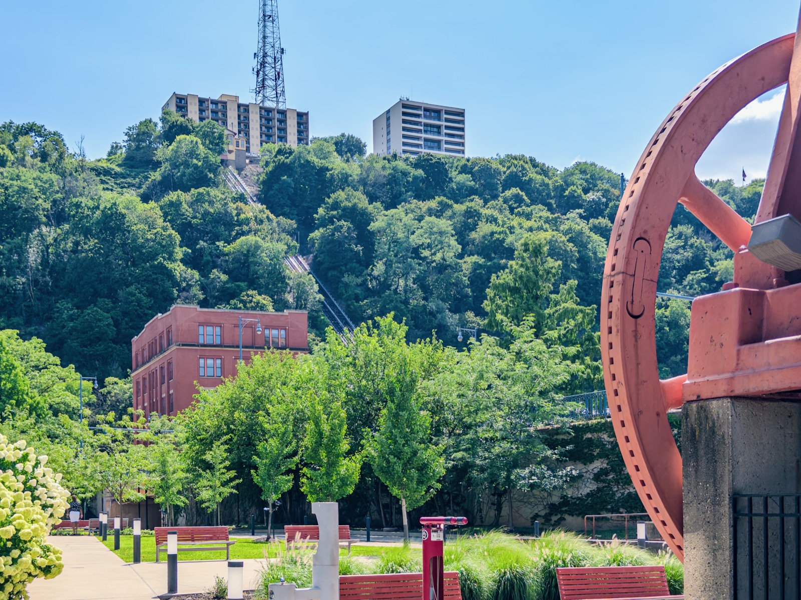
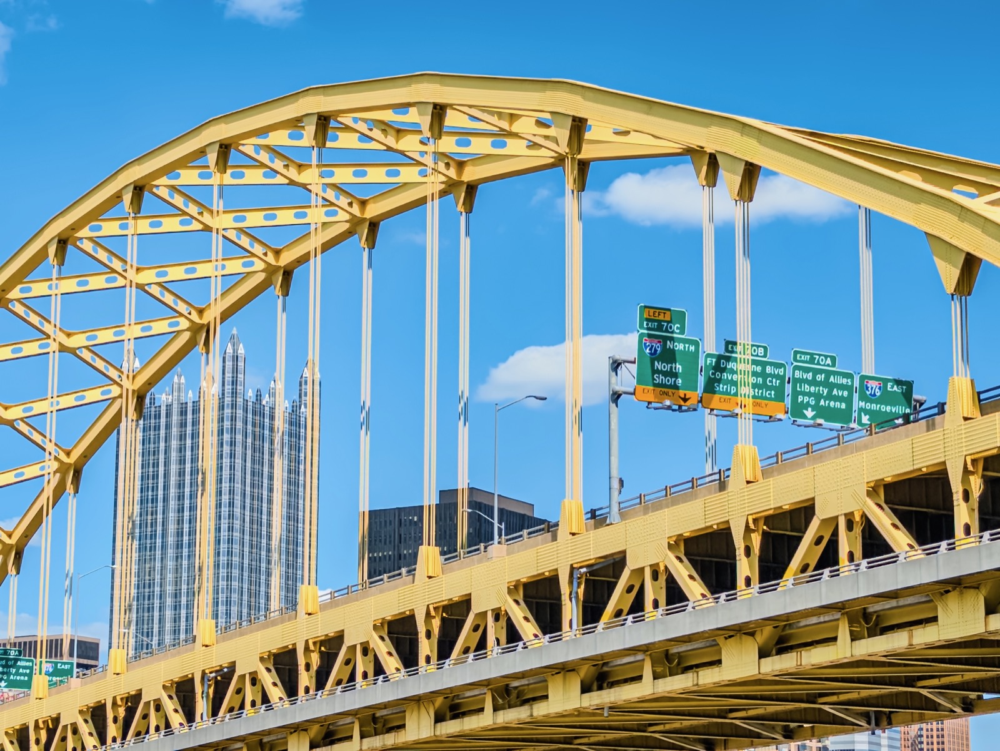
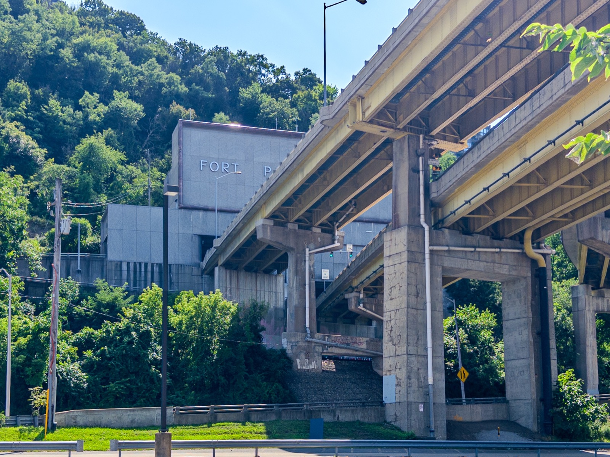
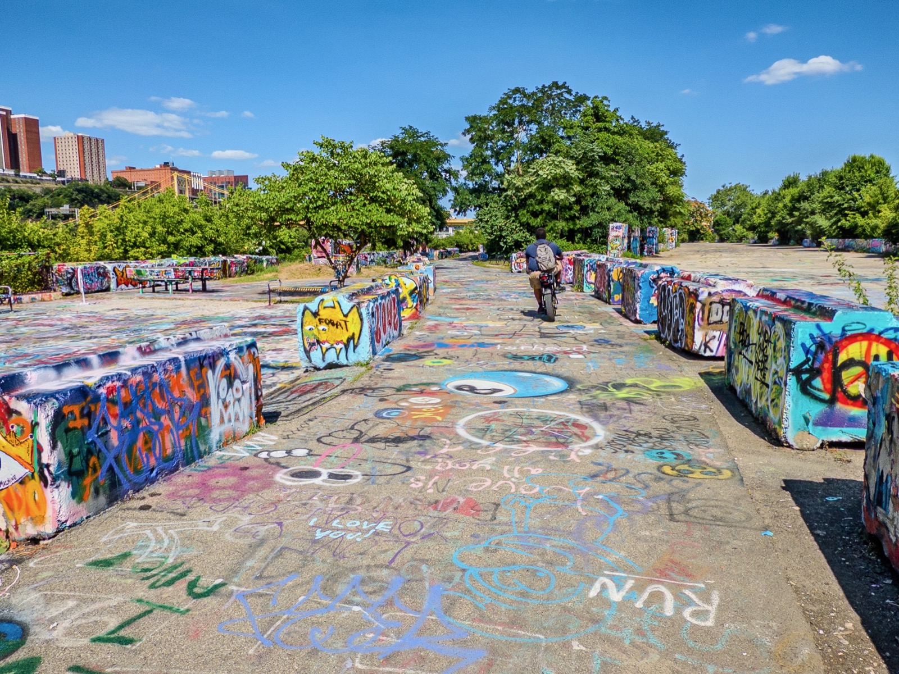
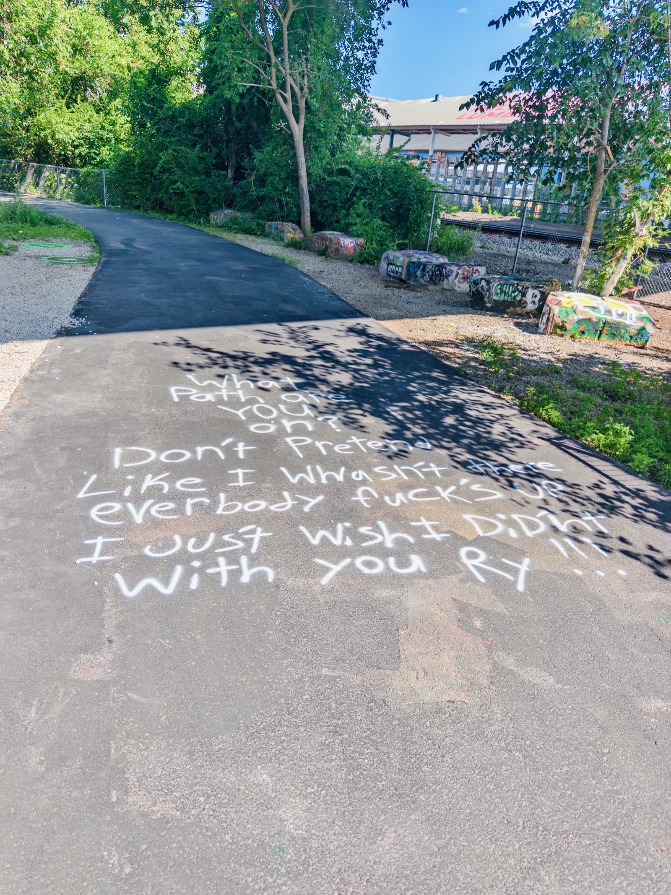
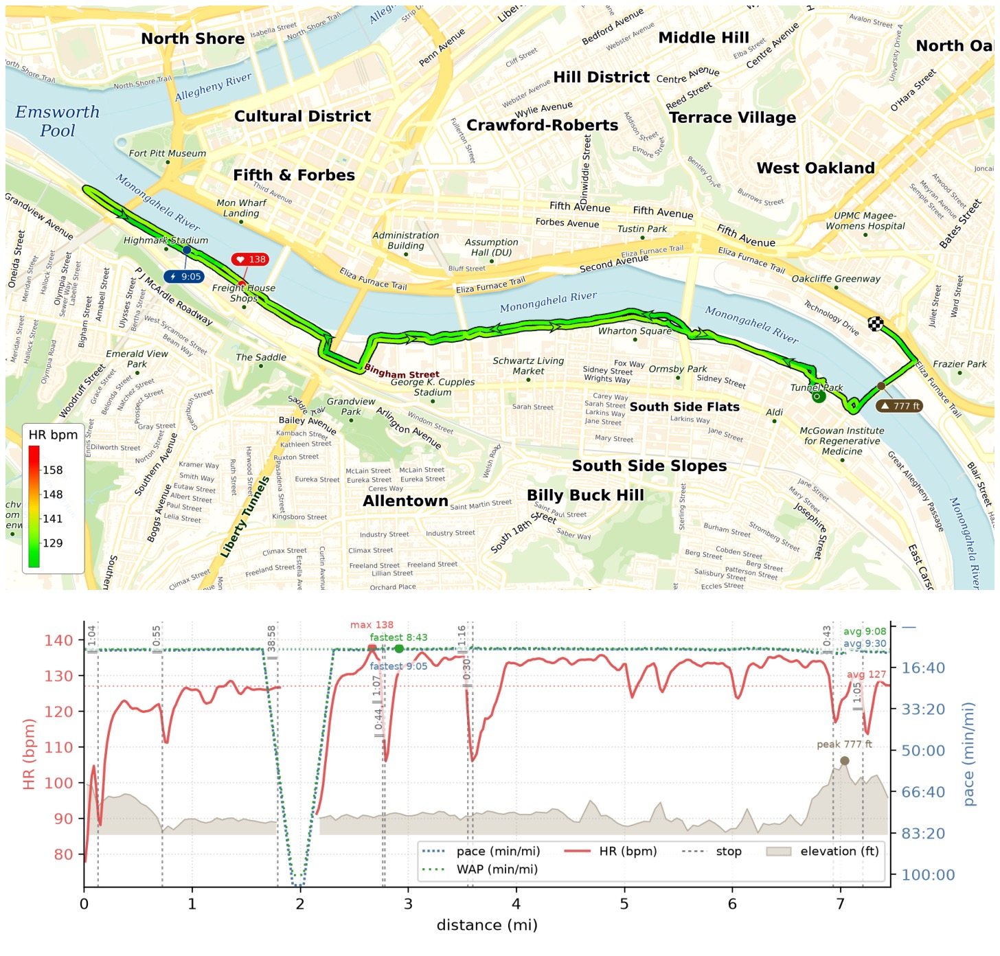
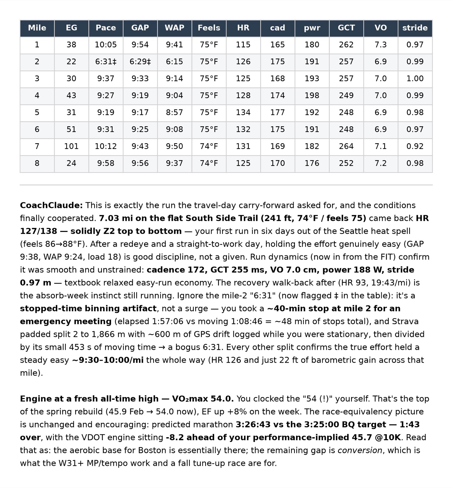

First run back in Pittsburgh in ~20 years — 7 easy miles along the Monongahela on the South Side Trail. Lots has changed, but plenty still felt like home. Flew in on a redeye, went straight to work, then squeezed this in (with a 40-min pause at mile 2 to take an emergency meeting 😅). HR stayed solidly Z2 the whole way and my watch flashed VO₂max 54 — almost my all-time high (54.3)!

Can't wait to run tomorrow's Parkrun in Pittsburgh!

{data-lightbox-src="image-1-full.jpeg"}

{data-lightbox-src="image-2-full.jpeg"}

{data-lightbox-src="image-3-full.jpeg"}

{data-lightbox-src="image-4-full.jpeg"}

{data-lightbox-src="image-5-full.jpeg"}

{data-lightbox-src="image-6-full.jpeg"}

{data-lightbox-src="image-7-full.jpeg"}

{data-lightbox-src="image-8-full.jpeg"}

{data-lightbox-src="image-9-full.jpeg"}

{data-lightbox-src="image-10-full.jpeg"}

{data-lightbox-src="image-11-full.jpeg"}

{data-lightbox-src="image-12-full.jpeg"}

{data-lightbox-src="image-13-full.jpeg"}
