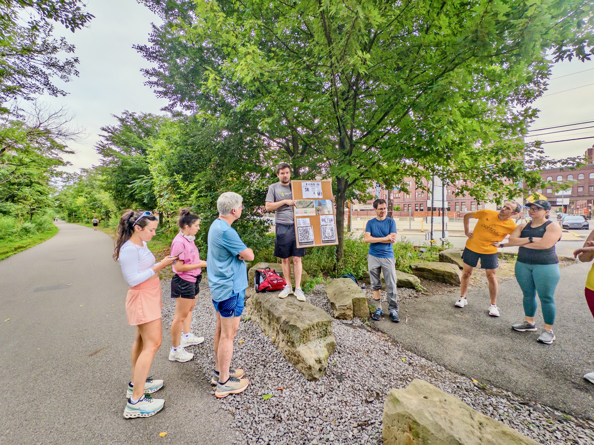
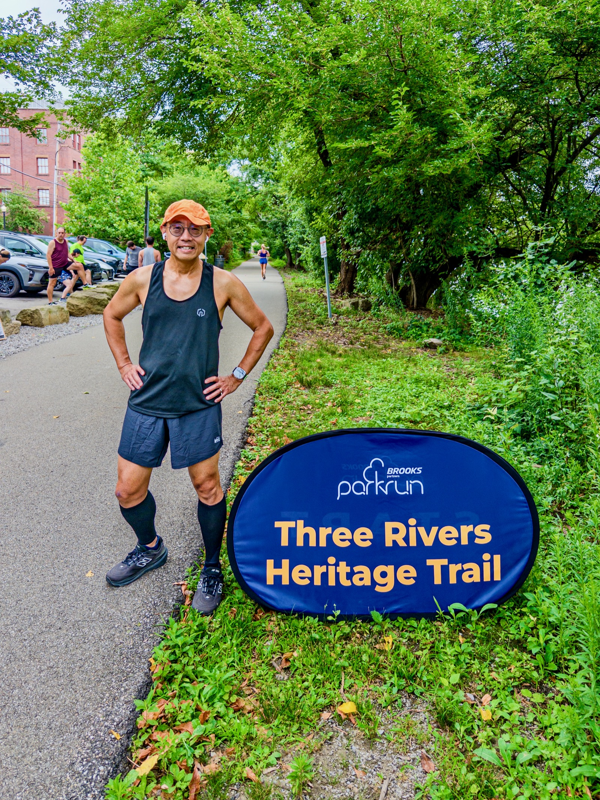
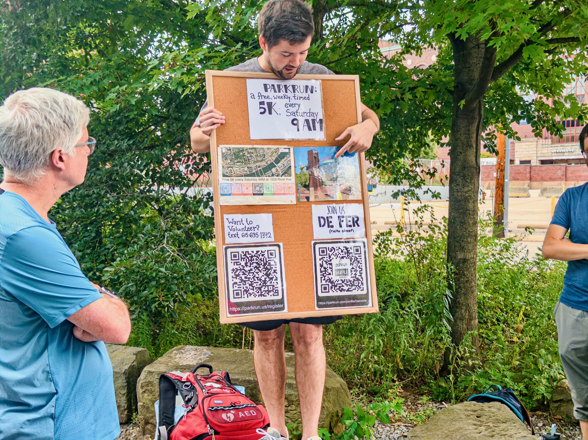
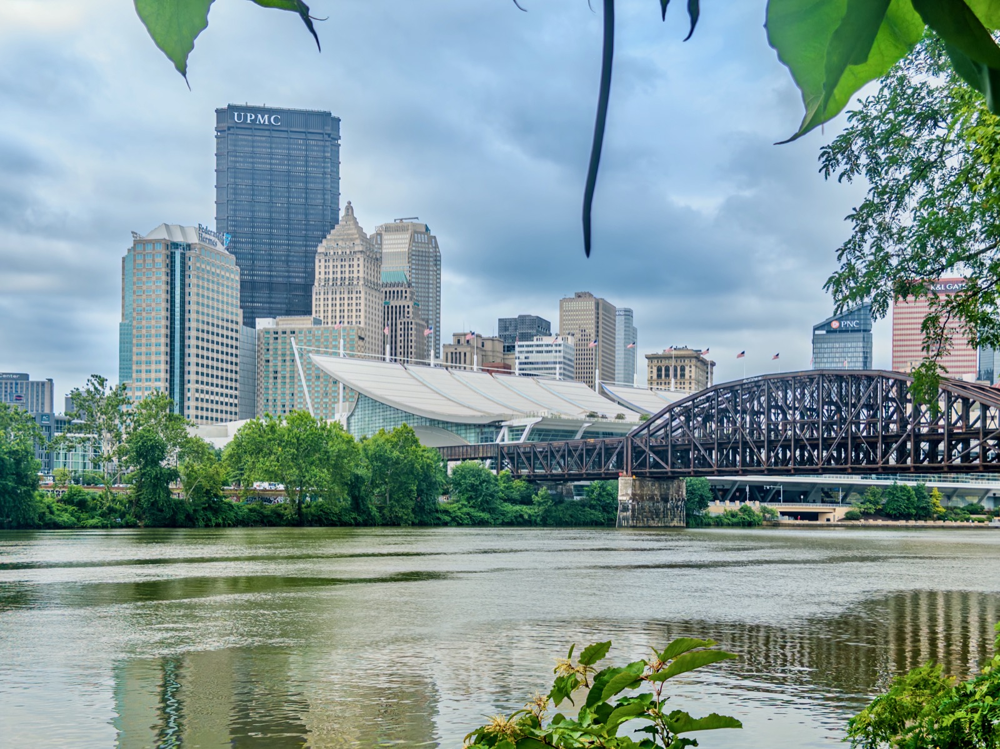
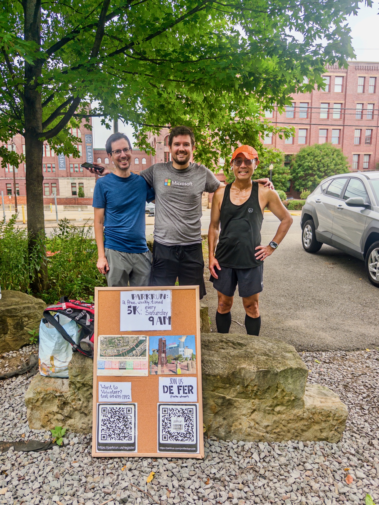
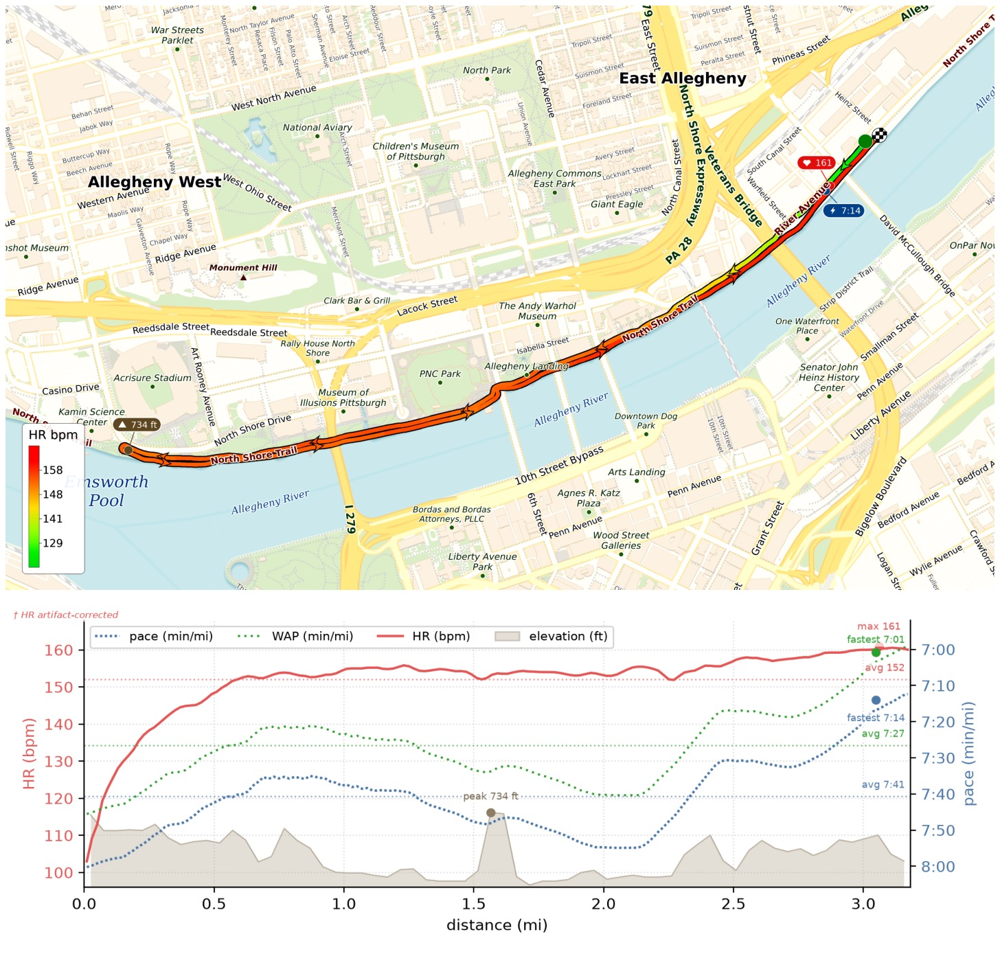
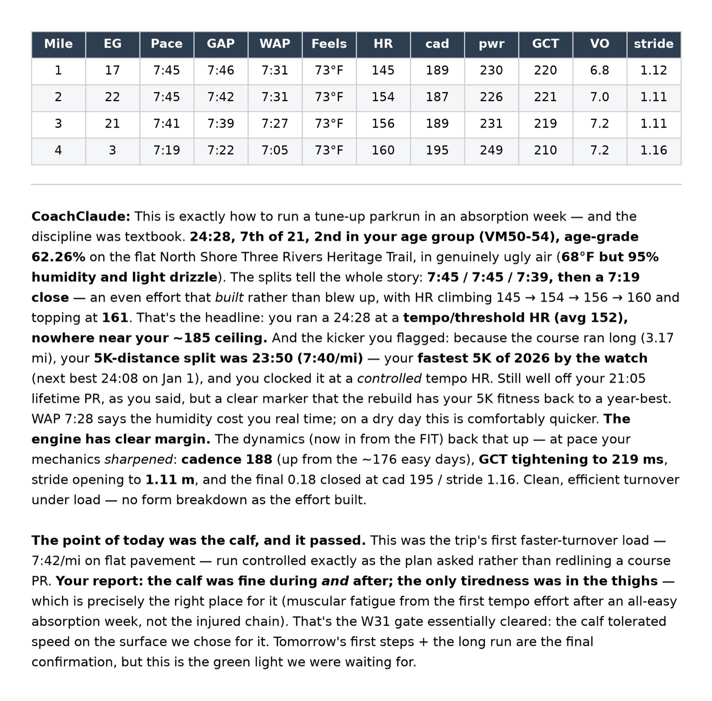

After two days of running 15mi in Pittsburgh, I ran my first-ever Pittsburgh Parkrun today! Official time 24:28 with a bit more distance at 3.17mi, otherwise it's my fastest 5k this year: time 23:50 pace 7'40"/mi (still way off from 21:05 last year)! Weather was not very hot but 90+% humid. Adding to the drama, there's no bathroom! I guess that could've made me faster or slower? 😆

We had ~20 runners and the majority of them were first-timers! I took a photo with Pat and Will — the volunteers today. Pat was actually the OG of this Parkrun, which started a bit over a year ago. They definitely need more runners to join the fun!

{data-lightbox-src="image-1-full.jpeg"}

{data-lightbox-src="image-2-full.jpeg"}

{data-lightbox-src="image-3-full.jpeg"}

{data-lightbox-src="image-4-full.jpeg"}

{data-lightbox-src="image-5-full.jpeg"}

{data-lightbox-src="image-6-full.jpeg"}

{data-lightbox-src="image-7-full.jpeg"}
