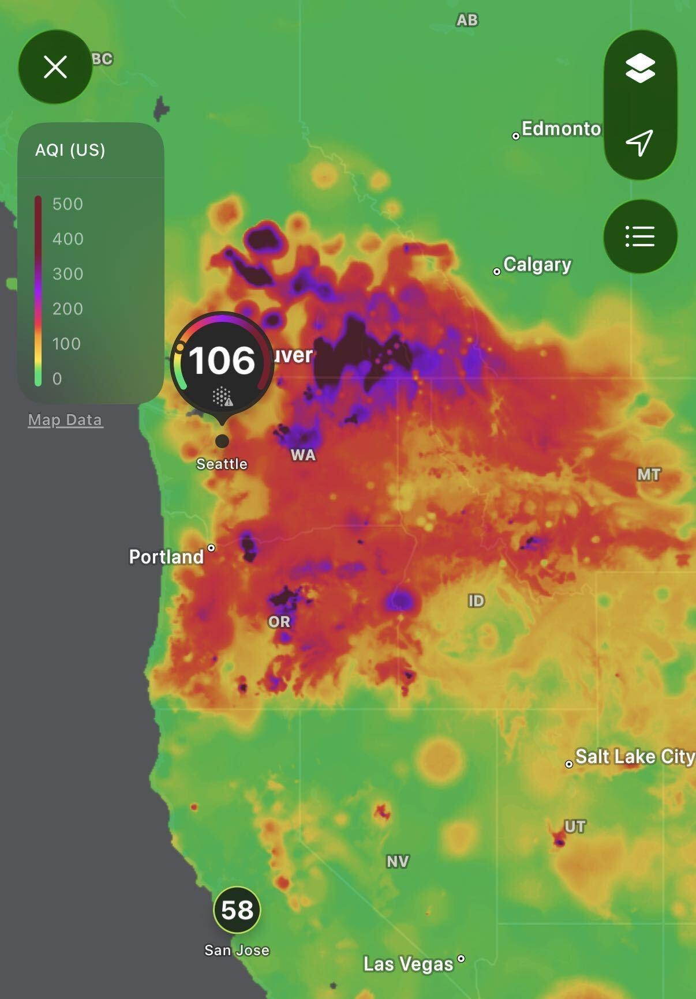
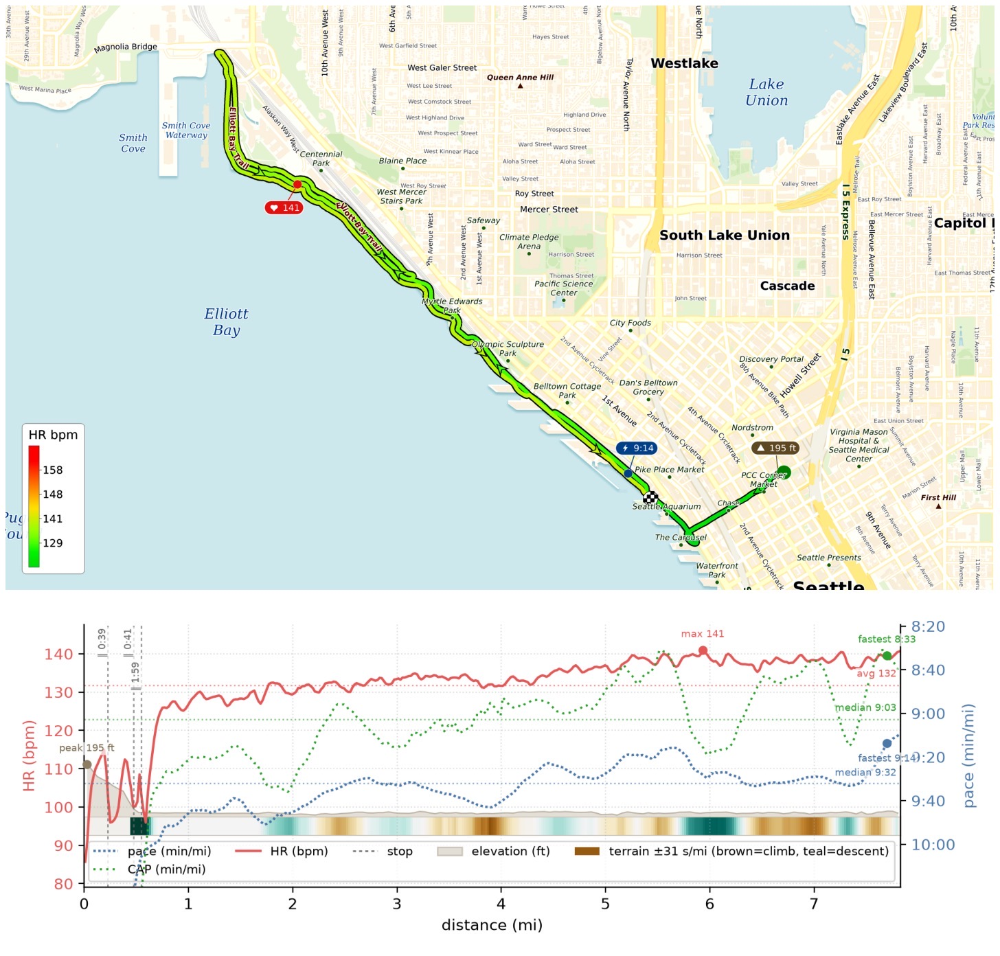
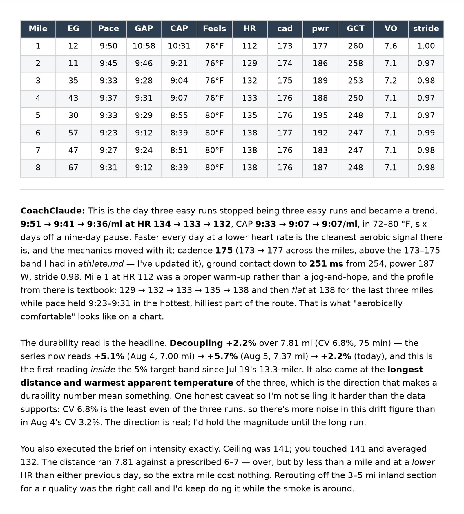

I was prepared to wear KN95 in yesterday's run on Elliott Bay, but my nose said it's okay. Ran a 7.81mi EZ at 9:36/mi, HR avg/max 132/141 bpm, felt like 76-80F. It was hot so I avoided running inland but instead just repeating segments along the shore. Notables: I now have EG correction online which is then fed into new CAP (conditions-adjusted pace) calculation!

{data-lightbox-src="image-1-full.jpeg"}

{data-lightbox-src="image-2-full.jpeg"}

{data-lightbox-src="image-3-full.jpeg"}

---

*Originally posted on [Mastodon](https://sigmoid.social/@BenjaminHan/117055989841086160).*
