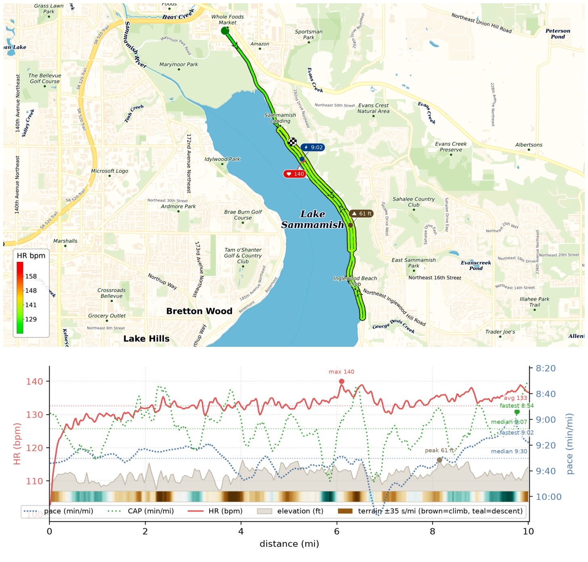
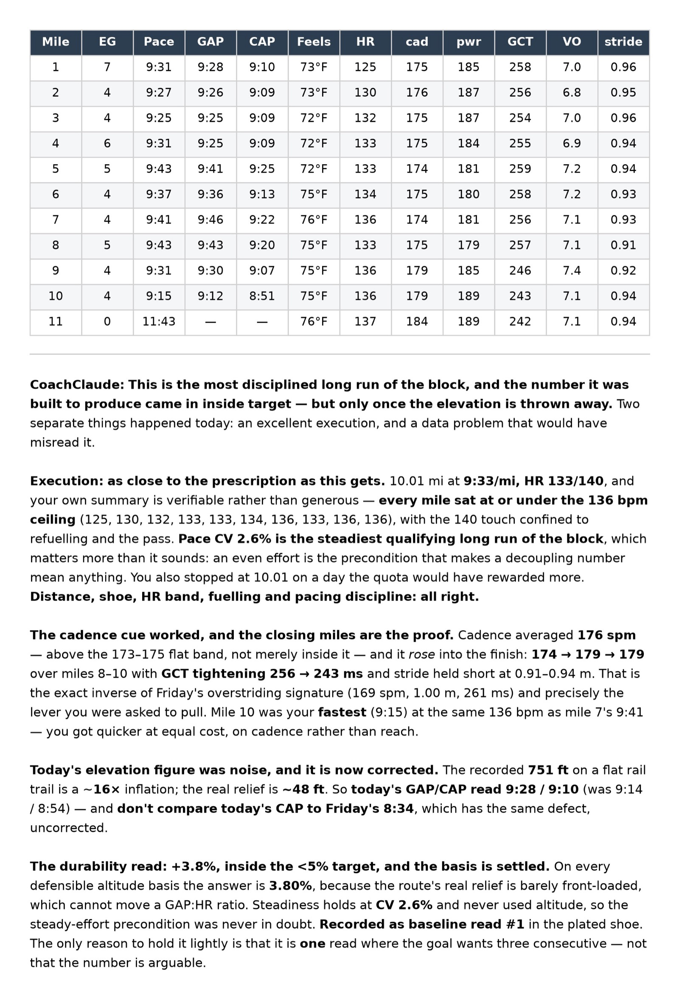

This Long Run Sunday I was the human test subject for [CoachClaude](/posts/20260710-coachclaude-is-coming-up-nicely/), running a prescribed 10mi EZ (<=136bpm) on East Lake Sammamish Trail to pass the durability test -- 9:33/mi, HR avg 133 bpm — passed it with flying color!

Then I got to investigate how to fix EG sensor drift with terrain & historical runs, and found out I need to fix GPS sensor drifts too! Hours of fun!

W32 now closed with 56.9mi run. Only 31mi behind 2,500 yearly quota now!

{data-lightbox-src="image-1-full.jpeg"}

{data-lightbox-src="image-2-full.jpeg"}

{data-lightbox-src="image-3-full.jpeg"}

{data-lightbox-src="image-4-full.jpeg"}

---

*Originally posted on [Mastodon](https://sigmoid.social/@BenjaminHan/117069358594216411).*
