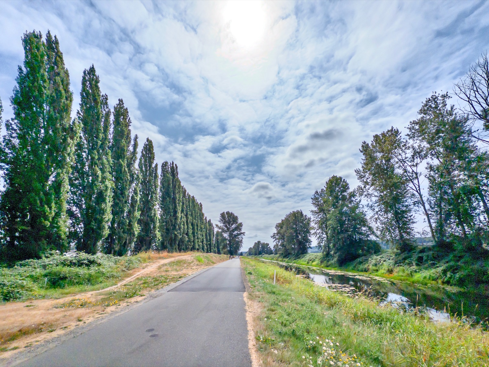
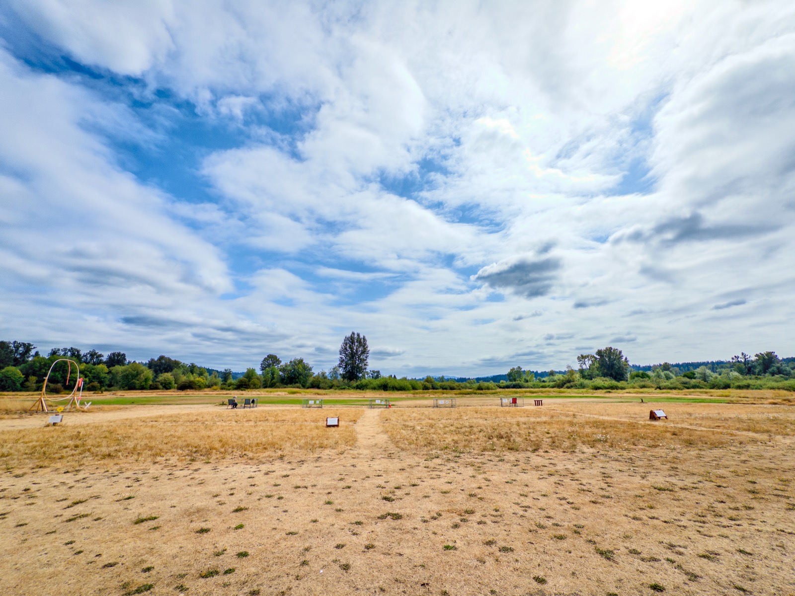
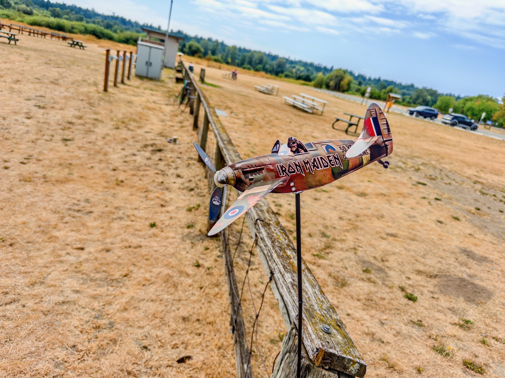
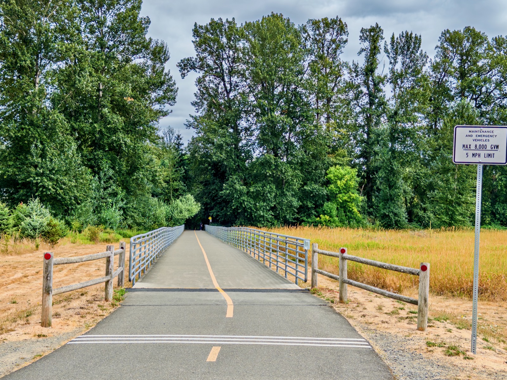
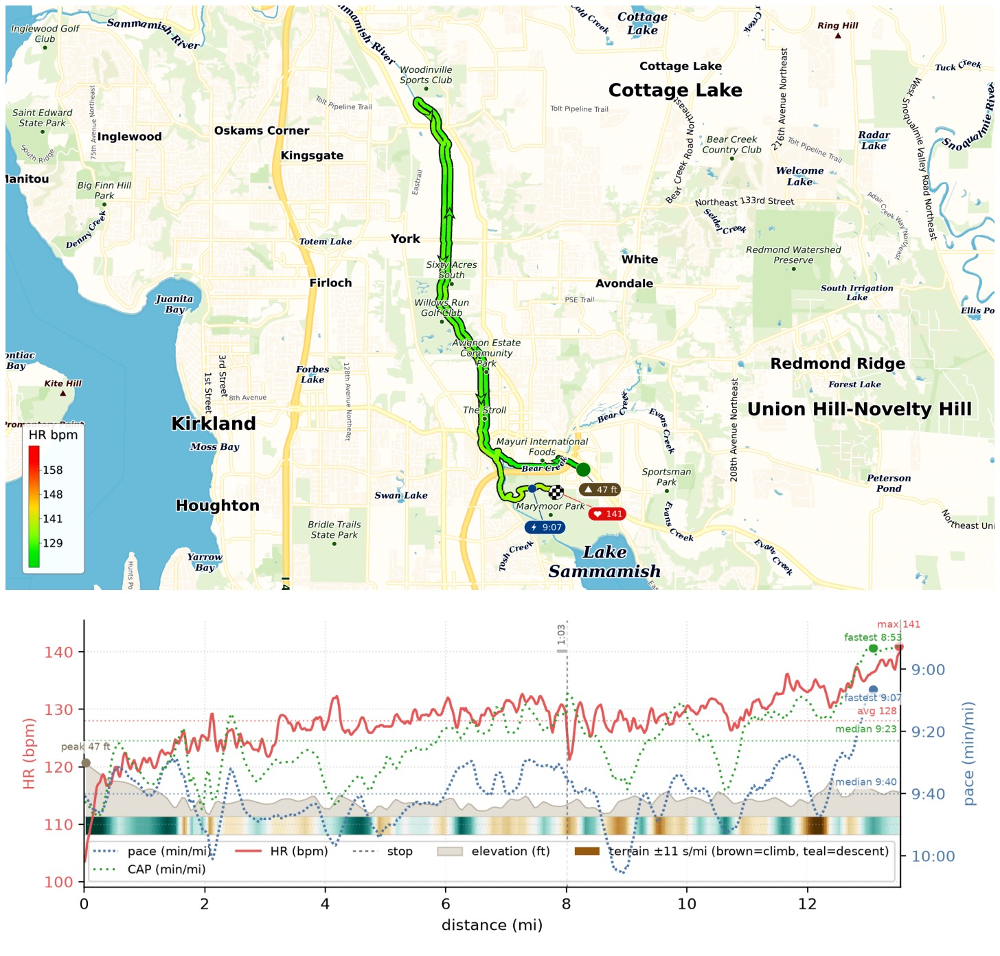
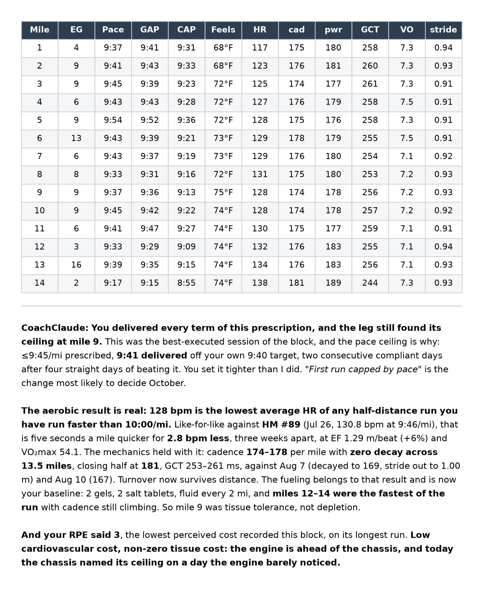

This Long Run Sunday I ran my 90th HM on the Sammamish River Trail, out from Marymoor Park to Woodinville and back. It was [CoachClaude](/posts/20260710-coachclaude-is-coming-up-nicely/)'s [second durability test](/posts/20260809-coachclaude-durability-test/), and the first run where the cap was pace instead of HR: the prescription was 9'45"/mi and I set my own target tighter at 9'40". Came in at 13.5mi, 9'41"/mi, EG 109ft, HR 128/141 and VO₂max 54.1. Lowest average HR of any HM I've run faster than 10'00"/mi!

Fueling: drink every 2mi, gel every 4mi (2 total), 2 salt tablets. One stop at the 8mi mark to refuel, under a minute.

Cadence held at 174–178 with no decay across the whole 13.5mi and closed at 181, and miles 12–14 were the fastest of the run. RPE 3, the lowest I've logged this block!

{data-lightbox-src="image-1-full.jpeg"}

{data-lightbox-src="image-2-full.jpeg"}

{data-lightbox-src="image-3-full.jpeg"}

{data-lightbox-src="image-4-full.jpeg"}

{data-lightbox-src="image-5-full.jpeg"}

{data-lightbox-src="image-6-full.jpeg"}

{data-lightbox-src="image-7-full.jpeg"}

{data-lightbox-src="image-8-full.jpeg"}
