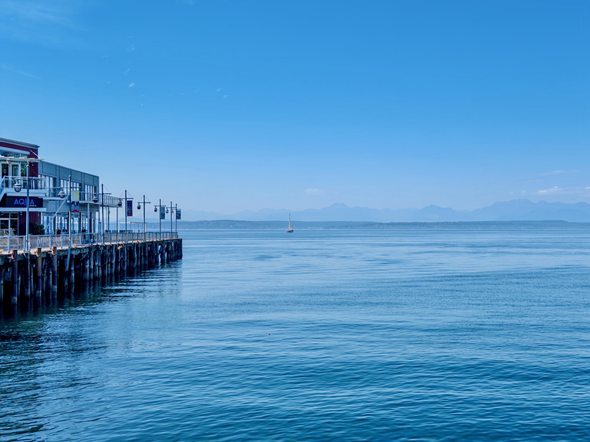
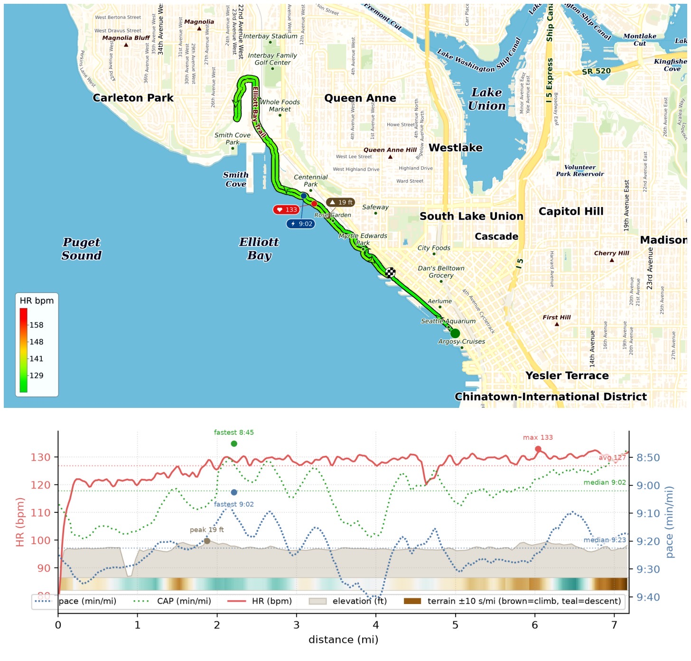
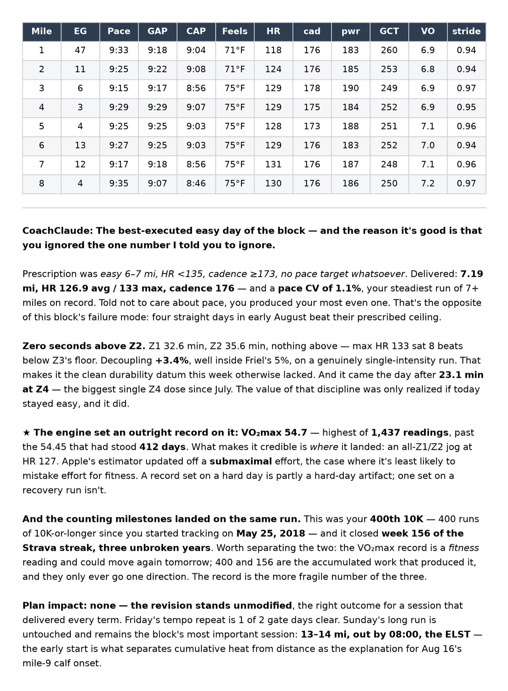

I didn't expect yesterday's easy 7.19mi run on Elliott Bay to be any different, but it turned out that I reached all these milestones!

1. It's my 400th 10K run since May 2018!
2. Also week 156 of my Strava streak — 3 years unbroken!
3. I reached an *all-time high* in VO2max, 54.7, beating the previous 54.45 after 412 days!!!
4. My pace variation was only 1.1%, the steadiest 7+ miler on record!

Got proper recognition from [CoachClaude](/posts/20260710-coachclaude-is-coming-up-nicely/)! 😊

{data-lightbox-src="image-1-full.jpeg"}

{data-lightbox-src="image-2-full.jpeg"}

{data-lightbox-src="image-3-full.jpeg"}

{data-lightbox-src="image-4-full.jpeg"}

---

*Originally posted on [Mastodon](https://sigmoid.social/@BenjaminHan/117130976326302033).*
