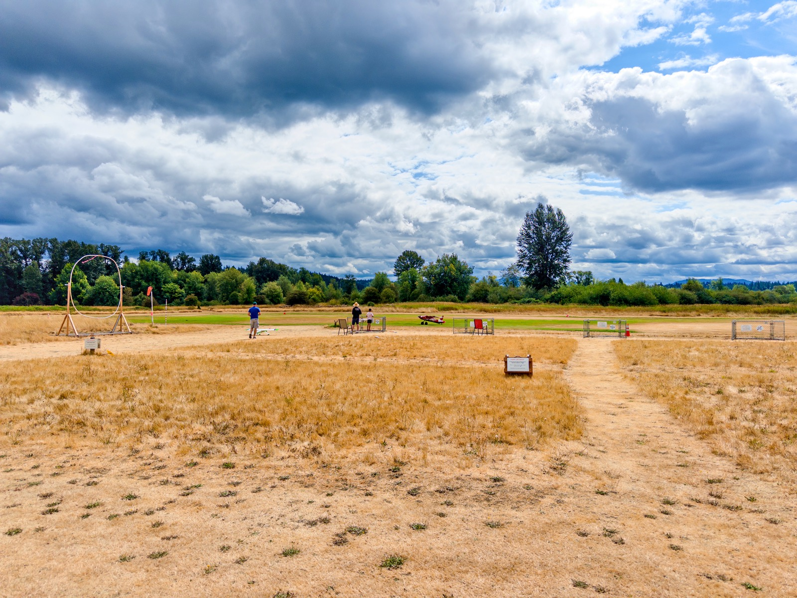
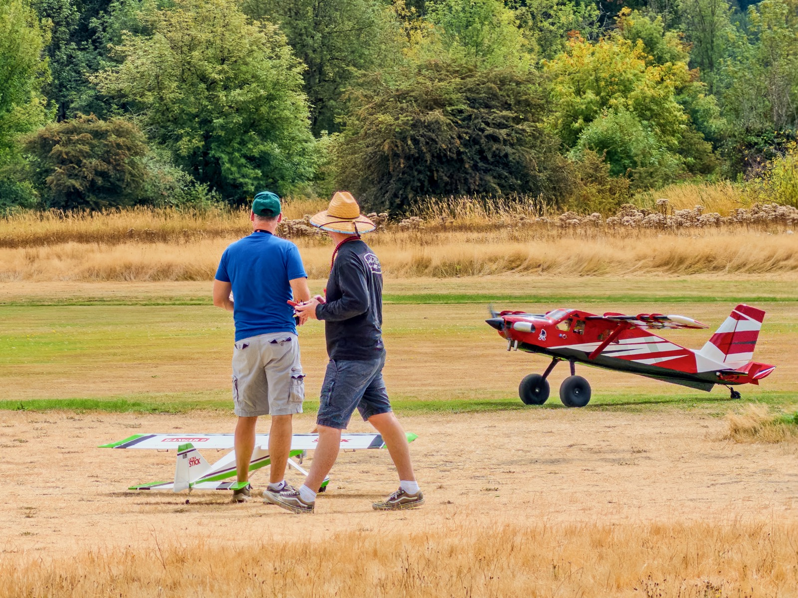
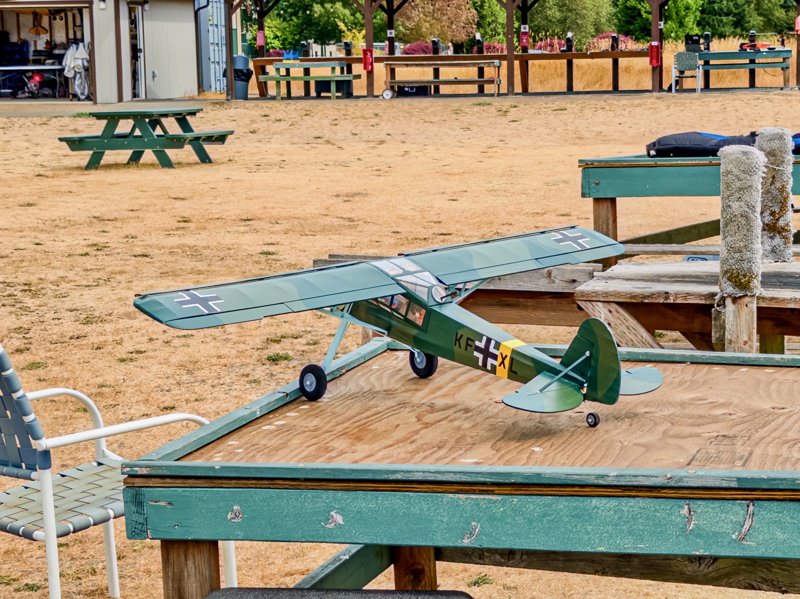
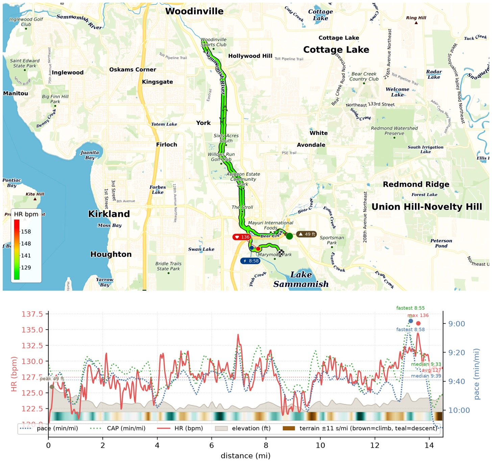
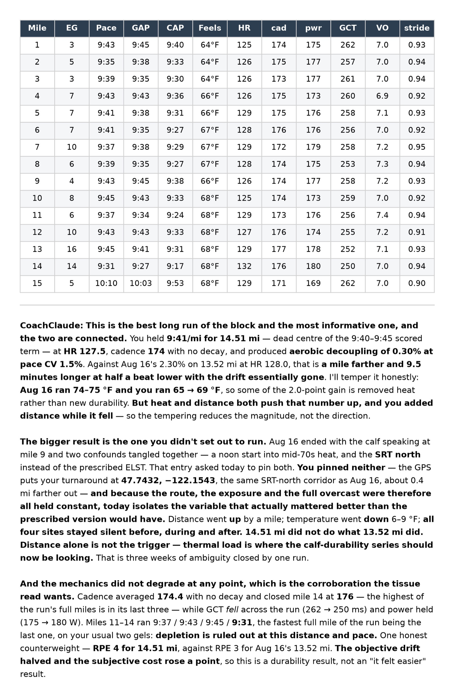

This #LongRunSunday I ran my 91st HM north on the Sammamish River Trail, and [CoachClaude](/posts/20260710-coachclaude-is-coming-up-nicely/) capped the pace at 9'45"/mi. I came in at 14.51mi, 9'41"/mi, and HR 127.5/136, 0.5 beat lower HR than [HM #90](/posts/20260816-half-marathon-90-durability-test-2/), another EZ HM along the same route!

My mile-to-mile pace variation also came in at only 1.5%, a record low for any run of mine at HM distance or longer, and the decoupling metric fell to 0.30% against 2.30% at HM #90!

T-2weeks until [Redmond Harvest Half](/posts/20250901-redmond-harvest-half/)!

{data-lightbox-src="image-1-full.jpeg"}

{data-lightbox-src="image-2-full.jpeg"}

{data-lightbox-src="image-3-full.jpeg"}

{data-lightbox-src="image-4-full.jpeg"}

{data-lightbox-src="image-5-full.jpeg"}

{data-lightbox-src="image-6-full.jpeg"}

{data-lightbox-src="image-7-full.jpeg"}

{data-lightbox-src="image-8-full.jpeg"}

{data-lightbox-src="image-9-full.jpeg"}

{data-lightbox-src="image-10-full.jpeg"}

{data-lightbox-src="image-11-full.jpeg"}

{data-lightbox-src="image-12-full.jpeg"}

{data-lightbox-src="image-13-full.jpeg"}

{data-lightbox-src="image-14-full.jpeg"}
