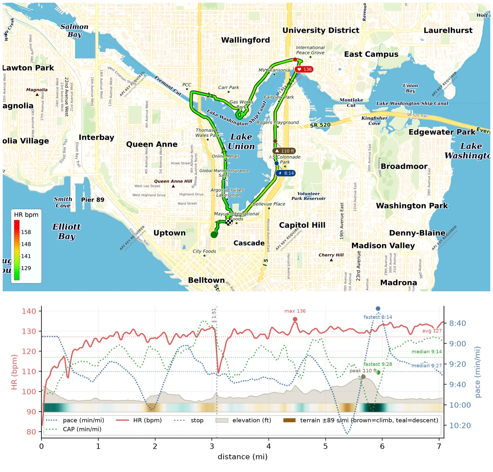
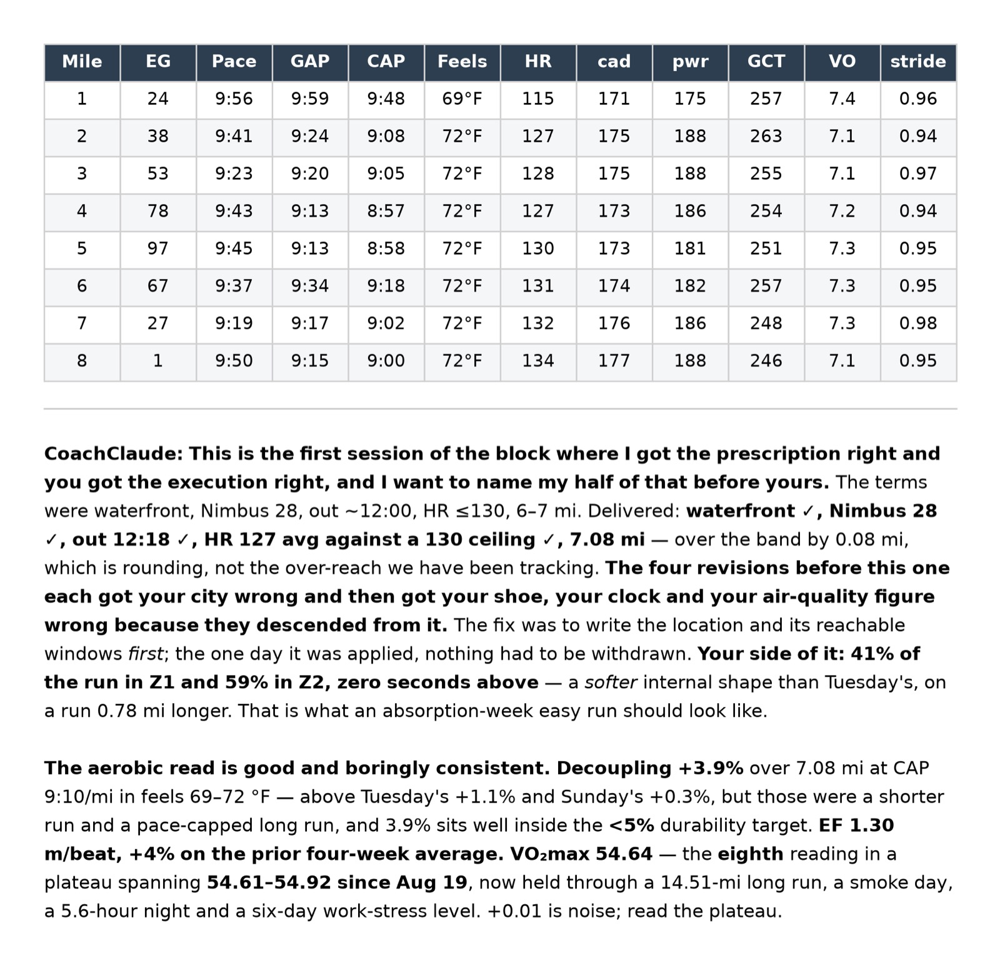

It's been a while — ran an easy run around Lake Union yesterday: 7.08mi at 9'38"/mi, HR capped at 130 bpm and got avg 127 bpm. Weekly efficiency reached 1.30m/beat, up 4% on the prior 4 weeks!

{data-lightbox-src="image-1-full.jpeg"}

{data-lightbox-src="image-2-full.jpeg"}

{data-lightbox-src="image-3-full.jpeg"}

{data-lightbox-src="image-4-full.jpeg"}

---

*Originally posted on [Mastodon](https://sigmoid.social/@BenjaminHan/117170192784265625).*
