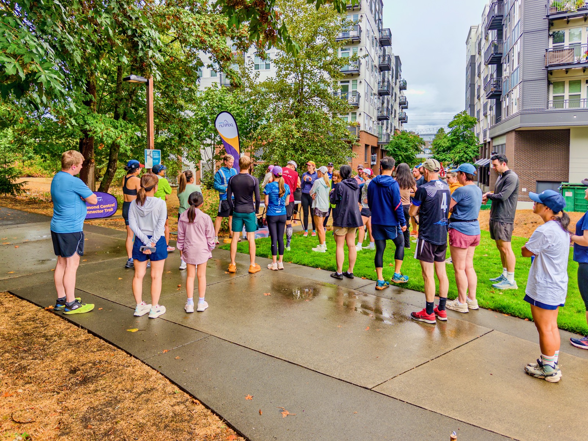
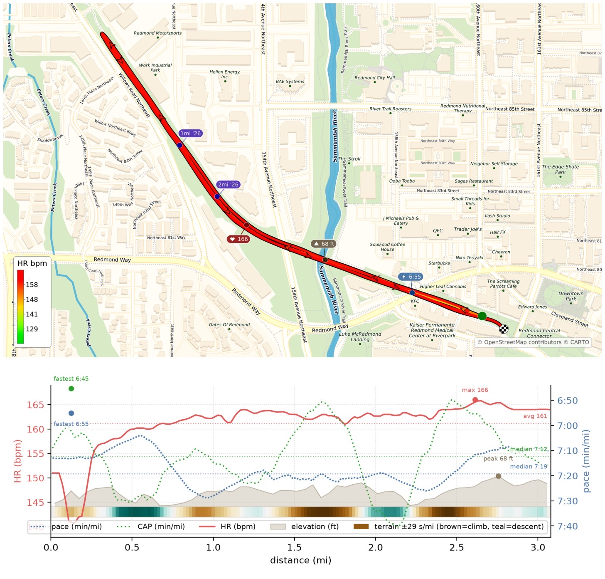
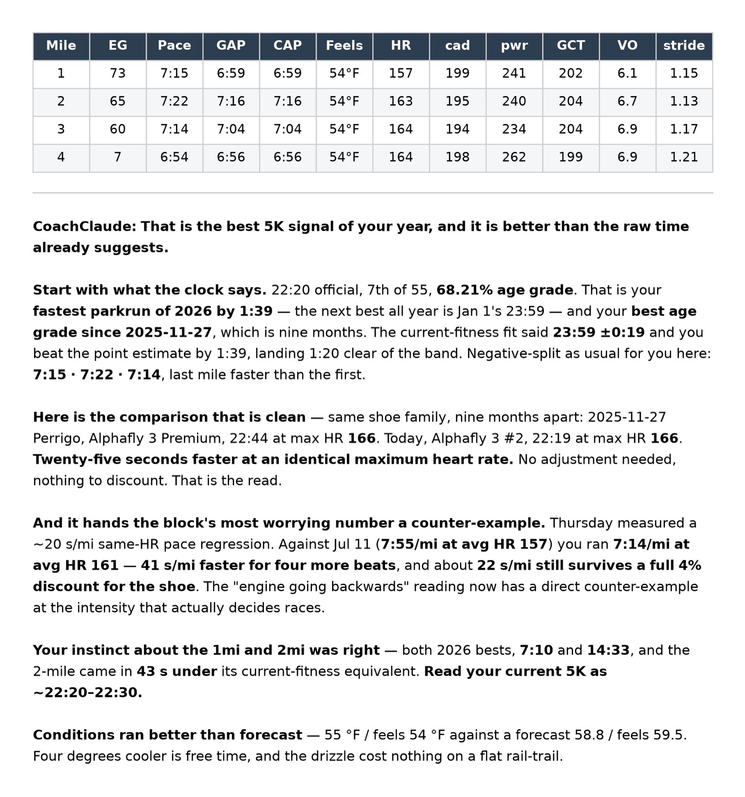

Recovery milestone today! [CoachClaude](/posts/20260710-coachclaude-is-coming-up-nicely/) for the first time gave green light for me to race a Parkrun: no HR cap and no pace cap, anything goes! Official time 22:20, pace 7:11/mi -- my fastest Parkrun this year (or in 9 months)!

My PR remains to be 21:05, but I'll be back!

{data-lightbox-src="image-1-full.jpeg"}

{data-lightbox-src="image-2-full.jpeg"}

{data-lightbox-src="image-3-full.jpeg"}

---

*Originally posted on [Mastodon](https://sigmoid.social/@BenjaminHan/117182953375561602).*
