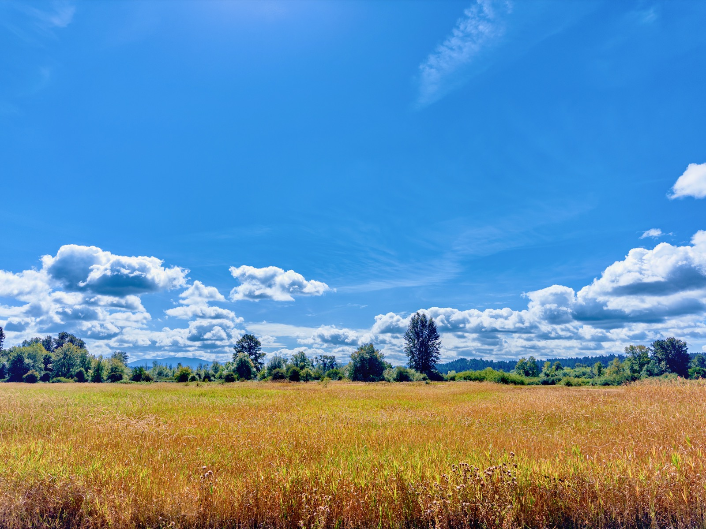
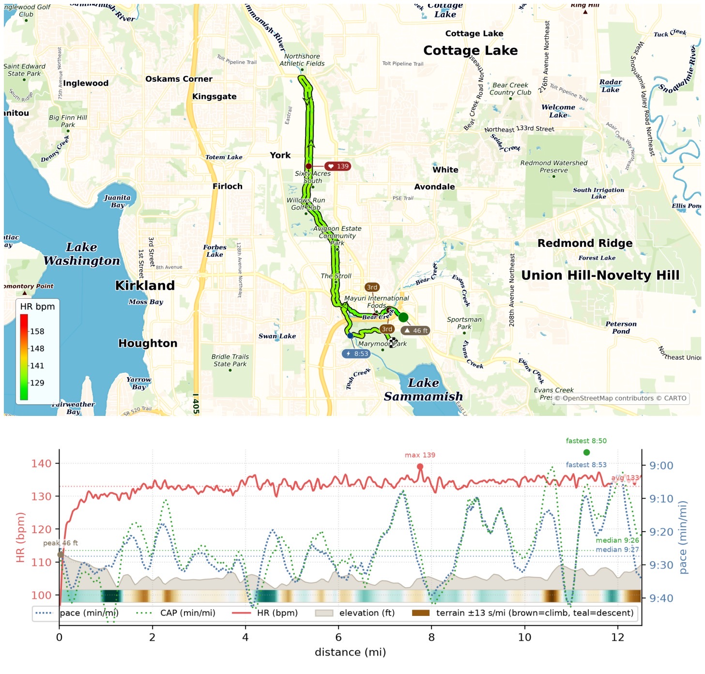
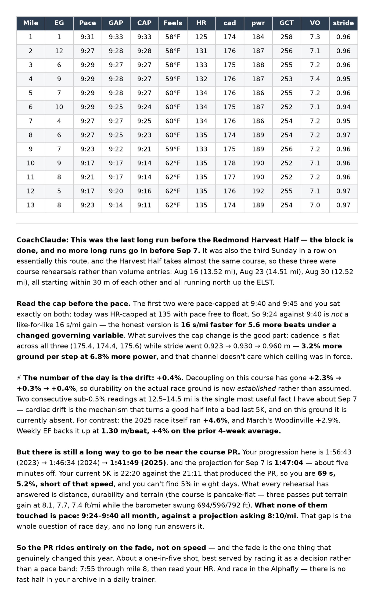

Last #LongRunSunday before the [Redmond Harvest Half](/posts/20250901-redmond-harvest-half/) (Sep 7): 12.52mi at 9:24/mi, avg HR 133 under a 135 cap. Third Sunday on essentially the race course, and the drift keeps getting better — decoupling [+2.3%](/posts/20260816-half-marathon-90-durability-test-2/) → [+0.3%](/posts/20260823-half-marathon-91-lowest-hr-flattest-pace/) → +0.4%, EF 1.30 m/beat (+4%). Felt easy and controlled, RPE 5, slightly negative split.

Still a long way off my 1:41:49 course PR though — projection says 1:47, and my 5K is 69s short of the one that got me the PR. Eight days to find out.

{data-lightbox-src="image-1-full.jpeg"}

{data-lightbox-src="image-2-full.jpeg"}

{data-lightbox-src="image-3-full.jpeg"}

{data-lightbox-src="image-4-full.jpeg"}

---

*Originally posted on [Mastodon](https://sigmoid.social/@BenjaminHan/117187954295745276).*
